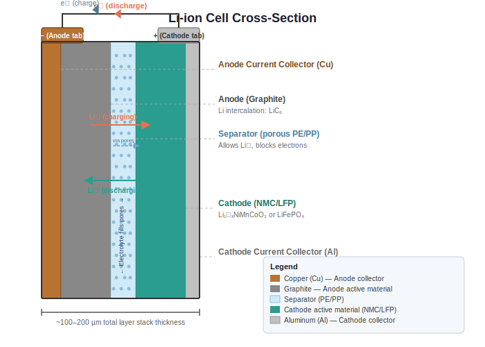
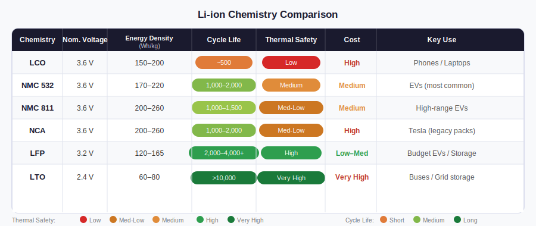
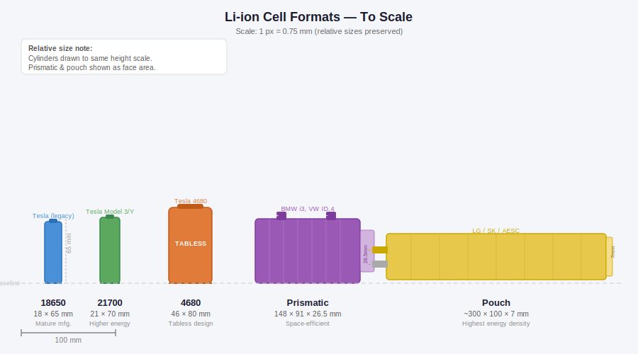

# The Lithium-Ion Cell — Chemistry, Formats, and What the Datasheet Actually Tells You

*Prerequisites: None. This is the vocabulary post for the entire series.*
*Next: [Battery Pack & Module Architecture →](./battery.md)*

---

## The Fundamental Unit

Every EV battery, from a Tata Nexon to a Tesla Semi, is made of cells. Thousands of them.

All the complexity of battery management software, thermal management hardware, and pack architecture exists to serve one purpose: keep each individual cell operating within safe limits. To understand any of that, you first need to understand what a cell actually is — physically, chemically, and electrically.

This post builds that foundation. It covers the electrochemistry at the level needed to understand BMS decisions, the physical formats that shape pack design, and how to extract useful numbers from a cell datasheet.

---

## What is a Li-ion Cell?

A cell is an electrochemical energy storage device. It converts stored chemical energy into electrical energy on demand (discharge) and converts electrical energy back into stored chemical energy when you charge it.

Three components make this work:

**Anode (negative electrode):** stores lithium ions during charging. In almost all EV cells, this is graphite — cheap, abundant, stable, and capable of storing one lithium atom per six carbon atoms (~372 mAh/g theoretical capacity).

**Cathode (positive electrode):** stores lithium ions during discharge. This is where most of the chemistry variation between cell types lives — NMC, LFP, NCA are all cathode chemistries. The cathode determines voltage, energy density, thermal behaviour, and cost.

**Electrolyte:** the medium through which lithium ions travel between electrodes. In liquid-electrolyte cells (all current EV cells), this is a lithium salt dissolved in an organic solvent — typically LiPF₆ in a mixture of ethylene carbonate and dimethyl carbonate. It conducts ions but not electrons (electrons travel through the external circuit).

**Separator:** a porous polymer membrane between anode and cathode. It prevents the electrodes from touching (which would be a short circuit) while allowing Li⁺ ions to pass through freely. At high temperatures, the separator melts and closes its pores — a thermal shutdown mechanism that, if tripped, means the cell is done.

### The Key Concept: Intercalation

The word "intercalation" describes what makes lithium-ion batteries different from older chemistries like lead-acid or nickel-metal hydride: lithium ions slot into the layered crystal structure of the electrode materials like a key into a lock, without permanently altering the host structure.

During discharge, lithium ions leave the anode (graphite), travel through the electrolyte, and intercalate into the cathode crystal. Electrons simultaneously leave the anode, travel through the external circuit (that is your current), and arrive at the cathode. The process reverses during charging.

Because intercalation does not involve dissolving or depositing electrode material the way older chemistries do, lithium-ion cells can survive thousands of charge cycles. The mechanisms that limit cycle life — SEI growth, particle cracking, lithium plating — are all secondary effects, not the primary reaction. This is why Li-ion batteries last years rather than hundreds of cycles.

---

## The Electrodes — What They Are Actually Made Of

### Anode

**Graphite** is the universal anode for current EV cells. It is well-characterised, inexpensive, and has a theoretical capacity of 372 mAh/g. The practical limitation: graphite has a relatively flat discharge curve near 0 V vs Li/Li⁺, which means fully lithiated graphite is borderline for lithium plating risk — a failure mode that matters during fast charging at low temperatures.

**Silicon-graphite blends** are the next step. Silicon holds up to 3579 mAh/g — nearly 10× graphite — but expands by roughly 300% when fully lithiated. This volumetric swelling causes particle cracking, SEI cracking, and capacity fade. Current production cells use 5–10% silicon by weight in the anode, capturing meaningful capacity gain while limiting the mechanical degradation. This fraction is increasing as coating and binder technology improves.

**Lithium Titanate (LTO)** is the outlier: a very safe anode material that operates at a higher voltage vs Li/Li⁺, which essentially eliminates lithium plating risk. The trade-off: much lower energy density (~60–80 Wh/kg at the cell level) and high cost. Used in buses, grid storage, and applications where cycle life >20,000 cycles or fast charging in cold conditions is the primary requirement.

### Cathode

This is where chemistries diverge in ways that directly affect BMS strategy, thermal management requirements, and pack design.

**NMC (Lithium Nickel Manganese Cobalt Oxide, LiNiₓMnᵧCoᵤO₂):** the dominant EV cathode today. The three elements each play a role: nickel (N) drives energy density, manganese (M) improves structural stability and reduces cost, cobalt (C) improves conductivity and cycle life. The ratio (NMC 111, NMC 532, NMC 622, NMC 811) is a trade-off dial — higher nickel means more energy but harder thermal management. NMC 811 is now common in high-range EVs.

**NCA (Lithium Nickel Cobalt Aluminum Oxide):** used by Tesla (with Panasonic). High energy density, good power capability. Requires tight BMS management of temperature and charge voltage — aluminum in the cathode improves structural stability compared to pure high-Ni NMC, but still demands careful operation.

**LFP (Lithium Iron Phosphate, LiFePO₄):** the chemistry that has reshaped the EV industry, especially in China and for more affordable EVs globally. Lower nominal voltage (~3.2V vs ~3.6V for NMC), lower energy density (120–165 Wh/kg vs 170–260 Wh/kg for NMC) — but outstanding thermal stability (the olivine crystal structure releases very little oxygen during thermal runaway, dramatically reducing fire risk), very long cycle life (2000–4000+ cycles to 80% SOH), and no cobalt or nickel (cheaper and supply-chain resilient). The BMS challenge: LFP's very flat OCV-SOC curve makes state-of-charge estimation significantly harder than NMC. More on this in the SOC post.

**LCO (Lithium Cobalt Oxide):** the original commercial Li-ion cathode (Sony, 1991). High energy density but thermally unstable above ~150°C and expensive due to cobalt content. Used in smartphones and laptops. Not used in EVs.

**LMFP (Lithium Manganese Iron Phosphate):** an emerging evolution of LFP that partially replaces iron with manganese, raising the average discharge voltage from 3.2V to ~3.6V while retaining LFP's safety and cycle life. CATL has announced production plans. Watch this space.

---

## Chemistry Comparison

| Chemistry | Nom. Voltage | Wh/kg (cell) | Cycle Life | Thermal Safety | Cobalt-free? | Key EV Use |
|---|---|---|---|---|---|---|
| LCO | 3.6 V | 150–200 | ~500 | Low | No | Phones / laptops |
| NMC 532 | 3.6 V | 170–220 | 1000–2000 | Medium | No | Mid-range EVs |
| NMC 811 | 3.6 V | 200–260 | 1000–1500 | Medium-low | No | Long-range EVs |
| NCA | 3.6 V | 200–260 | 1000–2000 | Medium-low | No | Tesla (Panasonic) |
| LFP | 3.2 V | 120–165 | 2000–4000+ | High | Yes | Budget EVs, storage |
| LTO | 2.4 V | 60–80 | >10,000 | Very high | Yes | Buses, grid |

The interactive chart below lets you explore the OCV-SOC curves for NMC and LFP side by side — the most important practical difference between them from a BMS perspective. Note how LFP's curve is nearly flat between 20% and 80% SOC while NMC's is clearly sloped.

> **Interactive:** [OCV-SOC curves — NMC vs LFP, adjustable temperature and C-rate](../../assets/claude_assetsplan/battery/ocv-soc-curves.html)

---

## Cell Formats — The Physical Packaging

How the electrodes, separator, and electrolyte are packaged determines cell form factor, cost, and how it integrates into a pack. Three main formats dominate; one proprietary variant deserves mention.

### Cylindrical

Named by diameter × height in millimetres. The 18650 (18 mm × 65 mm) is the laptop battery cell that became the foundation of Tesla's early packs. The 21700 (21 mm × 70 mm) is the current generation, used in Tesla Model 3/Y and many others. The 4680 (46 mm × 80 mm) is Tesla's next-generation cell — roughly 5× the energy of an 18650, with a "tabless" design where the current collector runs the full length of the electrode rather than using discrete tabs, which reduces internal resistance and heat generation at high current.

Advantages: mature, highly automated manufacturing; tight dimensional tolerances; self-contained rigid steel or aluminum case; no external compression hardware required.

Disadvantages: cylindrical geometry leaves air gaps between cells in a pack (the spaces at the corners of four touching cylinders), reducing volumetric energy density. Managing many small cells in parallel for high current demands careful busbar and welding design.

### Prismatic

Rigid rectangular aluminum housing. Much larger cells — typically 40–300 Ah per cell. Used by CATL, Samsung SDI, Panasonic (for BMW and VW), among others.

Advantages: rectangular cells pack efficiently with no wasted space; flat faces give good thermal contact to cooling plates; fewer cells needed per pack simplifies the module design.

Disadvantages: cells swell during cycling (volume change up to 3% over charge-discharge) — the pack structure must provide controlled mechanical compression to maintain electrode contact without over-stressing the cell. Requires compression plates and end brackets.

### Pouch

A laminated flexible foil enclosure (aluminium-plastic composite). The "naked" electrode stack is sealed in a heat-welded pouch. No rigid housing.

Advantages: highest possible energy density (no heavy metal can); the shape is fully design-flexible; thin profile.

Disadvantages: the flexible enclosure provides no compression — the pack structure must clamp the cells or they delaminate. Thermal management is more complex as there is no uniform reference surface. If abused (overcharge, high temperature), the pouch can swell and rupture. Used by LG Energy Solution (GM Ultium, Hyundai) and SK On.

### Blade (CATL CTP)

CATL's proprietary format: ultra-long prismatic LFP cells that span the full width of the pack, eliminating the module layer entirely. This "cell-to-pack" (CTP) design means the cell itself contributes to the structural rigidity of the pack enclosure. Despite LFP's lower energy density per kilogram, the volumetric efficiency gain from removing the module layer closes the gap considerably. The Blade Battery in the BYD Han EV and CATL's CTP3.0 packs are the leading examples.

---

## Reading a Cell Datasheet

When a BMS engineer characterises a new cell for a vehicle program, the datasheet is the starting point. Here are the parameters that matter most:

**Nominal capacity (Ah):** the charge stored at the standard discharge rate (C/5 or C/3) between the manufacturer's specified voltage limits. This is your reference for calculating C-rates and energy.

**Nominal voltage (V):** the average discharge voltage at the standard rate. Multiply by capacity for nominal energy per cell in Wh. Nominal voltage is not the same as OCV at any particular SOC — it is the average over a full discharge.

**Voltage window (V_max, V_min):** the absolute limits the BMS must enforce. Exceeding V_max causes lithium plating on the anode (during charge) and electrolyte oxidation at the cathode. Dropping below V_min causes copper dissolution from the anode current collector — irreversible damage that degrades subsequent charge/discharge cycles. The BMS must keep every cell within this window at all times. Typical values: V_max = 4.2 V (NMC), 3.65 V (LFP); V_min = 2.5 V (NMC), 2.5 V (LFP).

**C-rate:** a normalised current unit. 1C = the current that fully discharges the nominal capacity in one hour. For a 5 Ah cell, 1C = 5 A; 2C = 10 A; C/5 = 1 A. C-rates are used because they allow direct comparison across different cell sizes. The datasheet specifies maximum continuous discharge C-rate, maximum pulse C-rate, and maximum charge C-rate (usually lower than discharge).

**Energy density (Wh/kg and Wh/L):** both matter. Gravimetric density (Wh/kg) determines pack weight. Volumetric density (Wh/L) determines pack volume. Pouch cells typically win on Wh/L; cylindrical cells are competitive; prismatic cells trade some volumetric density for mechanical simplicity.

**Cycle life:** the number of charge-discharge cycles to reach 80% of the initial capacity at specified conditions (temperature, depth of discharge, C-rate). This is the engineering definition of end-of-life. A cell rated for 1000 cycles at 25°C, 100% DoD will reach 80% SOH faster if operated at 40°C or cycled to 100% DoD every day — the cycle life number is highly condition-dependent.

**DC Internal Resistance (DCIR):** typically specified at 50% SOC and 25°C, measured with a 10-second pulse. This is R₀ in the ECM. Low DCIR means less voltage sag under load and less heat generation. Rises with age and cold temperature.

**Operating temperature range:** two separate ranges — discharge and charge. Discharge is permissive (often −20°C to 60°C). Charge is stricter: below 0°C for most NMC cells, lithium plating risk during charge becomes significant and many manufacturers prohibit charging below 5°C. LFP cells are even more conservative. The BMS enforces these limits by cutting charge current based on temperature.

**Self-discharge rate:** typically 1–3% per month at 25°C. Doubles roughly every 10°C higher (Arrhenius relationship). Critical for vehicles parked for extended periods — the BMS must periodically wake and check cell voltage to detect over-discharge during storage.

---

## Formation — How a Cell is Born

A newly assembled cell is not yet usable. After the electrode stack is inserted into the housing and electrolyte is added, the cell undergoes **formation** — a precisely controlled first charge sequence at the manufacturer's facility.

During formation, the electrolyte reacts with the graphite anode surface for the first time, depositing the **Solid Electrolyte Interphase (SEI)**: a thin, ionically conductive but electronically insulating passivation layer. This is the most important interface in the cell. If the SEI forms correctly — dense, uniform, with the right chemical composition — the anode is protected from continuous electrolyte reduction and the cell will have good cycle life. If it forms poorly, the cell degrades rapidly.

Formation consumes a small fraction of the lithium (the SEI is lithium-containing compounds) and accounts for significant manufacturing cost and time — sometimes days of controlled cycling per cell.

After formation, each cell's capacity is measured and compared to specification. Cells are sorted into bins by capacity — typically within ±1% of each other. This **cell matching** is essential for pack assembly: cells within a module should have matched capacities so that no single cell determines the end-of-discharge for the whole string prematurely.

Electrolyte **additive packages** — small amounts of specific organic molecules mixed into the electrolyte formulation — control SEI chemistry, improve cycle life, and enable fast charging. These formulations are closely guarded trade secrets that differentiate manufacturers.

---

## What Limits a Cell's Life

Three mechanisms dominate cycle life degradation:

**SEI growth:** even after formation, the SEI continues to grow slowly throughout the cell's life, consuming lithium and electrolyte. This is the primary source of capacity fade in well-managed cells. Temperature accelerates it (Arrhenius relationship — every 10°C rise roughly doubles the rate). High SOC storage accelerates it. The SOH post covers this quantitatively.

**Lithium plating:** if the graphite anode cannot accept lithium as fast as it arrives — due to high charge current, low temperature, or anode degradation — metallic lithium deposits on the anode surface instead of intercalating. Metallic lithium is reactive, can form dendrites that pierce the separator (short circuit), and represents permanently lost capacity. This is the mechanism the BMS most aggressively guards against with charge current limits at low temperatures.

**Particle cracking:** both graphite and cathode active material particles crack under repeated expansion and contraction during cycling. Cracks expose fresh surfaces to electrolyte, consuming electrolyte and lithium and increasing internal resistance. Silicon in the anode makes this worse due to its larger volume change.

Understanding these mechanisms is the foundation for the SOH post — which covers how the BMS tracks degradation and adjusts power limits accordingly over the vehicle's life.

---

## Takeaways

- Every cell has three essential components — anode (graphite), cathode (NMC/LFP/etc.), electrolyte — and lithium ions shuttling between them via intercalation. No atoms are created or destroyed; the reversible ion movement is what makes rechargeable batteries possible.

- **Chemistry choice is a system-level engineering decision.** NMC offers higher energy density and is more complex to manage safely. LFP offers outstanding thermal stability and cycle life at lower energy density and is more forgiving of thermal management lapses. NMC 811 and LFP are the two poles of the current production landscape.

- **Format choice shapes pack design.** Cylindrical cells are manufacturing-mature; prismatic cells pack efficiently; pouch cells maximise energy density at the cost of mechanical complexity. CATL's CTP blade removes the module layer entirely.

- The datasheet's key numbers — voltage window, DCIR, C-rate limits, cycle life at temperature — are the parameters the BMS uses every millisecond to protect the cell. Knowing how to read them is the foundation for understanding BMS algorithms.

- Formation cycling creates the SEI — the protective layer that determines the cell's long-term behaviour. Cell matching during manufacturing is the first line of balancing before the pack ever drives a kilometre.

---

## Experiment Ideas

### Experiment 1 — OCV-SOC Curve by Chemistry

**Materials:** 1× NMC 18650 cell, 1× LFP 18650 cell (e.g., IFR18650), USB charger capable of CC/CV, Arduino + INA219, DMM

**Procedure:**
1. Fully charge both cells per datasheet spec (typically 4.2 V CC/CV for NMC, 3.65 V CC/CV for LFP). Rest 2 hours.
2. Discharge each cell in steps: apply a C/5 load, track cumulative charge removed, and when you've removed 10% of nominal capacity, pause, rest 30 minutes, and record OCV.
3. Repeat at 20%, 30%, ... 90% discharged.
4. Plot both OCV curves against SOC (0% = fully discharged, 100% = fully charged).

**What to observe:** NMC has a clearly sloped curve across its full range — the voltage at 80% SOC is visibly different from 50%. LFP has a flat plateau from about 20% to 80% SOC where the voltage barely changes (~3.28–3.32 V), then drops sharply at the ends. This is exactly why LFP SOC estimation cannot rely on voltage alone — the voltage provides almost no information about SOC in the middle of the curve. This experiment makes the SOC post's Kalman filter motivation immediately concrete.

### Experiment 2 — C-Rate versus Delivered Capacity

**Materials:** 18650 NMC cell, Arduino + N-channel MOSFET + INA219 as a programmable CC load

**Procedure:**
1. Fully charge cell. Discharge at C/5 to cutoff voltage (2.5 V). Record Ah delivered.
2. Recharge. Discharge at 1C to cutoff. Record Ah.
3. Recharge. Discharge at 2C to cutoff. Record Ah.
4. Plot delivered capacity vs C-rate as a percentage of the C/5 result.

**What to observe:** At 1C, you will typically recover 95–98% of the C/5 capacity. At 2C, closer to 85–92% — the voltage hits the cutoff sooner because the I × R₀ drop is larger at higher current, even though the cell still has charge chemically available. This is the Peukert effect. It is the reason BMS power limits are not simply "cell voltage × max current" but require a model of how the voltage will evolve under load.

### Experiment 3 — Internal Resistance by Temperature

**Materials:** 18650 NMC cell at 50% SOC, INA219, MOSFET load switch, NTC thermistor, small insulated container, ice water bath

**Procedure:**
1. At room temperature (~25°C): apply a 1 A pulse, record voltage before and during, compute DCIR = ΔV / ΔI. Rest cell until voltage recovers.
2. Cool cell to ~5°C (ice water bath, cell sealed in a plastic bag). Stabilise 10 minutes. Repeat measurement.
3. Optionally repeat at 0°C.

**What to observe:** DCIR at 5°C will be roughly 1.5–2.5× higher than at 25°C. This is why cold EVs have reduced power output — not reduced capacity per se, but reduced *power capability* because the IR drop under high current would pull the terminal voltage below the BMS cutoff. The relationship between temperature and DCIR is governed by an Arrhenius model — the same relationship that governs degradation rate, charge acceptance, and self-discharge.

---

## Literature Review

### Core Textbooks

- **Tarascon, J.M. & Armand, M.** (2001) — "Issues and challenges facing rechargeable lithium batteries" — *Nature* 414, pp. 359–367 — the most-cited accessible overview of Li-ion fundamentals; start here before anything else
- **Linden, D. & Reddy, T.B.** — *Handbook of Batteries, 4th edition* (McGraw-Hill) — chemistry-by-chemistry reference; use for electrode material properties
- **Nazri, G.A. & Pistoia, G.** — *Lithium Batteries: Science and Technology* (Springer) — electrode material deep dive

### Key Papers

- **Goodenough, J.B. & Park, K.S.** (2013) — "The Li-ion rechargeable battery: A perspective" — *Journal of the American Chemical Society* 135(4) — Nobel laureate overview of cathode development from LCO to the present
- **Blomgren, G.E.** (2017) — "The development and future of lithium-ion batteries" — *J. Electrochemical Society* 164(1), pp. A5019–A5025 — readable history and technology trajectory
- **Zuo, X. et al.** (2017) — "Silicon-based lithium-ion battery anodes: A chronicle perspective review" — *Nano Energy* 31 — silicon anode status and failure mechanisms
- **Peled, E. & Menkin, S.** (2017) — "Review — SEI: Past, present and future" — *J. Electrochemical Society* 164(7) — the SEI layer, its formation, and its role in cycle life

### Online Resources

- **Battery University** — BU-201 through BU-217 series on Li-ion chemistry — free, well-organised, good for building intuition before the technical depth
- **Samsung INR21700-50E datasheet** — publicly available; excellent example of a well-documented NMC cell with all key parameters
- **Panasonic NCR18650B datasheet** — the classic 18650; use for learning how to read specification tables
- **Jeff Dahn group (Dalhousie University)** — open-access papers on precision cell lifetime testing; some of the most rigorous long-term cycle life data available

### Standards / Test Protocols

- **IEC 62660-1** — Secondary lithium-ion cells for electric road vehicles: performance testing including capacity, C-rate capability, and impedance
- **UN 38.3** — Transport testing standard defining the abuse tests (thermal, vibration, shock, overcharge) every production cell must pass
- **IEC 61960** — Standard test methods for secondary lithium cells and batteries (portable applications — also used as baseline for EV cell characterisation)
