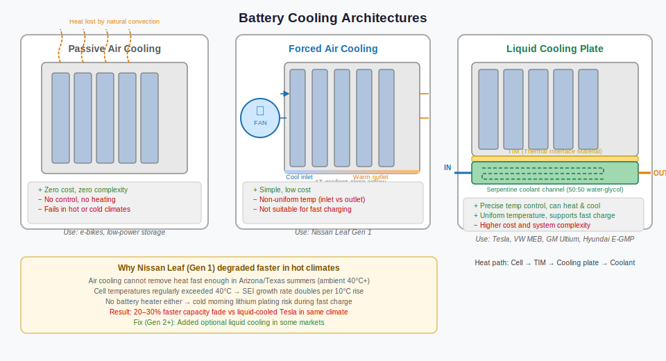
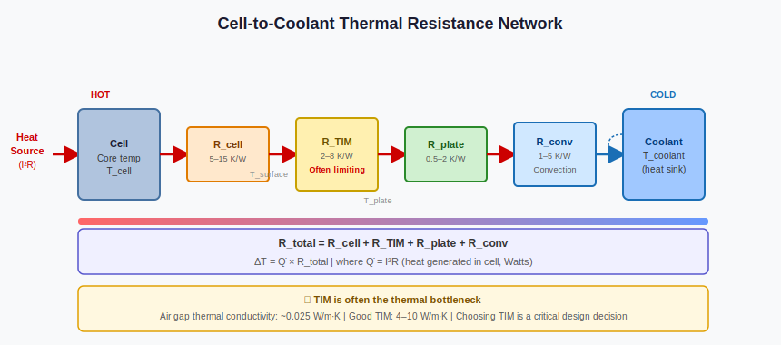

# Thermal Management — Why Temperature is the Battery's Biggest Enemy

*Prerequisites: [Cell →](./cell.md), [Battery Pack →](./battery.md)*
*Next: [OCV vs Terminal Voltage →](../bms-concepts/ocv-vs-terminal-voltage.md)*

---

## The Number That Determines Everything

The same battery pack, in the same EV, gives 15% less range at −10°C than at 25°C. It ages twice as fast at 40°C as it does at 25°C. The difference between a Nissan Leaf that has degraded to 70% of original range after 100,000 km and a Tesla Model S at the same mileage that still has 90% — most of that difference is thermal management.

Temperature is not one of many factors affecting battery performance. It is the master variable. Thermal management is not an afterthought in EV pack design. It shapes the entire architecture: where cells are arranged, how the pack is structured, what the BMS controls, and how fast the vehicle can charge.

This post explains where battery heat comes from, how different cooling architectures handle it, and what the BMS does with temperature information in real time.

---

## The Goldilocks Zone

Lithium-ion cells have a comfort zone: **15–35°C for best performance, 20–25°C for slowest ageing.**

What happens outside it:

**Too hot (>40°C):**
- SEI growth rate roughly doubles for every 10°C rise (Arrhenius relationship). At 45°C, the same calendar ageing that takes a year at 25°C takes six months.
- Above 60°C: electrolyte decomposition accelerates; above 80°C: exothermic reactions begin that can trigger thermal runaway.
- At the pack level: cells in the pack interior are always hotter than edge cells. A 10°C internal gradient means centre cells age significantly faster than their neighbours, creating localised capacity imbalance.

**Too cold (<10°C):**
- Electrolyte conductivity drops sharply — ion transport slows, internal resistance rises, and available power falls.
- Below 5°C during charging: lithium plating risk becomes significant. Lithium ions that cannot intercalate into the graphite anode fast enough deposit as metallic lithium on the anode surface — a potentially irreversible failure mode that can cause dendrite growth and internal shorts. The BMS must limit charge current as temperature falls.
- Delivered capacity shrinks because the early voltage cutoff (due to high IR drop) terminates discharge before the cell is electrochemically empty.

**Temperature gradient within the pack:**
Not just absolute temperature but the *uniformity* matters. A cell running at 35°C while its neighbour runs at 25°C ages at twice the rate. After thousands of cycles, that becomes significant capacity imbalance, which cascades into cell balancing work, reduced pack capacity, and eventually premature pack retirement. The design goal is to keep all cells within a **5°C window of each other**, within the optimal absolute range.

---

## Where Does the Heat Come From?

### Ohmic Heating (I²R)

Every resistive element in the current path generates heat at a rate P = I² × R.

At the cell level, the dominant sources are cell internal resistance (R₀ + the RC components, all ohmic at high frequency), busbar resistance, and contact resistance at welded connections. At pack level, the HV cable, contactors, and current sensor also contribute.

The I² dependence is important: doubling the discharge rate does not double heating, it **quadruples** it. A 2C discharge generates 4× the heat of 1C from the cell's internal resistance alone. This is why fast charging is so thermally aggressive — and why fast-charge performance is almost entirely a thermal management problem.

Cold temperatures increase cell internal resistance, so the same current generates more heat at −10°C than at 25°C. The BMS power derating in cold is not just about protecting against lithium plating — it also manages this additional heat generation in an already cold environment where the temperature gradient across the pack is larger.

### Entropic Heating

The electrochemical reaction that stores and releases lithium also has a thermodynamic heat component — the entropy change of lithiation and delithiation.

This term is smaller than I²R at high rates, but it matters at low rates. For NMC, entropic heat is net exothermic throughout most of the discharge. For LFP, it is nearly thermally neutral at mid-SOC. At high SOC and very low charge rates — like a cell sitting at 100% SOC overnight — entropic effects dominate because I²R is tiny.

For thermal management sizing, I²R dominates in all high-power scenarios. Entropic heating primarily matters for accurate thermal modelling at low C-rates and for understanding why different chemistries behave differently during slow charging.

### Where Heat Concentrates

Within a cylindrical cell at high C-rate, the core is hotter than the surface — heat is generated uniformly through the electrode winding but must travel radially outward to reach the cooling surface. The 4680 cell's tabless design (current collectors running the full cell length) reduces this internal gradient by distributing the current path.

Within a module, the cells in the centre are surrounded by neighbours and have no direct path to the cooling surface — they run hotter. Cells at the edge of the module dissipate heat to the cooling plate more readily. This is why the temperature uniformity design target (±5°C) is the challenge, not the average temperature.

---

## Four Cooling Architectures



### Passive Cooling

No active system. Heat dissipates to ambient air by natural convection and radiation.

Works only when: the application is low-power (e-bikes, slow scooters), the ambient temperature is consistently moderate, and the cells are spaced to allow airflow.

**The engineering reality:** passive cooling cannot maintain temperature uniformity under any significant load, has no heating capability, and provides no protection against extreme ambient temperatures. It is not used in passenger EVs. It is the baseline against which every other architecture is compared.

### Air Cooling

A fan forces air over or between cells. Used in the first-generation Nissan Leaf and some early hybrids.

**External air (cabin air) cooling:** the simplest implementation. The HVAC system's cabin air is ducted through the pack. No liquid lines, no pump, no heat exchanger.

The Nissan Leaf's degradation issues in hot climates (Arizona, Texas) made the limitations of air cooling widely understood. Three problems:
1. Non-uniform: cells near the inlet are cooler than cells near the outlet, creating a systematic temperature gradient that causes differential ageing.
2. No heating: cabin air in winter is cold. The pack temperature tracks ambient — with no active heating, cold-weather power and charge rate suffer with no BMS recourse.
3. Limited capacity: air has low thermal conductivity (0.026 W/m·K) and heat capacity compared to water (0.6 W/m·K, 4× higher heat capacity). Even at high fan speed, the heat removal rate per cell surface area is limited.

Air cooling remains relevant for lower-power applications and climates where cooling demands are modest. It is inadequate for fast charging or hot-climate daily driving at EV performance levels.

### Liquid Cooling

The dominant approach in modern EVs. Water-glycol coolant (50/50 ethylene glycol in water) flows through a cooling plate in contact with the cells, removing heat continuously.

Water-glycol offers:
- Thermal conductivity ≈ 0.4 W/m·K (15× air)
- Heat capacity ≈ 3500 J/(kg·K) — excellent energy storage per unit mass
- Low but non-zero electrical conductivity — standard ethylene glycol mixes are not truly non-conductive, and conductivity rises further with contamination and age. EV battery systems increasingly use dedicated low-conductivity coolant formulations (e.g. BASF GLYSANTIN ELECTRIFIED) and still require isolation monitoring regardless
- Antifreeze down to approximately −37°C (50/50 mix)

**The cooling plate:** an aluminium plate with machined or hydroformed internal channels. Coolant flows through the channels; cells sit on the plate surface, bonded with a Thermal Interface Material (TIM). The heat path is: cell → TIM → cooling plate wall → coolant. Each element in this chain has a thermal resistance that determines the temperature rise at the cell surface above the coolant temperature.

**Serpentine channels** run a single flow path back and forth across the plate. The inlet is coolest, the outlet is warmest — a ΔT of 5–10°C is typical, creating a temperature gradient across the pack from inlet to outlet. Minimising this gradient requires either high flow rate (which increases pump power) or parallel channel arrangements.

**Parallel channels** split the flow across multiple parallel paths, distributing temperature more evenly but increasing flow complexity and the risk of air-locking in one path.

**Cylindrical cell cooling specifics:** only the cell bottom or side contacts the cooling plate. For an 18650 or 21700, heat must travel the full 65–70 mm of cell height to reach the cooling surface — a significant internal resistance. Side cooling (coolant channels between rows of cells) gives better coverage. The 4680's tabless design, combined with bottom cooling, works well because the heat generation is more uniform along the cell length.

### Immersion Cooling

An emerging approach where cells are submerged in a dielectric (non-conductive) fluid — either mineral oil or engineered fluids like 3M Novec. Direct contact between cell surface and fluid gives extremely low thermal resistance.

Used in: some high-performance racing applications, some stationary storage systems. Not yet common in production EVs — complexity of sealing, fluid containment, and maintenance is a challenge. Expected to become relevant as charge rates continue to increase beyond 350 kW.

---

## Thermal Interface Materials — The Overlooked Bottleneck

The TIM fills the microscopic air gap between the cell surface and the cooling plate. Air has a thermal conductivity of 0.025 W/m·K — an air gap of even 0.1 mm adds substantial thermal resistance. TIM replaces this air with a material that conducts heat orders of magnitude better.

The **thermal resistance chain** from cell core to coolant is:

```
T_cell_surface
     ↓  R_TIM
T_plate_inner_wall
     ↓  R_plate (conduction through aluminum)
T_coolant_wall
     ↓  R_convective (coolant film coefficient)
T_coolant_bulk
```



The TIM is frequently the largest resistance in this chain — larger than the aluminium plate's conduction resistance, and often larger than the convective resistance of flowing coolant. Improving TIM conductivity from 2 W/m·K to 6 W/m·K can reduce cell operating temperature by 3–5°C at the same coolant temperature and flow rate. This translates directly to slower ageing.

**TIM types and trade-offs:**

| Type | Conductivity (W/m·K) | Structural? | Reworkable? | Notes |
|---|---|---|---|---|
| Thermal gap pad | 2–8 | No | Yes | Compressible; handles cell swell; common in module designs |
| Thermal paste / grease | 4–12 | No | Messy | High conductivity; not used in automated production |
| Thermally conductive adhesive | 2–5 | Yes | No | Bonds cells to plate; used in CTP; makes disassembly destructive |
| Phase-change TIM | 4–8 | No | Yes | Melts slightly at operating temp to conform to surface |

The shift to thermally conductive adhesive in CTP designs (CATL blade, Tesla 4680 pack) gives both thermal contact and structural bonding — but makes the pack a single non-reworkable unit.

---

## Heating — The Winter Problem

Cooling gets the attention, but **heating is equally critical** and more power-hungry per unit time.

A cold battery (at −10°C) has internal resistance 2–4× higher than at 25°C. Fast charging at −10°C without pre-heating causes lithium plating. Performance driving in winter is limited by the BMS protecting against both lithium plating (charge current limit) and over-voltage under regen braking (regen current limit when resistance is high).

**Heating sources:**

**PTC (Positive Temperature Coefficient) resistive heaters:** ceramic resistors whose resistance increases with temperature — a self-limiting safety property (if it overheats, it draws less current and self-regulates). Simple, reliable, fail-safe. Coefficient of Performance (COP) = 1: every watt of electrical energy produces one watt of heat.

**Heat pump:** the refrigerant loop that cools the cabin in summer can be reversed (or extended) to move heat from ambient air into the coolant loop that heats the battery. COP of 2–4: for every 1 kWh of electricity used, 2–4 kWh of heat is delivered. At −10°C ambient, a heat pump COP of ~2 is typical. Below −20°C, heat pumps lose effectiveness and a resistive backup is needed.

The Tesla Model Y's heat pump integration — which moves waste heat from the motor, inverter, and other electronics into the battery heating loop — is the state of the art for integrated thermal management, recovering energy that would otherwise be wasted.

**Self-heating via internal resistance:** an emerging approach where the BMS applies controlled AC current pulses through the pack, generating I²R heat from within the cells themselves. Since the heat is generated inside the cells rather than conducted in from outside, it is thermally faster and avoids the inefficiency of external heat transfer. Research cells have demonstrated 0°C to 20°C self-heating in under 5 minutes. Not yet common in production.

### Battery Preconditioning

Modern EVs (Tesla, Ioniq 5, ID.4) begin heating the battery before the driver arrives at a DC fast charger, triggered by:
- Navigation destination detected as a DC fast charger
- Scheduled departure time (cold morning plug-in)
- Driver-initiated preconditioning via phone app

The energy cost is real: heating the pack from −20°C to 20°C can consume 2–5 kWh — a measurable fraction of a 60 kWh pack's usable range. This is why range estimates in winter account for thermal management energy, not just traction energy.

---

## Temperature Monitoring and BMS Control

The BMS maintains temperature awareness through a network of **NTC (Negative Temperature Coefficient) thermistors** placed at:
- Representative cell surfaces within each module (typically 1–2 per module face)
- Coolant inlet and outlet
- Ambient reference (pack exterior)
- Busbar and contactor regions in some designs

The BMS control loop:

1. **Normal range (15–35°C):** coolant pump at a baseline speed. No derating. Balancing proceeds normally.

2. **Elevated temperature (>38°C):** pump speed increases. Charge and discharge current begins to derate proportionally. CAN message to VCU with updated SOP limits.

3. **High temperature (>45°C):** charge current severely derated (or halted). Discharge current derated. Thermal fault DTC logged.

4. **Critical temperature (>55°C):** L3 protection action — contactors opened if temperature continues rising. Emergency CAN broadcast.

5. **Low temperature (<10°C):** charge current limited. Heater activated if available. Regen current limited (voltage spikes more under regen at high resistance).

6. **Very cold (<0°C):** charging halted or limited to trickle (C/20). Heater at maximum. Drive performance limited.

The SOP post covers in detail how the BMS translates temperature into real-time current limits. The key point here: temperature is not just a monitoring variable — it is a control input that directly shapes what the battery is allowed to do at every moment.

---

## Real-World Production Architectures

| Vehicle | Cooling | Chemistry | Notable |
|---|---|---|---|
| Nissan Leaf (Gen 1) | Air (passive, cabin-based) | NMC/LMO | No active heating; accelerated degradation in hot climates |
| Tesla Model S/3/X/Y | Liquid (ribbon helix between cylindrical cells) | NCA / NMC | Industry-leading thermal management; heat pump standard on Model Y |
| Chevy Bolt EV | Liquid (bottom plate, pouch cells) | NMC pouch | No heating in early versions; fire recall partly thermal related |
| BMW i3 | Liquid (bottom plate, prismatic) | NMC prismatic | Good uniformity; active heating standard |
| Hyundai Ioniq 5 / 6 | Liquid (800 V system) | NMC pouch | Heat pump standard; pre-conditioning via navigation; 350 kW capability |
| CATL Blade (BYD Han) | Liquid (coolant channel integrated in blade cell) | LFP | CTP; cell is structural; excellent thermal uniformity per cell length |

The Leaf vs Tesla comparison in hot climates is the most studied real-world evidence for the importance of active cooling and heating. Leaf batteries in Arizona degraded to 70–80% SOH in 5 years; Tesla Model S batteries in the same market averaged 90%+ SOH at the same mileage. The primary driver: liquid cooling and active thermal management, not just chemistry.

---

## Takeaways

- **Temperature is the single biggest external factor controlling battery performance and longevity.** Everything else — chemistry choice, balancing strategy, charge rate — operates within the boundaries that temperature sets.

- **I²R heating scales with the square of current.** Doubling C-rate quadruples heat generation. Fast charging is almost entirely a thermal challenge, not a chemistry one.

- **The thermal resistance chain from cell to coolant** — cell surface → TIM → cooling plate → coolant — is only as good as its weakest link. TIM is frequently the bottleneck. Specification of TIM thickness and conductivity is a first-order thermal design decision.

- **Heating is as critical as cooling.** Lithium plating at low temperatures is irreversible and potentially dangerous. The BMS must actively manage heating in cold conditions, at real energy cost.

- **Air cooling is insufficient for high-power EV applications.** Liquid cooling is the current production standard; immersion cooling is coming for high-C-rate applications.

- **Temperature uniformity** (across all cells in the pack) matters as much as absolute temperature. A 10°C gradient within the pack causes cells to age at different rates, creating capacity imbalance that compounds over the vehicle's life.

---

## Experiment Ideas

### Experiment 1 — Heat Generation vs C-Rate (Verify the I² Law)

**Materials:** 18650 NMC cell at 50% SOC, NTC thermistor bonded to cell surface with thermal tape, Arduino + INA219, adjustable constant-current load (MOSFET + resistor divider or a programmable load)

**Procedure:**
1. Rest cell at room temperature. Apply C/5 discharge for 5 minutes. Log cell surface temperature every 10 s. Allow cell to cool back to ambient between runs.
2. Repeat at C/2, 1C, and 2C.
3. Plot temperature rise (ΔT above ambient) vs time for each C-rate.
4. Compare the temperature rise at 2C to the temperature rise at 1C — the ratio should be approximately 4:1 (I² law).

**What to observe:** The quadratic relationship between current and heat generation. A doubling of C-rate produces a roughly 4× increase in temperature rise rate. This is why thermal management sizing must account for the maximum C-rate scenario, not the typical one. Also note: at higher C-rates, the temperature continues rising even after the discharge ends (thermal inertia) — this "thermal lag" must be accounted for in BMS protection limits.

### Experiment 2 — Temperature Gradient Across a Pack

**Materials:** 4× 18650 cells in 4S string, 4× NTC thermistors (one bonded to each cell), Arduino with analog multiplexer or 4 ADC pins, foam insulation on all sides except one edge

**Procedure:**
1. Charge pack to 80% SOC. Wrap in foam insulation on all sides, leaving the cells accessible.
2. Discharge at 1C. Log all four cell temperatures every 5 s for 10 minutes.
3. Repeat with cells oriented so that two cells are in the interior and two are exposed to ambient (no insulation on one side).

**What to observe:** The cells in the insulated interior run measurably hotter than those with ambient air exposure. This is a simplified model of the gradient that occurs in a real pack between centre cells and edge cells. Quantify the gradient and extrapolate — if this temperature spread were sustained over 1000 cycles, how much additional capacity would the hotter cells lose relative to the cooler ones? (Use the Arrhenius rule of thumb: 10°C = 2× degradation rate.)

### Experiment 3 — Cooling Plate Concept

**Materials:** Small aluminium plate (150 mm × 150 mm × 3 mm), 6 mm copper tube soldered or clamped to the plate back face, 2× 18650 cells, NTC thermistors, peristaltic pump, room-temperature water, Arduino

**Procedure:**
1. Mount cells to the aluminium plate surface with thermal tape. Bond thermistors to the cell surfaces.
2. Run water through the copper tube at a low flow rate.
3. Discharge cells at 1C for 5 minutes. Log temperatures.
4. Repeat with no water flow (still air cooling only).

**What to observe:** Active liquid cooling keeps cell temperature significantly lower than still-air cooling. Attempt to calculate the heat removal rate: Q = m_dot × Cp_water × (T_outlet − T_inlet). Compare calculated heat removal to the theoretical I²R heat generated. The difference is what the cells retained as temperature rise. Discuss what happens at the TIM interface — if you have a second run with thermal paste applied between cell and plate, compare the cell temperature to the no-paste case.

---

## Literature Review

### Core Textbooks

- **Warner, J.T.** — *The Handbook of Lithium-Ion Battery Pack Design* (Elsevier) — Chapter on thermal management: best practical engineering reference for cooling plate design, TIM selection, and thermal modelling
- **Bergman, T.L. et al.** — *Fundamentals of Heat and Mass Transfer, 7th edition* (Wiley) — reference for thermal resistance network analysis, convective heat transfer sizing, and fin design

### Key Papers

- **Pesaran, A.A.** (2002) — "Battery thermal management in EVs and HEVs: Issues and solutions" — *Advanced Automotive Battery Conference* — foundational NREL paper; still the best single-source overview of the problem space
- **Bandhauer, T.M., Garimella, S. & Fuller, T.F.** (2011) — "A critical review of thermal issues in lithium-ion batteries" — *Journal of the Electrochemical Society* 158(3), pp. R1–R25 — comprehensive heat generation, cooling architectures, and thermal runaway review
- **Waldmann, T. et al.** (2014) — "Temperature dependent ageing mechanisms in lithium-ion batteries — a post-mortem study" — *Journal of Power Sources* 262, pp. 129–135 — quantifies the Arrhenius relationship and identifies the dominant mechanisms at different temperatures
- **Xu, J. et al.** (2014) — "Coupled effect of state-of-charge and temperature on the thermal runaway of lithium-ion cells" — critical for understanding the interaction between thermal and electrochemical state in runaway initiation

### Online Resources

- **NREL Battery Thermal Management** — national lab research page with freely downloadable technical reports, test data, and design tools; Pesaran's team has decades of open-access work here
- **Munro & Associates** — YouTube teardowns showing Tesla's serpentine ribbon cooler, CATL blade cooling channels, and GM Ultium cooling plate in real production hardware
- **Battery University** — "BU-410: Charging at High and Low Temperatures" — accessible explanation of temperature effects on charge acceptance and the lithium plating risk

### Standards / Application Notes

- **ISO 6469-1** — Safety requirements for on-board energy storage; thermal management requirements referenced in the test regime
- **SAE J2288** — Life cycle testing of electric vehicle battery modules — specifies temperature-controlled test environments
- **IEC 62660-1** — Electrochemical performance tests for Li-ion EV cells; includes thermal characterisation test methods (DCIR at temperature, capacity at temperature)
- **AIS-156** (India) — EV battery safety standard with thermal propagation test requirements — relevant to the thermal runaway handling requirements this post sets up for
