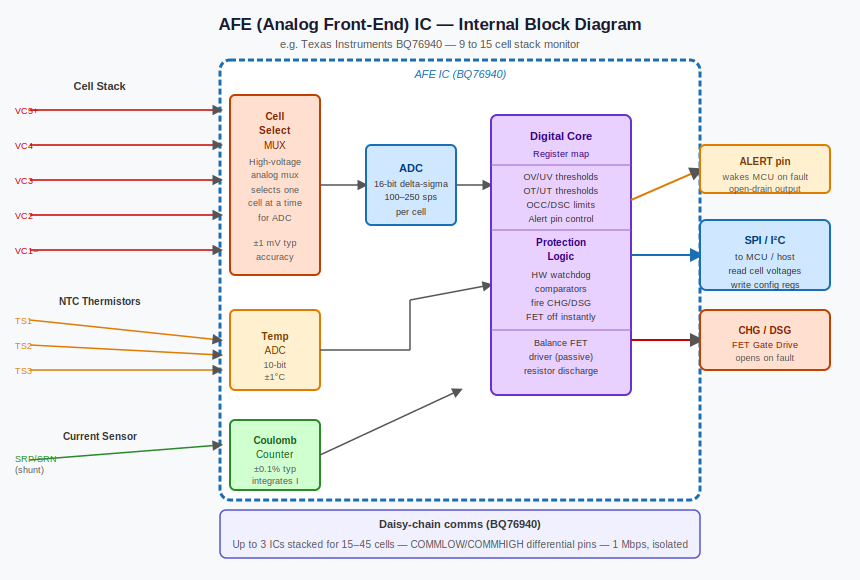
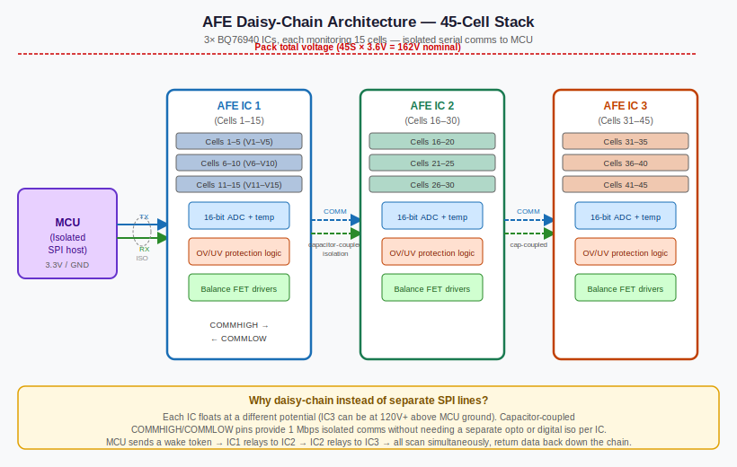

# Analog Front End (AFE) — The Eyes and Ears of the BMS

*Prerequisites: [Battery Pack & Module Architecture →](../battery/battery.md)*
*Next: [Cell Balancing →](./cell-balancing.md)*

---

## Flying Blind Without It

Consider what the BMS is trying to do: protect and manage a system operating across 0–800 V, up to 1000 A of current, and temperatures ranging from −40 to +85 °C — all in real time, all with microsecond-level protection requirements. Now consider that the MCU at the heart of the BMS is a 3.3 V digital chip that would be destroyed instantly if it touched the high-voltage bus directly.

The **Analog Front End (AFE)** is the hardware that bridges these two worlds. It conditions, measures, and digitises the raw analog signals from the battery — cell voltages, pack current, and module temperatures — and hands the MCU clean, calibrated numbers over a safe digital interface. Without it, the BMS is flying blind.

This matters for accuracy as much as safety. A 10 mV cell voltage error can propagate into roughly 0.5–2% SOC error for NMC depending on operating point — more in the flatter regions of the OCV curve, less in the steep mid-charge region (see Experiment 2). Across a drive cycle, that error means premature power cutoffs, range underestimates, or — worse — unreported overcharge conditions. The AFE is where hardware quality becomes software performance.

---

## What an AFE Actually Is

An AFE is a purpose-built integrated circuit for battery monitoring. It is not a general-purpose ADC wired up with some glue logic — it is a chip designed from the ground up for the specific challenges of measuring cells in a high-voltage series string.

Common AFE chips and their cell counts:

| Manufacturer | Part | Cells per chip | Notes |
|---|---|---|---|
| Texas Instruments | BQ76920 | 5-cell | Entry-level, widely used in DIY and low-volume |
| Texas Instruments | BQ76930 | 10-cell | Mid-tier; same register map as BQ76920 |
| Texas Instruments | BQ76940 | 15-cell | Full-featured; most common TI design reference |
| Analog Devices | LTC6804 | 12-cell | isoSPI daisy-chain; automotive staple |
| Analog Devices | LTC6811 | 18-cell | Higher cell count; same isoSPI architecture |
| Analog Devices | LTC6812 | 15-cell | Derivative of LTC6811 with different pinout |
| Maxim | MAX17843 | 14-cell | Automotive-grade; UART-based daisy-chain |
| NXP | MC33771 | 14-cell | Automotive-grade; used in European OEM designs |

What every AFE on this list has in common: differential cell voltage measurement, an internal precision voltage reference, a delta-sigma ADC, cell balancing FET drivers, and a CRC-protected digital output. That combination is why these chips cost considerably more than a general-purpose ADC of comparable resolution — the entire application is designed in.

---

## Cell Voltage Measurement

The fundamental challenge of measuring cells in a series string is that each cell's voltages are referenced to a different potential. Cell 10 in a 15S pack sits with its negative terminal at roughly 36 V above the BMS ground. A conventional single-ended ADC referenced to ground cannot measure it without either being destroyed or measuring something meaningless.

The AFE solves this with **differential measurement**: it measures the potential difference between V+ and V− of each individual cell, independent of where that cell sits in the stack. The absolute voltage relative to ground is irrelevant — only the cell's own 2.5–4.2 V span matters.



The ADC topology used in almost every production AFE is the **delta-sigma** converter. Unlike successive-approximation (SAR) ADCs that are common in microcontrollers, delta-sigma converters operate by massively oversampling the input — hundreds of times above Nyquist — and using a digital decimation filter to extract a high-resolution result. This trades conversion speed for noise rejection and resolution. It is the right trade for battery voltage measurement, where the signal changes slowly (seconds to minutes) but must be resolved to 100 µV or better to be useful for SOC estimation.

Typical performance across common AFEs:

| Parameter | Typical value |
|---|---|
| Resolution | 16-bit |
| Accuracy | ±1–5 mV per cell |
| Full scan time (15 cells) | 1–10 ms |
| Internal voltage reference drift | < 50 ppm/°C |

*Typical values; see BQ76940 datasheet (SLUSBK3) and LTC6811 datasheet (Analog Devices) for guaranteed specifications across temperature and supply.*

The ±1 mV end of that accuracy range is what a premium AFE like the LTC6811 achieves under controlled conditions. The ±5 mV end is what a cost-reduced design achieves after temperature and common-mode variation. For SOC estimation, every mV counts — the OCV-SOC slope of NMC at mid-charge is roughly 20 mV per percent SOC, so a 5 mV measurement error translates directly to 0.25% SOC error per cell.

---

## Current Measurement

Pack current measurement is a different problem. The signal of interest — the voltage drop across a low-value shunt resistor — is in the microvolts to millivolts range, sitting on top of a common-mode voltage that may be hundreds of volts above ground and swinging dynamically with the pack voltage.

The standard approach: a precision **shunt resistor** (typically 0.5–2 mΩ) is placed in the main current path, and the AFE's **high-side current sense amplifier** measures the differential voltage across it. At 100 A through a 1 mΩ shunt, the signal is 100 mV — measurable. At 10 A, it is 10 mV — still measurable, but noise and offset start to matter.

The alternative is a **Hall-effect current sensor**: a contactless measurement using the magnetic field generated by current flow through a conductor. Hall sensors are galvanically isolated from the HV bus, can survive an open-shunt fault gracefully, and add no power dissipation in the main path. The drawback is accuracy: Hall sensors typically achieve ±1–2% accuracy versus ±0.5% or better for a precision shunt. For Coulomb counting, that 1% systematic error compounds — a 1% current error yields a 1% SOC drift per full charge-discharge cycle.

Some AFEs integrate the current sense amplifier internally (TI BQ76940 has a dedicated current input pin). Others expect an external current sense IC, such as the INA219, that communicates its own result to the MCU over I2C.

The accuracy chain matters here: current sensor → Coulomb counter → SOC. Every percentage point of current error is a percentage point of SOC error accumulating silently with each use.

---

## Temperature Measurement

Temperature sensing in an AFE uses **NTC thermistors** — resistors whose resistance decreases as temperature rises, following a strongly nonlinear curve. The AFE applies a known excitation voltage to the thermistor voltage divider, measures the resulting voltage, and converts it to temperature using either the **Steinhart-Hart equation** or a pre-computed lookup table stored in firmware.

The Steinhart-Hart equation:

```
1/T = A + B·ln(R) + C·(ln(R))³
```

where T is in Kelvin, R is the thermistor resistance, and A, B, C are coefficients from the thermistor manufacturer's datasheet. Production BMS firmware almost always uses a lookup table — it is faster and avoids floating-point arithmetic on the MCU — but the physics underneath is Steinhart-Hart.

Accuracy is typically ±1–2 °C, adequate for the thermal management decisions the BMS makes: charge rate derating begins at 45 °C and again below 15 °C, with hard cutoffs at +60 °C and −20 °C (thresholds vary by chemistry and OEM policy).

Thermistor placement is as important as thermistor count. A module with ten cells and one thermistor may completely miss a hotspot if that cell happens to sit away from the sensor. Production automotive packs place thermistors every 3–6 cells, with additional sensors near the cell tabs where resistance heating concentrates.

---

## Why Measurement Accuracy Has a Price Tag

The ±1–5 mV accuracy range in the cell voltage table above is not just a spec to compare across datasheets — it is directly translatable to money lost or saved on every pack shipped.

The first-order argument is about endpoints. Voltage accuracy matters most at the top and bottom of the charge window: a cell voltage reading that is too high triggers premature charge termination before the cell is actually full; a reading that is too low triggers premature discharge cutoff before the cell is actually empty. In both cases, the pack delivers less usable energy than it physically contains. The unusable fraction is capacity that was paid for but cannot be accessed.

The OCV-SOC slope at the cutoff point converts mV of measurement error into percent of lost capacity. For NMC near the top of charge, the curve rises steeply — roughly 60–70 mV per percent SOC. A ±33 mV measurement error at the charge cutoff shifts the perceived charge termination point by roughly 0.5% SOC. For a single $4.25 cell that is immaterial — $0.02 of lost capacity. For a $10,000 battery pack, 0.5% of capacity is $50. The value of accuracy scales with the size and cost of the pack:

```
$ per mV ≈ battery cost ($) / OCV-SOC slope (mV / %SOC) at the cutoff point
```

For a $10,000 NMC pack, this gives roughly $7 per mV at the top of charge. That is the economic case for paying a few dollars more per chip for a higher-accuracy AFE.

**LFP changes the numbers significantly.** The LFP OCV-SOC curve has a long flat plateau from roughly 20–90% SOC where the slope approaches zero. In this plateau region, 10 mV of voltage difference can correspond to tens of percent SOC difference — voltage alone cannot tell the BMS where it is in the operating window. At the endpoints where the LFP curve steepens, the slope is roughly half that of NMC, so $/mV is approximately double. In the mid-range plateau the slope is so small that the $/mV for balancing decisions becomes very large — this is why tight voltage accuracy and reliable current measurement (for coulomb counting) are proportionally more important for LFP packs than for NMC.

**Balancing introduces a further mechanism.** The analysis above treats each cell independently. In a real series string, voltage measurement error can produce *measurement-induced imbalance*: the BMS balances cells to equal *measured* voltages, but if two cells have offsetting measurement errors, a real SOC gap remains after balancing completes. That residual imbalance propagates through the discharge — the worse-measured cell hits its cutoff voltage first, stranding energy in the other cells. The capacity lost depends on the OCV-SOC slope at the point where balancing happens relative to the slope at the discharge endpoint, which varies with chemistry and operating conditions.

The practical implication: when comparing two AFE chips with different accuracy specs, the relevant question is not "how different are the headline numbers?" but "how much pack capacity — and pack cost — does that difference represent at my system's battery cost and chemistry?" A 2 mV improvement in accuracy means much more for a $15,000 LFP bus battery than for a $300 e-scooter pack.

For the full derivation — including the exact capacity-loss formula accounting for both the balancing point slope and the endpoint slope, worked numerical examples for a car-sized and a skateboard-sized pack, and a careful reading of how three commercial AFE datasheets present their accuracy figures across temperature and solder shift — Ania Mitros's BMS course covers this rigorously in its "Value of Accuracy" module: [Ania's BMS Course](https://ofb.net/~ania/Anias-BMS-course/).

---

## Balancing Control

The AFE's role in balancing is to act as the gatekeeper: the BMS MCU decides *which* cells to balance; the AFE provides the gate drive to make it happen.

Each cell channel in the AFE has a corresponding **control bit** in a balancing register. When the MCU writes a 1 to that bit, the AFE turns on a MOSFET gate driver that connects an external bleed resistor across that cell. Current flows through the resistor, dissipating the cell's excess energy as heat — this is **passive balancing**. The resistor value (typically 10–100 Ω, chosen based on cell capacity and the module's thermal budget) sets the balancing current, typically 50–200 mA — illustrative example values; actual designs vary. The AFE includes internal temperature monitors that will automatically disable balancing if die temperature rises too high.

This architecture means the AFE never makes balancing decisions independently. It executes what the MCU requests, but the MCU's balancing algorithm — which cells are high, by how much, and in what order to discharge them — runs entirely in software. The AFE just controls the switches.

---

## Communication Interface to the MCU

Different AFE families use different digital interfaces; knowing which your chip uses determines MCU wiring, firmware libraries, and isolation design.

**TI BQ76920 / BQ76930 / BQ76940 use I2C** (up to 400 kHz fast mode). The interface uses standard I2C register semantics: write a register address, then read back one or more data bytes. BQ76920 and BQ76940 share I2C address 0x08; BQ76930 uses 0x10. Pull-up resistors (4.7 kΩ to 3.3 V) are required on SDA and SCL.

A typical BQ76940 cell voltage read over I2C:

```
1. Send START + address 0x08 + WRITE bit
2. Write register address 0x0C (VC1_HI)
3. Send REPEATED START + address 0x08 + READ bit
4. Read 2 bytes: VC1_HI and VC1_LO (14-bit raw ADC count, packed)
5. Send STOP
6. Compute: V_cell = raw_count × GAIN + OFFSET
   (GAIN and OFFSET are factory-trimmed calibration values stored in the chip's own registers — read them at startup)
```

Arduino Wire library equivalent:

```cpp
Wire.beginTransmission(0x08);   // BQ76940 I2C address
Wire.write(0x0C);               // VC1_HI register
Wire.endTransmission(false);    // repeated start
Wire.requestFrom(0x08, 2);
uint8_t hi = Wire.read();
uint8_t lo = Wire.read();
int16_t raw = ((hi & 0x3F) << 8) | lo;
float voltage_V = raw * 0.000382f;  // ~382 µV/LSB; use actual GAIN register for calibration
```

The BQ769x0 does not append a PEC (packet error code) by default. Implement application-level plausibility checks in firmware — voltage within the valid cell range, scan-complete flag set — rather than relying on a transport-layer CRC.

**Analog Devices LTC6804 / LTC6811 use isoSPI** — a transformer-isolated differential variant of SPI with CRC (PEC) on every transaction. Commands such as ADCV (start ADC conversion) and RDCV (read cell voltage group) are LTC-family-specific. Many application notes describing "SPI transactions with RDCV and PEC" refer to this family, not TI BQ769x0.

Key register groups in the BQ76940:

| Register group | Contents |
|---|---|
| Configuration | OV/UV thresholds, ADC gain, protection enable, temperature source select |
| Status | ALERT flags: OV, UV, OT, SCD, OCC |
| Cell voltage data | Raw ADC counts for each cell (multiply by gain + offset) |
| Temperature data | ADC counts for each thermistor channel |
| Balancing control | Per-cell balancing enable bits |

The OV (overvoltage) and UV (undervoltage) thresholds loaded during initialisation are the primary software-side protection gates. If any cell voltage exceeds the OV threshold, the corresponding bit sets in the STATUS register and the ALERT pin goes low, waking the MCU from sleep if necessary.

---

## Daisy-Chain Topology for Large Packs

A single AFE chip handles 5–18 cells. A production EV pack may have 90S, 96S, or 108S cells — far beyond one chip. The solution is a **daisy-chain**: multiple AFE chips wired in series, each monitoring its module, with data flowing up and down the chain to a single MCU interface point.



The challenge with daisy-chaining is isolation. Each AFE chip floats at its module's high-voltage potential relative to the BMS MCU. The AFE for module 6 in a 90S pack sits at roughly 300 V above ground. Running a direct SPI bus between that AFE and the MCU is impossible without isolation.

Analog Devices solved this with **isoSPI** (used in LTC6804 and LTC6811): a transformer-isolated differential communication scheme that uses narrow-pulse encoding. Each AFE connects to the next via a small pulse transformer — the signal crosses the isolation barrier, but no DC path exists. The MCU, sitting at chassis ground, sends a broadcast command that propagates down the chain; each AFE adds its data and passes it along. Responses propagate back up. The MCU interacts with the entire stack through a single isoSPI port.

The practical result: the BMS MCU is fully isolated from the high-voltage bus, sees nothing above its 3.3 V logic levels, and can read every cell voltage in the pack with a single broadcast transaction. The isolation barrier (typically rated to 1000 V) is embedded in the transformer, not added as an external component.

For TI-based designs (BQ76940), isolation requires external I2C isolators (e.g., TI ISO1541) between the MCU and each chip's I2C lines. The hardware is more complex because TI's BQ769x0 family does not include a built-in daisy-chain scheme equivalent to isoSPI. Some production BMS designs use a hybrid approach: LTC chips for the daisy-chain and TI fuel-gauge ICs for SOC estimation.

---

## Hardware-Speed Protection

Software protection runs at the MCU's sample rate — perhaps every 10–100 ms. For a cell undergoing thermal runaway or an external short circuit, that is an eternity.

Most AFEs include a hardware protection layer that operates independently of the MCU. **Overvoltage and undervoltage comparators** inside the AFE continuously compare each cell voltage against programmed thresholds. If any cell crosses the threshold, the AFE immediately pulls the ALERT pin low — this can trigger an external protection FET directly, with microsecond latency, before the MCU has even woken from its sleep state.

The protection FET (or contactor) in the main current path opens, disconnecting the pack. The MCU eventually wakes, reads the fault from the AFE status registers, logs it, and decides whether to attempt recovery or maintain lockout.

This hardware protection layer is the final backstop: it activates even if the MCU is frozen, running wrong code, or caught in a software fault. The AFE's hardware is the cell's last line of defence against software failures — which is why production BMS designs treat the AFE's OV/UV threshold programming as a safety-critical initialisation step, verified after every power-on reset.

---

## Experiments

### Experiment 1: Interface with a BQ76940 Eval Board

**Materials**: TI BQ76940EVM or BQ76920 breakout board, Arduino Uno, 5 or 15 Li-ion 18650 cells, jumper wires, Arduino serial monitor, precision DMM.

**Procedure**:
1. Wire the eval board per TI's reference schematic: I2C lines (SDA to Arduino A4, SCL to A5) with 4.7 kΩ pull-up resistors to 3.3 V on each line, ALERT pin to a digital input, 12 V supply to board VCC.
2. Write an Arduino Wire (I2C) driver using the TI BQ76940 register map (datasheet SLUSBK3): read the GAIN and OFFSET calibration registers at startup, then issue a register-address write followed by a 2-byte read for each cell voltage register pair.
3. Parse the 12-bit raw ADC counts: `V_cell = (raw × GAIN / 1000) + OFFSET` (gain and offset are trimmed values stored in the AFE's own registers — read them first).
4. Print all cell voltages to serial at 1 Hz. Simultaneously measure each cell with a DMM.

**What to observe**: The I2C transaction structure — address phase, register write, repeated start, data bytes. Compare AFE readings to DMM: you should see agreement within ±5 mV under low-noise conditions. Introduce a twist in a cell wire and watch whether the AFE reading shifts — this illustrates common-mode noise pickup.

---

### Experiment 2: Measurement Error → SOC Error

**Materials**: Same AFE setup, plus a precision voltage reference IC (e.g., LT1021 or REF5025), resistors to build a cell simulator network.

**Procedure**:
1. Build a resistor divider network from the precision reference to simulate 5 cell voltages at known values (e.g., 3.800, 3.801, 3.799, 3.802, 3.800 V).
2. Apply this network to the AFE input pins instead of real cells.
3. Read and record the AFE's reported values. Compute the error in mV against the known reference values.
4. Using an NMC OCV-SOC table (from the SOC post experiment or a published datasheet), compute the SOC error that each mV of voltage error implies at different operating points.

**What to observe**: In the steep portion of the NMC OCV-SOC curve (around 3.8–4.0 V), 5 mV of error may correspond to only 0.25% SOC error. On the flat LFP plateau (~3.2–3.35 V), the same 5 mV could mean 5–20% SOC error. This is the direct hardware reason why SOC estimation is harder for LFP — and why tighter AFE accuracy specifications are more valuable for LFP packs than for NMC.

---

### Experiment 3: Two-Chip Daisy-Chain Simulation

**Materials**: 1× BQ76920 breakout board (5-cell, I2C address 0x08) and 1× BQ76930 breakout board (10-cell, I2C address 0x10), 10× 18650 cells, Arduino, jumper wires with 4.7 kΩ pull-up resistors. (Two BQ76920 chips share address 0x08 and cannot co-exist on the same bus without an I2C multiplexer such as the TCA9548A — using BQ76920 + BQ76930 avoids this constraint.)

**Procedure**:
1. Wire chip 1 (BQ76920, addr 0x08) to cells 1–5, chip 2 (BQ76930, addr 0x10) to cells 6–10. Connect both chips' SDA and SCL to the Arduino A4/A5 bus with shared 4.7 kΩ pull-up resistors.
2. Write a polling loop: send I2C transactions to addr 0x08, read chip 1 voltages; send I2C transactions to addr 0x10, read chip 2 voltages. Assemble the complete 10-cell voltage array.
3. Print the full array in a single serial report labelled by cell number.
4. Deliberately imbalance one cell (use a cell with a different SOC). Observe which cell stands out in the report.

**What to observe**: The multi-chip coordination — how the MCU must address each chip in turn and reassemble cell indices from multiple I2C transactions. Compare the software complexity to the single-chip case. This experiment makes concrete why isoSPI daisy-chain with a broadcast command is attractive at scale: with 8 chips instead of 2, per-chip CS management becomes a maintenance burden.

---

## Further Reading

- **Mitros, A.** — *Ania's BMS Course* (2023) — "Value of Accuracy" module: derives the $/mV and $/A metrics for voltage and current measurement accuracy, works through NMC vs LFP comparisons, and shows how to read AFE datasheet accuracy tables critically (temperature range, solder shift, long-term drift). Available at [ofb.net/~ania/Anias-BMS-course/](https://ofb.net/~ania/Anias-BMS-course/).
- **Andrea, D.** — *Battery Management Systems for Large Lithium-Ion Battery Packs* (Artech House, 2010) — Chapter 7 covers AFE chip selection, interface design, and layout considerations. The most practical hardware-focused BMS reference available.
- **TI BQ76940 Datasheet** (Texas Instruments, SLUSBK3) — the complete register map, timing diagrams, protection threshold programming, and application schematics. The primary reference for BQ-series BMS firmware development. Download directly from TI.
- **TI BQ76940 Product Page** (Texas Instruments, ti.com/product/BQ76940) — links to the datasheet (SLUSBK3), reference design, and evaluation module user guide. The BQ76940 uses I2C; the datasheet contains the full register map, I2C timing diagrams, GAIN/OFFSET calibration procedure, and example firmware flow.
- **Analog Devices LTC6804 Datasheet** (Analog Devices, LTC6804-1) — isoSPI daisy-chain architecture is explained thoroughly in the application section. The timing diagrams for broadcast vs addressed commands are the clearest in the industry.
- **Analog Devices AN-2394** — "LTC6804 Battery Stack Monitor Demonstration System" — system-level schematic, firmware architecture, and layout recommendations for a 12-cell daisy-chain.
- **TI Application Report SLVA729** — "Li-Ion Battery Pack Protection Fundamentals" — explains the hardware protection FET topology and how AFE protection outputs connect to the main contactor or mosfet array.
- **GitHub: nwesem/bq76940_arduino** — open-source Arduino I2C library for the BQ76940; the register access functions are a clean starting point for custom firmware.
- **GitHub: analogdevicesinc/Linduino** — LTC6804 and LTC6811 Arduino examples from Analog Devices. Includes isoSPI setup and multi-chip broadcast read routines.
- **Razavi, B.** — *Design of Analog CMOS Integrated Circuits* (McGraw-Hill, 2nd ed.) — Chapter 12 covers delta-sigma ADC architecture in depth. Relevant for engineers who want to understand why the AFE's ADC topology was chosen over SAR.
