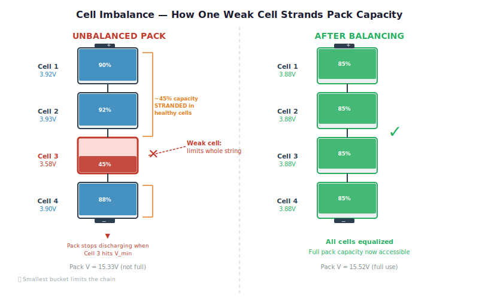
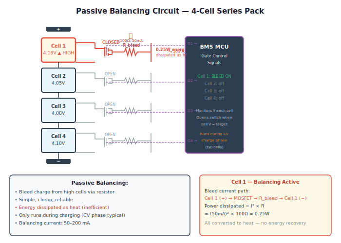
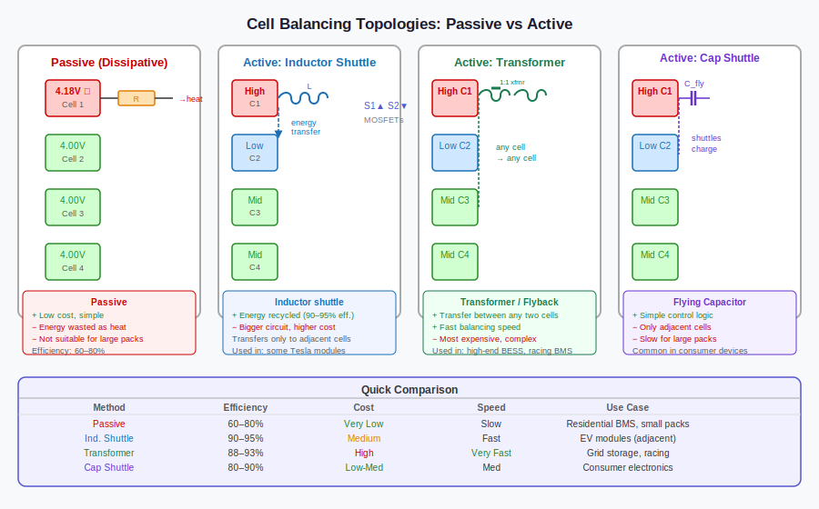

# Cell Balancing — Why One Weak Cell Ruins the Whole Pack

*Prerequisites: [State of Charge (SOC) →](./state-of-charge-soc.md), [Analog Front End (AFE) →](./analog-front-end-afe.md)*
*Next: [Charging Algorithm →](./charging-algorithm.md)*

---

## The Chain of Buckets

Imagine filling a row of buckets connected by a pipe at the bottom. Pour water in at one end and it distributes itself until every bucket is at the same level. Now add one bucket that is slightly smaller than the rest. When that small bucket reaches its rim, water spills — even though the other buckets still have room. You had to stop filling before the others were full.

Draining works the same way in reverse. The small bucket empties first and the drain must stop there, even with water remaining in the others.

This is exactly the situation inside an EV battery pack. Series-connected cells must carry the same current — there is no other path. Charge stops when the highest-voltage cell hits its maximum. Discharge stops when the lowest-voltage cell hits its minimum. A pack of 100 cells where 99 are healthy and one is 5% weaker will operate as if it has 95% of its rated capacity. That 5% capacity deficit translates directly to lost range — every charge cycle, every discharge cycle, for the life of the pack.

**Cell balancing** is the BMS function that counteracts this effect by redistributing charge among cells to keep them at matching states of charge.

---

## Why Cells Go Out of Balance

Fresh from the factory, even "matched" cells from the same production batch have inherent variation. Capacity spread of ±2–5% is typical in commercial 18650 and prismatic cells before any matching or sorting is applied. A 100-cell pack sourced without capacity matching could start life with a 5–10% spread between its weakest and strongest cell.

Manufacturing variation is the starting point, but it is not the endpoint. **Differential aging** is what turns a small initial spread into a large operational problem over years of use.

Temperature gradients within a battery pack create the main driver of differential aging. Cells at the edge of a module, or near a cooling channel, run cooler than cells in the thermal centre. Cooler cells age more slowly — their capacity degrades less per cycle. After a few hundred cycles, the cells that ran hotter have noticeably lower capacity than their cooler neighbors. The pack started balanced and drifted apart through uneven thermal loading.

**Self-discharge variation** adds another source. Every cell has a slightly different rate of parasitic self-discharge — the slow electrochemical leakage that drains a cell even when no external current is drawn. A spread of 0.5–1% SOC per month among cells in the same pack accumulates over months of storage. A fleet vehicle left parked for two months returns from storage with cells that have diverged measurably in SOC even if they started matched.

These effects are cumulative. A pack that starts with ±2% capacity spread, experiences thermal gradients in service, and sits in storage between uses can easily reach ±10% SOC imbalance within three to five years of operation. Without balancing, that imbalance compounds — the weak cell limits the pack more severely each cycle, accelerating its relative degradation further.

---

## Why Imbalance Matters

The capacity loss effect is the most visible consequence, but safety is the more urgent concern.

**Capacity loss**: in a balanced 100 Ah pack, the usable window runs from the pack's minimum SOC to its maximum. With a 5% imbalance, the weakest cell's minimum is hit before the others are depleted, and the strongest cell's maximum is hit before the others are full. The effective usable capacity shrinks by roughly 1–3× the imbalance percentage — so a 5% imbalance costs 5–15 Ah from a 100 Ah pack, depending on how the cells have diverged in their OCV-SOC curves.

**Overcharge risk**: if the BMS charges to a pack voltage that would be safe for a balanced string, but one cell is already at a higher SOC than the others, that cell reaches its maximum voltage first. The BMS sees the pack voltage as still-acceptable and continues charging. The high cell is overcharged — pushed beyond 4.2 V for NMC — into a regime where lithium plating on the anode begins and thermal runaway risk increases. This is why per-cell voltage monitoring (not just pack-level voltage) is mandatory for safety.

**Deep discharge risk**: the symmetric failure on the discharge side. The weakest cell reaches V_min first. Without per-cell monitoring, the pack might continue discharging, pushing that cell into deep discharge and the copper dissolution regime described in the [previous post](./deep-discharge-protection.md).

Per-cell monitoring by the [AFE](./analog-front-end-afe.md) catches both failure modes — but monitoring alone does not fix the imbalance. Balancing is the active corrective mechanism.

---

## Passive Balancing

The simpler and more common approach is **passive balancing**: bleed excess charge from high-SOC cells through a resistor until all cells converge to the lowest SOC in the string.

The circuit is minimal. Each cell has a bleed path consisting of a resistor in series with a MOSFET switch. The BMS closes the switch on any cell whose voltage exceeds the target, allowing current to flow through the resistor and dissipate the excess charge as heat. When that cell's voltage drops to match the target, the switch opens.

The implementation is straightforward enough to integrate directly into AFE ICs — many commercial AFE chips include passive balancing FETs and drivers as on-chip features, requiring only the external bleed resistors. This keeps BOM cost low and the circuit compact.

**Typical bleed currents** run 50–200 mA. At the high end, a 200 mA bleed on a 3.6 V cell dissipates 720 mW per active balancing channel. In a 16-cell module with several channels active simultaneously, thermal design matters — the dissipation must be accounted for in the pack's thermal management layout.

**The fundamental limitation** of passive balancing is that it wastes energy. Charge is not transferred from a high cell to a low cell — it is converted to heat and lost. For a pack with a 5% imbalance that is corrected on every charge cycle, the energy wasted in balancing resistors over the pack's lifetime is not trivial. For a large truck or bus pack with 400+ cells, this becomes a meaningful efficiency penalty.

**When balancing happens**: most passive balancing implementations run during the **constant-voltage (CV) phase** of charging, when charge current is already tapering and the cells are near full. This minimises the time available for balancing — typically 30–60 minutes per charge cycle. The relatively low bleed current (50–200 mA) compared to normal charge/discharge rates (10–50 A) means balancing is intrinsically slow. Correcting a 5% imbalance in a 100 Ah pack at 200 mA takes 25 Ah / 0.2 A = 125 hours of continuous balancing. In practice, small imbalances are corrected incrementally across many charge cycles; large imbalances require many cycles or a deliberate multi-day balancing session at low power.

---

## Active Balancing

**Active balancing** transfers charge from high-SOC cells to low-SOC cells rather than dissipating it. No energy is wasted as heat — the charge that leaves a high cell arrives at a low cell. In principle, 100% efficient; in practice, conversion losses mean 85–95% transfer efficiency, which is still dramatically better than passive balancing's 0%.

Three main topologies are used in practice.

**Capacitor shuttling** is the simplest active approach. A flying capacitor is charged from the high cell, then switched to discharge into the low cell. The circuit is switched at tens of kilohertz. Each switching cycle transfers a small packet of charge. The approach is well-suited to adjacent-cell balancing and has low component count. Its limitations are relatively low transfer power and that it can only directly balance neighboring cells — transferring charge across the string requires many switching cycles.

**Inductor/flyback (switched-mode converter)** uses an inductor as the energy transfer element, operating as a bidirectional DC-DC converter between cells. Transfer rates are higher than capacitor shuttling, and the converter can be configured to balance non-adjacent cells. This is the most common active balancing topology in high-performance BMS designs. The tradeoff is circuit complexity and the need for careful EMC design — switched inductors at high frequency require attention to radiated emissions in an automotive environment.

**Transformer-based isolation** uses a multi-winding transformer to allow any cell to transfer charge to any other cell in the string, including across large voltage differentials. This enables "any-to-any" balancing and is the most flexible topology. Cost and size are the barriers — a multi-winding transformer for a 100-cell string is a significant component.

Active balancing's advantages are most pronounced in large packs — truck and bus applications where pack size makes passive balancing energy losses economically significant, and where the balancing currents needed for meaningful correction within a reasonable time frame would produce unacceptable heat in a passive system. In smaller passenger EV packs, the cost and complexity premium of active balancing is harder to justify, which is why passive balancing remains dominant in that segment as of 2026.

---

## Top Balancing vs Bottom Balancing

The SOC level at which cells are equalised — the balancing target — matters as much as the balancing method.

**Top balancing** equalises cell SOCs at the top of the charge window. The BMS bleeds charge from higher-SOC cells during the CV phase until all cells end the charge cycle at the same voltage (at or near Vmax). At the start of every discharge, every cell is at its maximum SOC.

The advantage is that the pack is as full as possible at the beginning of each discharge, maximising available range. The limitation is that top balancing cannot prevent the weakest cell from running out first during discharge. Cells with smaller capacities — whether from manufacturing variation or aging — have less Ah to give at the same current. Even if all cells start a discharge at identical SOC, the weakest cell depletes its SOC faster, reaches Vmin first, and forces the pack to stop. The stronger cells still have energy remaining at that point. Top balancing equalises the starting SOC but does not remove the underlying capacity mismatch.

**Bottom balancing** takes the opposite approach: cells are arranged so they all reach Vmin simultaneously at the end of a full discharge. To make cells with different capacities arrive at empty together, the stronger cells must start each discharge at a lower SOC than they are capable of reaching. In practice this means the charger must stop when the weakest cell hits Vmax during charging — before the larger-capacity cells are fully filled. The pack can never be charged to its full energy potential; the strong cells spend their lives partially under-charged.

Bottom balancing was historically used in applications where driving any individual cell into deep discharge was the primary risk (some stationary storage and industrial systems). For EVs it is the wrong trade: you give up the ability to fully charge the pack, and the weak-cell discharge limit still exists (now it is the weak cell that the charge was designed around, not an outlier that drifted).

Modern EV BMS designs use top balancing universally. It is straightforward to implement (balancing runs naturally during the CV phase), it ensures all cells begin each drive at maximum SOC, and per-cell overvoltage monitoring handles the early-Vmax event that stops the charge. The discharge limitation — weakest cell hits Vmin first — is accepted and managed through cell sorting at pack assembly and consistent balancing across many charge cycles.

---

## The Balancing Algorithm

The BMS balancing algorithm runs as a background task during the CV phase of charging, cycling through a measure–decide–bleed loop:

1. **Stop all active bleed paths** — open all balancing FETs. A 50 mA bleed current through a 100 Ω resistor creates a voltage drop that corrupts the cell voltage reading; measurement must happen with the bleeds off.
2. **Wait for voltages to settle** — 50–200 ms is typically sufficient for cell voltages to stabilise after the FETs open.
3. **Read all cell voltages** from the AFE.
4. **Check preconditions** — only proceed if: pack is in CV phase, pack temperature is below the thermal limit (typically 40–45 °C), and no cell voltage is below a safety floor. If any condition fails, hold balancing off and check again on the next cycle.
5. **Identify the target** — for passive top balancing, the target is the lowest cell voltage in the string. All higher-voltage cells will balance down toward it.
6. **Mark cells for balancing** — any cell whose voltage exceeds the target by more than the start threshold (typically 10–30 mV) is flagged for bleed.
7. **Enable bleed paths** for all flagged cells simultaneously — assert gate signals, bleed current flows through the resistors.
8. **Run for a fixed bleed interval** (typically 10–30 seconds), then return to step 1 and re-measure.

The stop threshold (typically 5–10 mV) is tighter than the start threshold. This hysteresis prevents FET chatter: a cell that begins balancing at +20 mV above target will not stop until it falls within 5 mV. Convergence is gradual — each measure–bleed cycle removes a small increment of imbalance, and meaningful correction accumulates across many charge sessions.

<iframe src="../../assets/bms-concepts/cell-voltage-convergence.html" width="100%" height="900" frameborder="0"></iframe>

The convergence animation above shows a typical CV-phase balancing session: cells start spread across a 50 mV window, bleed balancing activates on the high cells, and all voltages converge to the target over the course of the CV phase. Note that convergence is not instantaneous — the 50–200 mA bleed current is small relative to the cell capacity, and meaningful convergence requires sustained balancing across multiple charge cycles.

**SOC-based vs voltage-based balancing**: a more sophisticated implementation balances based on estimated cell SOC rather than raw voltage. This is more accurate because the OCV-SOC relationship is nonlinear — a 10 mV difference in voltage represents very different SOC differences at different points on the curve. At the steep part of the NMC OCV curve, 10 mV is a small SOC difference; in the flat LFP plateau, 10 mV is a large SOC difference. SOC-based balancing decisions are more consistently meaningful across the operating range.

For further detail on how the AFE enables per-cell measurement at the hardware level, see the [AFE post](./analog-front-end-afe.md). For how balancing interacts with capacity fade tracking, see the [SOH post](./state-of-health-soh.md).

---

## Practical Considerations

**Cell sorting at manufacturing**: before a pack is assembled, cells are sorted by capacity and internal resistance. Cells within a narrow matched range are grouped into modules together. This reduces the initial imbalance that balancing must correct over the pack's life — a sorted and matched pack might start with ±0.5% spread rather than ±3–5%. The balancing system still matters for managing the divergence that develops with use, but a well-sorted initial assembly reduces the lifetime burden on the balancing circuit.

**Module-level vs cell-level balancing**: in large packs with hundreds of cells, full cell-level active balancing every cell is complex and expensive. Many large pack designs implement balancing at the module level — groups of 8–16 cells are balanced internally, and module-level balancing handles any module-to-module divergence. This reduces circuit complexity at the cost of some granularity.

**Balancing is slow relative to driving**: the rate at which balancing corrects imbalance is much slower than the rate at which driving creates it. A 30-minute fast charge provides perhaps 15–20 minutes of CV-phase balancing time at 100–200 mA. A long high-power drive session may create more imbalance than that 20-minute window can correct. Balancing is a steady, cumulative correction rather than a per-cycle reset. This is why packs with good thermal management — which reduces differential aging — need less balancing capacity than poorly cooled packs.

**Thermal runaway interaction**: an unbalanced cell that is overcharged due to imbalance is the most direct link between cell balancing failure and thermal runaway. See the [Thermal Runaway Detection post](./thermal-runaway-detection.md) for how the BMS detects the downstream consequences if balancing fails.

---

## Experiments

### Experiment 1: Measure Cell-to-Cell Voltage Spread After a Charge Cycle

**Materials**: 3–4 18650 NMC cells of mixed age or source (ideally some that have been cycled more than others), bench charger, INA219 + Arduino, DMM

**Procedure**:
1. Charge all cells individually to 4.2 V (CC-CV). Rest 1 hour. Record OCV for each cell.
2. Connect cells in series (without a balancing circuit). Discharge the series string at C/5 through a resistive load until the string voltage hits 4 × V_min. Remove the load and rest 30 minutes.
3. Measure the open-circuit voltage of each cell individually. Record the spread.
4. Repeat the charge (all cells together in the series string via a string charger if available, or individually) and discharge cycle two more times. Record the spread after each cycle.

**What to observe**: Even cells that started at the same OCV after individual charging will begin to diverge as their small capacity differences accumulate over cycles. The weakest cell will reach V_min first, limiting the discharge. Quantify how much capacity is left in the other cells when the weak cell hits its limit — this is the capacity penalty of imbalance. If you have an older and a newer cell, the divergence will be more dramatic and visible within fewer cycles.

---

### Experiment 2: Build and Test a Passive Balancing Circuit

**Materials**: 2–3 18650 NMC cells, N-channel MOSFETs (2N7000 or similar), resistors (10–47 Ω, depending on desired bleed current), Arduino + INA219, breadboard

**Procedure**:
1. Charge one cell to 4.05 V and another to 3.85 V — a deliberate 200 mV imbalance representing a significant SOC spread.
2. Wire a bleed circuit: MOSFET drain to cell positive, source through resistor to cell negative. Connect the MOSFET gate to an Arduino digital output pin.
3. Write a simple sketch: read both cell voltages via INA219, turn on the bleed MOSFET for the high cell when its voltage exceeds the low cell by more than 20 mV, turn it off when the gap is less than 5 mV. Log voltages every 5 seconds.
4. Run the balancing loop and log until the cells converge within 10 mV.

**What to observe**: The high cell's voltage slowly decreases as charge bleeds through the resistor. Measure the resistor temperature with a fingertip or IR thermometer during balancing — feel the heat that represents wasted energy. Time how long convergence takes. Calculate the energy wasted as heat (power = V²/R × time of bleed) vs the energy that would have been transferred if this were active balancing. This makes the passive-vs-active efficiency tradeoff tangible.

---

### Experiment 3: Quantify the Capacity Penalty of Imbalance

**Materials**: 2 18650 NMC cells (one well-cycled, one newer), Arduino + INA219, resistive load, bench charger

**Procedure**:
1. Measure individual capacity of each cell: charge to 4.2 V (CC-CV), rest 1 hour, discharge at C/5 to 2.8 V, measure total Ah. Record as Q_cell1 and Q_cell2. This establishes the capacity difference.
2. Connect the two cells in series. Charge the series string to 2 × 4.2 V = 8.4 V using a two-cell string charger (or charge each cell individually to 4.2 V then reconnect).
3. Discharge the series string at C/5 (based on the smaller cell's capacity). Stop when either cell hits 2.8 V. Record total Ah discharged.
4. Compare to the theoretical maximum Ah: min(Q_cell1, Q_cell2). How much capacity is still in the stronger cell when the weaker cell hits V_min?

**What to observe**: The series string can only deliver as many Ah as the weakest cell — even though the stronger cell still has charge. The difference between the stronger cell's remaining capacity and zero is the capacity penalty directly attributable to imbalance. If your two cells differ by 10% in capacity, the pack delivers roughly 10% less than its rated capacity. This is the chain-of-buckets effect that we discussed earlier.

---

## Further Reading

- **Plett, G.L.** — *Battery Management Systems, Vol. 1* (Artech House, 2015) — Ch. 6–7 cover cell balancing strategies, SOC-based balancing algorithms, and the interaction between balancing and SOC estimation.
- **Andrea, D.** — *Battery Management Systems for Large Lithium-Ion Battery Packs* (2010) — Ch. 7: detailed passive and active balancing circuit topologies with component selection guidance.
- **Cao, J. et al.** (2008) — "A new battery/ultracapacitor hybrid energy storage system for electric, hybrid, and plug-in hybrid electric vehicles" — *IEEE Trans. Power Electronics* — covers active balancing topologies in the context of hybrid storage systems.
- **Baronti, F. et al.** (2014) — "Active balancing of Li-ion batteries: the effect of balancing on the lifetime of the battery" — *IEEE IECON* — quantifies how active balancing extends pack lifetime by reducing differential aging.
- **Severson, K.A. et al.** (2019) — "Data-driven prediction of battery cycle life" — *Nature Energy* — shows that variance in per-cell degradation, detectable early, predicts pack-level capacity fade; directly relevant to why sorting matters.
- **Attia, P.M. et al.** (2020) — "Closed-loop optimization of fast-charging protocols for batteries with machine learning" — *Nature* — fast charging creates more imbalance; understanding the charging protocol informs balancing requirements.
- Texas Instruments BQ76940 datasheet and application note SLUA891 — practical passive balancing implementation in a commercial AFE, including FET selection and thermal design.
- Battery University — "BU-803a: Cell Mismatch, Balancing" — accessible overview of imbalance causes and balancing methods for an enthusiast audience.
- Orion BMS User Manual — Section on cell balancing configuration: threshold voltages, balancing current settings, and thermal cutoffs — a real-world reference for balancing parameter selection.
- [State of Health (SOH) →](./state-of-health-soh.md) — how differential aging is tracked and how capacity fade in individual cells is detected.
- [Battery Thermal Management →](../battery/cooling.md) — reducing thermal gradients within the pack is the upstream intervention that slows differential aging and reduces the lifetime balancing burden.
