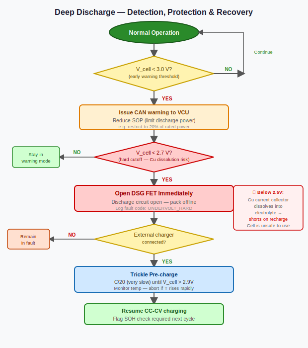

# Deep Discharge Protection — Why Dead Isn't Just Empty

*Prerequisites: [State of Charge (SOC) →](./state-of-charge-soc.md)*
*Next: [Cell Balancing →](./cell-balancing.md)*

---

## The Phone That Won't Wake Up

You have probably left a phone in a drawer for six months and come back to find it completely dead — not just drained, but unresponsive. Sometimes it refuses to charge. Sometimes it revives slowly on a trickle current for ten minutes before the charging screen even appears. In the worst cases it never recovers at all.

What happened is not simply "the battery ran out." The battery ran out, and then kept discharging — slowly, through its own internal leakage — until the voltage dropped below the threshold where safe chemistry ends and irreversible damage begins. The phone went from empty to harmed.

In an EV, this same failure mode carries far higher stakes. A 90 kWh pack contains hundreds of cells in series and parallel. Any cell that slips into deep discharge during prolonged storage, a parasitic drain fault, or a 12V auxiliary battery failure can sustain permanent electrochemical damage — damage that reduces pack capacity, increases internal resistance, and in the worst case creates the preconditions for an internal short circuit.

**Deep discharge protection** is the BMS subsystem that detects when a cell is approaching or has crossed this threshold and acts to prevent or minimise the harm. Understanding it requires knowing exactly what that threshold is, why it exists, and what happens inside the cell when it is violated.

---

## What Deep Discharge Actually Means

**Normal operating range** for a lithium-ion cell has a defined lower voltage limit — called **V_min** or the **undervoltage cutoff** — that is set conservatively above the electrochemically safe floor.

| Chemistry | Nominal V_min (BMS cutoff) | Absolute minimum | Typical full charge |
|-----------|---------------------------|------------------|---------------------|
| NMC       | 2.8–3.0 V                 | ~2.0 V           | 4.2 V               |
| NCA       | 2.8–3.0 V                 | ~2.0 V           | 4.2 V               |
| LCO       | 3.0 V                     | ~2.5 V           | 4.2 V               |
| LFP       | 2.5 V                     | ~2.0 V           | 3.65 V              |
| LTO       | 1.5 V                     | ~1.0 V           | 2.8 V               |

**Deep discharge** means the cell voltage has dropped below V_min into the damage zone — not merely to zero SOC as the BMS reports it, but physically below the cutoff the BMS is designed to enforce. This happens when the discharge protection mechanism itself fails or is bypassed: the BMS powers down due to auxiliary battery failure, a fault is not detected in time, or the cell self-discharges during months of unmonitored storage.

The distinction matters enormously. A cell at SOC = 0% as reported by the BMS is sitting at V_min with its cathode material fully lithiated and its anode depleted — but structurally intact. A cell at 1.8 V has crossed into a regime where the electrochemistry itself begins to attack the cell's physical structure.

---

## The Copper Dissolution Mechanism

Below approximately 2.0 V, the copper current collector on the anode side — a thin foil that mechanically supports the graphite electrode and conducts current out of the cell — begins to oxidise electrochemically.

The reaction is:

```
Cu → Cu²⁺ + 2e⁻
```

Copper atoms leave the foil and enter solution as copper ions in the electrolyte. The foil thins, loses mechanical contact with the graphite layer, and begins to lose its ability to carry current uniformly. This is already a capacity loss mechanism — regions of the anode that lose contact with the current collector become electrochemically inactive.

The second problem is worse. On recharge, the copper ions in solution are reduced back to metal — but not back onto the current collector foil. They plate out wherever the electric field drives them, which includes the graphite surface, the separator, and the opposing cathode surface. This electrodeposition of copper produces **metallic dendrites** — branching filaments of copper metal that grow through the porous separator.

A dendrite that bridges anode to cathode through the separator creates a direct metallic short circuit. This is not a soft fault. An internal short causes local heat generation; heat drives further reaction; the result is thermal runaway. The copper dissolution mechanism is therefore not merely a capacity-fade story — at sufficient severity it becomes a safety failure mode.

Even below the dendrite threshold, the loss of current collector contact is **irreversible**. A cell that has experienced copper dissolution cannot be restored to its pre-fault capacity by any recovery charging protocol.

---

## Other Low-Voltage Degradation Modes

Copper dissolution is the most dangerous mechanism, but it is not the only one active below V_min.

**SEI instability**: The solid-electrolyte interphase on the anode graphite is a product of controlled, early-cycle reactions during formation. It is stable in the normal operating window. At very low cell voltages, the electrochemical potential at the anode shifts into regimes where the SEI decomposes or new, less stable compounds form. The reconstructed SEI is typically thicker and less conductive, which increases the cell's DC internal resistance permanently.

**Electrolyte reduction**: Below ~2.0 V, electrolyte solvents (ethylene carbonate, dimethyl carbonate) can undergo reduction reactions at the anode at unusual potentials, consuming electrolyte and generating gas. Gas generation inside the sealed cell increases internal pressure, stressing the cell casing and separator.

**Cathode over-lithiation**: From the cathode side, deep discharge means lithium ions flood back into the cathode material beyond its designed capacity. For layered oxide cathodes (NMC, NCA), this can cause structural collapse of the lattice at very high lithiation levels, permanently reducing the sites available on the next charge cycle.

---

## BMS Undervoltage Protection — How It Works

The BMS detects deep discharge risk through continuous per-cell voltage monitoring via the **Analog Front End (AFE)** — see the [AFE post](./analog-front-end-afe.md) for hardware details. The protection logic is straightforward in principle but requires care in implementation.

**Detection**: the AFE samples each cell voltage, typically every 100–500 ms. When any cell voltage falls below V_min, the BMS flags an **undervoltage (UV) fault**.

**Response**: the BMS opens the main discharge contactor, interrupting the load path. Discharge ceases. The fault event is logged with cell ID, measured voltage, timestamp, and a snapshot of the full pack state (freeze-frame) for later analysis.

**The sag problem**: under heavy load, terminal voltage sags below OCV due to the cell's internal resistance. A cell at 50% SOC with 10 mΩ internal resistance under a 200 A pack current sees a local voltage sag of 2 V — the terminal voltage may temporarily read below V_min even though OCV remains well above it. A BMS that acts on instantaneous terminal voltage will cut power prematurely every time the driver applies full throttle.

The solution is **debounce with current awareness**. The BMS applies a UV fault only when:
1. The cell voltage remains below V_min for a configurable dwell time (typically 50–200 ms) — transient sag is shorter than this.
2. Or the BMS back-calculates estimated OCV from terminal voltage using the Thevenin model: estimated OCV = V_T + I × R₀ + V_RC1 + V_RC2. If estimated OCV is below V_min, the fault is genuine regardless of current.

The second approach — acting on estimated OCV rather than raw terminal voltage — is more correct and eliminates false positives under high current. Both approaches are used in production systems.

After opening the contactor, the BMS performs an **OCV recovery check**: with no load, the cell is allowed to rest for a configurable period (30–120 seconds). If the terminal voltage recovers above V_min, the sag was the cause and the cell may be healthy. If the open-circuit voltage remains below V_min, the cell is genuinely discharged to or past the safe limit and requires recovery charging or removal from service.



---

## Self-Discharge and Long-Term Storage

A cell left on the shelf loses charge slowly even with no external load. This **self-discharge** occurs through parasitic reactions at the electrode-electrolyte interface and through microscopic electronic conduction through the separator. The rate depends on chemistry, temperature, and cell age.

<iframe src="../assets/bms-concepts/self-discharge-chart.html" width="100%" height="380" frameborder="0"></iframe>

Typical self-discharge rates at 25°C run 1–3% SOC per month for NMC and NCA cells, and somewhat lower for LFP. Temperature accelerates the rate significantly — a cell stored at 40°C may self-discharge two to four times faster than one stored at 20°C.

The practical consequence: a cell stored at 100% SOC for 24 months at room temperature loses 24–72% SOC. A cell stored at 50% starts from a better position but can still reach deep discharge during multi-year storage if not monitored. This is the scenario for EVs parked at airports, fleet vehicles taken out of rotation, or BMS development test cells left in drawers.

**Best practice for storage** is 40–60% SOC at 10–20°C — enough charge that self-discharge cannot reach V_min within a reasonable storage window, and cool enough to slow the self-discharge rate itself.

**In-vehicle parked EV handling**: modern BMS firmware includes a periodic wake-up from low-power sleep mode — typically every 24–72 hours for a deeply parked vehicle. The BMS wakes, samples all cell voltages, compares against V_min thresholds, and returns to sleep if everything is normal. If any cell is approaching the limit, the BMS logs the event and, where available, alerts the owner through the vehicle's telematics system.

The failure mode that defeats this protection is **auxiliary (12V) battery death**. If the 12V aux battery that powers the BMS processor drains completely, the BMS shuts down entirely. The traction pack then self-discharges without any monitoring or protection. This is a known failure sequence in EVs stored for extended periods without a trickle charge on the 12V system — and it explains why manufacturer storage guidelines always include maintaining the 12V battery.

---

## Recovery Charging Protocol

When a cell has been identified as deep discharged — OCV confirmed below V_min after the contactor-open recovery check — the standard fast-charge protocol cannot be applied. Pushing normal charge current into a cell with copper dendrites risks driving those dendrites to grow faster, heat the cell, and accelerate separator penetration.

The recovery protocol is a **low-rate pre-charge phase**:

1. Apply a charge current of **C/20 to C/10** (for a 50 Ah cell: 2.5–5 A maximum). This is a fraction of the normal charge rate.
2. Monitor cell voltage continuously. A healthy cell recovering from deep discharge will show a rising terminal voltage that reaches approximately 3.0 V (for NMC) within 20–30 minutes at this rate.
3. Monitor cell temperature. Anomalous heating — temperature rise exceeding roughly 5°C above ambient at C/10 — suggests that copper dendrites are present and increasing internal resistance locally. **If temperature rises abnormally, stop charging immediately.** The cell is damaged and should be removed from service.
4. If cell voltage reaches 3.0 V within the timeout window and temperature is normal, transition to normal CC-CV charging.
5. If cell voltage does not reach 3.0 V within 30 minutes of pre-charge, or temperature rises abnormally at any point: the cell has sustained irreversible damage. Remove from service. Do not return to pack without capacity testing and safety verification.


See the [Charging Algorithm post](./charging-algorithm.md) for how the standard CC-CV protocol integrates with this pre-charge phase, and the [Error Handling post](./error-handling-fault-reporting.md) for how UV faults are logged and communicated upstream.

---

## Chemistry Comparison

The threshold voltages and failure mechanisms vary meaningfully across chemistries. Engineers specifying a BMS for a new pack chemistry should set V_min with headroom above the copper dissolution onset — not at it.

| Chemistry | BMS V_min | Cu dissolution onset | Self-discharge (25°C) | Tolerance to deep discharge |
|-----------|-----------|---------------------|----------------------|----------------------------|
| LCO       | 3.0 V     | ~2.5 V              | 2–3% / month         | Low — LCO lattice unstable at high lithiation |
| NMC       | 2.8–3.0 V | ~2.0 V              | 1–3% / month         | Moderate — dendrite risk below 2.0 V |
| NCA       | 2.8–3.0 V | ~2.0 V              | 1–3% / month         | Moderate — similar to NMC |
| LFP       | 2.5 V     | ~2.0 V              | 0.5–1% / month       | Best — stable olivine structure, lower self-discharge |
| LTO       | 1.5 V     | N/A — no Cu anode   | <1% / month          | Excellent — titanate anode eliminates Cu dissolution entirely |

LTO (lithium titanate) is notable: it uses a titanate anode rather than graphite-on-copper, so there is no copper current collector to dissolve. LTO cells can be discharged to 0 V without the dendrite failure mode. This is one of the engineering reasons LTO is used in applications requiring extreme cycling or occasional deep discharge, despite its lower energy density.

For LFP, the lower self-discharge rate means storage windows before V_min is reached are longer — a significant practical advantage for fleet and backup applications.

---

## Experiments

### Experiment 1: Measure Self-Discharge Rate

**Materials**: Two 18650 NMC cells (same lot), INA219 + Arduino, DMM, storage at two temperatures (room temperature and a warm location ~35–40°C such as near a heat source)

**Procedure**:
1. Charge both cells to 50% SOC (approximately 3.70 V for NMC). Measure and record OCV after 2 hours of rest.
2. Store cell A at room temperature (~22°C) and cell B at elevated temperature (~35°C). Do not connect any load.
3. Measure OCV of each cell every 7 days for 4–6 weeks. Log date, temperature, and OCV.
4. Convert OCV readings to approximate SOC using the OCV–SOC table you built in the SOC experiments.

**What to observe**: Both cells lose SOC over time, but cell B at elevated temperature loses it noticeably faster. Plot SOC vs time for each cell. Extrapolate: at what rate would each cell reach V_min if left unattended? This makes concrete the manufacturer's guidance to store cells at 10–20°C for long-term storage, and quantifies why an EV parked at an airport in summer is more at risk than one in a climate-controlled garage.

---

### Experiment 2: Simulate an Undervoltage Event and OCV Recovery

**Materials**: 18650 NMC cell (partially discharged to ~20% SOC), INA219 + Arduino, small resistive load (10–33 Ω)

**Procedure**:
1. Discharge cell to approximately 20% SOC. Rest 30 minutes, record OCV (should be near 3.4 V for NMC).
2. Connect the resistive load. Log terminal voltage at 100 ms intervals. Observe the instantaneous sag when the load connects — this is the ohmic drop I × R₀.
3. Increase load current by switching to a smaller resistor until terminal voltage reads below 3.0 V (the BMS V_min for NMC). Note that OCV has not changed significantly.
4. Disconnect the load. Log the voltage recovery over 5 minutes.

**What to observe**: Terminal voltage drops below V_min under load but recovers above it when current stops — this is the load-induced sag that causes false UV trips in a naive BMS. The OCV recovery after disconnecting the load demonstrates why the BMS should measure open-circuit voltage (or model it) rather than tripping solely on instantaneous terminal voltage. Compare the recovery time constant to the 50–200 ms debounce window in a typical BMS.

---

### Experiment 3: Pre-Charge Recovery on a Mildly Over-Discharged Cell

**Materials**: 18650 NMC cell intentionally discharged below V_min to ~2.2–2.5 V (discharge at C/10 past the BMS cutoff on a bench charger that allows override), bench charger with current-limit capability, thermistor taped to cell surface, Arduino logger

**Procedure**:
1. Carefully discharge a sacrificial cell to approximately 2.3 V at C/10 on a bench charger with manual cutoff override. This cell is now genuinely deep discharged. (Note: do not discharge below 2.0 V — the experiment requires a mildly over-discharged cell, not one with severe copper dissolution.)
2. Record OCV. Set the charger to C/20 (100 mA for a 2 Ah cell). Begin charging.
3. Log terminal voltage and surface temperature every 10 seconds for 30 minutes.
4. Observe whether voltage reaches 3.0 V within 30 minutes and whether temperature remains near ambient.

**What to observe**: A mildly over-discharged cell will recover — voltage climbs steadily at C/20 and reaches 3.0 V without anomalous heating. The slow pre-charge rate gives any marginal copper deposits time to stabilise rather than grow under high current stress. Compare the cell's capacity after recovery (full charge and discharge) to a reference cell that was never over-discharged — the capacity reduction, if any, quantifies the permanent damage from that brief deep discharge event.

---

## Further Reading

- **Plett, G.L.** — *Battery Management Systems, Vol. 1* (Artech House, 2015) — Ch. 2 covers electrochemical degradation mechanisms including SEI growth and copper dissolution in the context of BMS design constraints.
- **Vetter, J. et al.** (2005) — "Ageing mechanisms in lithium-ion batteries" — *J. Power Sources* 147(1–2) — comprehensive review of degradation mechanisms including deep discharge effects on anode, cathode, and electrolyte.
- **Arora, P. et al.** (1998) — "Capacity fade mechanisms and side reactions in lithium-ion batteries" — *J. Electrochemical Society* 145(10) — foundational treatment of copper dissolution and lithium plating.
- **Andrea, D.** — *Battery Management Systems for Large Lithium-Ion Battery Packs* (2010) — Ch. 4–5: practical BMS protection circuit design including UV fault logic and contactor control.
- **Severson, K.A. et al.** (2019) — "Data-driven prediction of battery cycle life" — *Nature Energy* — shows that early-cycle degradation signatures, including those caused by deep discharge events, are detectable in voltage curves before capacity fade becomes obvious.
- Battery University — "BU-802b: What Does Elevated Self-discharge Do?" and "BU-808: How to Prolong Lithium-based Batteries" — accessible framing of self-discharge and storage recommendations.
- Orion BMS User Manual — Section on undervoltage protection thresholds, fault logging, and recovery charge modes — practical reference for real-world BMS implementation choices.
- [Analog Front End (AFE) →](./analog-front-end-afe.md) — how per-cell voltage measurement is implemented in hardware.
- [Error Handling and Fault Reporting →](./error-handling-fault-reporting.md) — how UV faults are logged, communicated, and acted on at the system level.
- [Charging Algorithm →](./charging-algorithm.md) — where the pre-charge recovery protocol connects to the normal CC-CV charge sequence.
