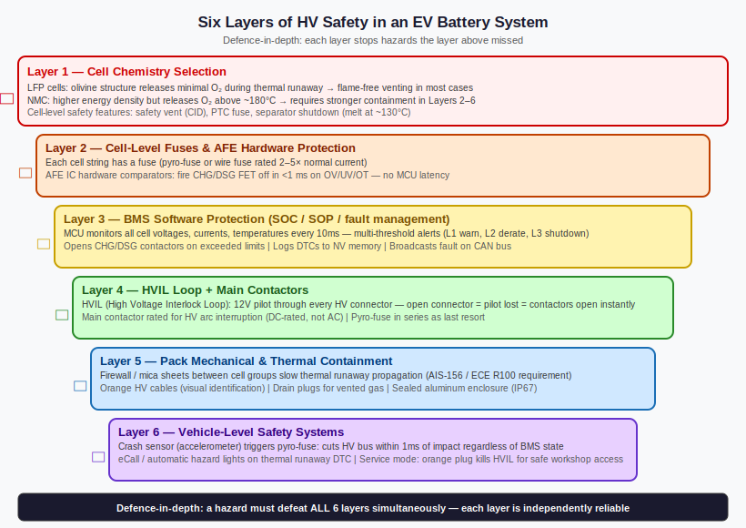
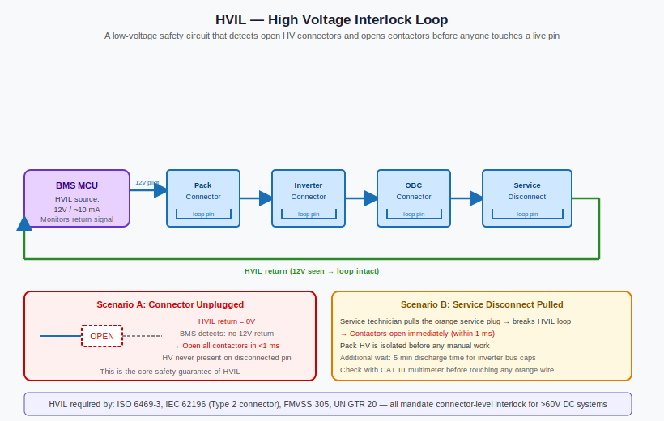

# HV Safety Architecture — Six Layers Between You and 400 Volts

*Prerequisites: [Ignition Handling →](./ignition-handling.md)*
*Next: [Error Handling & Fault Reporting →](./error-handling-fault-reporting.md)*

---

## 400 Volts, and Why It Needs Six Independent Layers

The traction pack in a typical EV sits at 400–800 V DC. The lethal threshold for cardiac arrest is around 50–100 mA of AC current through the chest — and a 400V pack can deliver tens of thousands of amperes through low resistance paths. The energy stored in the pack of a mid-size EV is measured in tens of kilowatt-hours. This is not a hazard to be hand-waved away with a warning label.

Yet EV technicians work on live vehicles. Crash responders cut open accident-damaged EVs. Passengers sit three centimetres above battery packs every day. None of them — in normal operation or in the most common fault scenarios — encounter live HV.

This is not luck, and it is not a single safety device. It is a deliberately engineered **defence-in-depth architecture** with six independent protection layers, each designed to catch the failure modes the previous layer might miss.

This post traces every layer from the cell terminals outward, explains what failure mode each one addresses, and describes how they interact during both normal operation and fault conditions.

---

## The Safety Principle — Single-Fault Tolerance

Before examining individual layers, understand the design philosophy. **No single protection device is assumed to be perfect.** Every component can fail. Contactors can weld. Software can hang. Fuses can fail to open. The architecture is built so that any single failure leaves the system safe — a property called **single-fault tolerance**.

This is mandated, not aspirational. ECE R100 (the UN regulation governing BEV safety) and ISO 6469-3 both require that a single fault shall not result in electric shock risk to the occupants. ISO 26262 functional safety analysis (ASIL decomposition) requires that each safety function protecting against electrocution be analysed for its failure mode coverage.

The critical design rule: **each layer must be independent**. HVIL cannot depend on the BMS microcontroller — if the MCU hangs, HVIL must still work. The crash fuse cannot depend on software — if the BMS ECU is destroyed by the crash, the fuse must still fire. Independence of layers is what gives the system its single-fault tolerance property.

---

## Layer 1 — The Contactor System

The foundation of HV safety is the **main contactor pair**: a main positive contactor and a main negative contactor, both **normally open** (spring-return to open position when de-energised). Both must be closed for the HV bus to be live. Either one opening immediately removes one rail from the load, breaking the current path.

**Why two contactors and not one?** Consider a single contactor that welds closed — a real failure mode from inrush current damage or contact material fatigue. With a single welded contactor, the pack positive rail remains connected to the inverter through that weld. If a second fault then connects the pack negative rail to chassis, a complete shock hazard path exists. With two contactors, a welded main positive contactor is isolated by the open main negative: even with the positive stuck closed, no complete HV circuit exists to the load.

Contactors are high-power electromechanical relays with significant engineering behind them:

| Parameter | Typical Spec |
|---|---|
| Voltage rating | 900–1500 V DC |
| Continuous current | 200–500 A |
| Peak make/break current | 2–10 kA |
| Contact material | Silver-cadmium oxide or silver-nickel |
| Coil voltage | 12 V (from BMS) |
| Arc suppression | Magnetic blowout |

The 12V coil requirement is critical for the fail-safe design. The 12V coil holds the contactor closed — it requires continuous power to remain closed. Loss of BMS control power, loss of 12V aux battery, or a BMS fault that removes the drive signal all result in the contactors opening. The safe state is achieved by doing nothing — by removing power rather than actively commanding an open.

**Contact weld detection** is a BMS diagnostic function: the BMS monitors the voltage on both sides of each contactor. If the load-side voltage matches pack voltage when the contactor should be open, the contactor is welded. This is logged as a critical fault, and the BMS prevents any further contactor operations until cleared by a service technician — because operating a welded positive contactor and then attempting to open the negative could leave the positive rail permanently connected.

---

## Layer 2 — Pre-Charge

The pre-charge circuit protects the contactors themselves from the inrush current that would occur if a main contactor closed onto the uncharged DC link capacitors of the motor inverter.

This is covered in full mechanical and electrical detail in the [Ignition Handling post](./ignition-handling.md). In the safety context, the key point is: **pre-charge is protection for Layer 1**. Without it, repeated inrush events weld the main contactors — and a welded contactor is a failure of the primary HV disconnect mechanism.

The safety-relevant behaviour of the pre-charge circuit:

- If the inverter-side voltage fails to reach the target voltage within the pre-charge timeout, the BMS aborts the sequence and logs a pre-charge fault. This protects against an inverter with a shorted capacitor, which would represent a near-permanent short on the HV bus.
- Pre-charge completion is confirmed by voltage measurement — not by a fixed timer — because a timer-only approach would allow the main positive contactor to close onto a still-uncharged capacitor if the actual charging was slower than expected (e.g., high resistance in the pre-charge path).

---

## Layer 3 — HVIL (High Voltage Interlock Loop)

**What it is**: a 12V continuity loop wired in series through every HV connector, service access cover, and the Manual Service Disconnect in the vehicle.

**How it works**: When all HV connectors are properly mated and all covers are closed, a small current flows continuously around the HVIL loop. The BMS monitors this current return with a dedicated hardware comparator — not a software poll. Any break in the loop — a disconnected HV connector, an opened access cover, a removed MSD, a wiring harness fault from crash damage — interrupts the loop. The comparator fires in under 1 ms, immediately opening the main contactors.

The HVIL loop routing is deliberate. It passes through the mechanical path of every HV connector such that the loop cannot remain closed if the connector is disconnected. This means the HV pins of that connector are mechanically protected by their housing — but even if someone forced a connector apart, the HVIL would fire before the pins could separate enough to arc to a body part.

**Why hardware-speed and not software?** The BMS MCU main loop typically runs at 10–100 ms cycle time. A software-polled HVIL check in the main loop would have up to 100 ms response latency. In that time, a disconnecting HV connector could expose live pins. A hardware comparator wired directly to the contactor coil drive circuit responds in microseconds, independent of software execution state. Even if the BMS MCU is in a fault handler, executing a long computation, or has crashed entirely, the HVIL still opens the contactors.

**HVIL in the service workflow**: The HVIL loop design ensures that technicians cannot access HV components without the BMS first opening contactors. Removing the MSD (Layer 5) breaks the HVIL loop — the contactors open before the MSD physically separates the HV circuit. The technician's hands are never in a position to touch live HV, because the HV is removed before physical access is possible.

**Failure mode addressed**: accidental or crash-induced disconnection of an HV connector while the HV bus is live.

---

## Layer 4 — Isolation Monitoring (IMD)

This is the most nuanced layer, because it addresses a fault mode that is invisible until it becomes dangerous.

### The Floating HV Topology

The EV HV system is designed to be electrically **floating** — completely isolated from the vehicle chassis (vehicle ground). Neither HV+ nor HV− has an intentional electrical connection to chassis. This is called an **IT (Isolated Terra) topology**.

The safety benefit of a floating system is enormous. If the HV bus is floating, a person who touches a single HV rail and simultaneously touches the chassis completes a circuit only through the insulation resistance of the cables — which in a healthy system is hundreds of megaohms. The resulting current is microamperes, far below any physiological threshold.

The danger arises when this isolation degrades. A single **insulation fault** — a chafed cable that shorts HV+ to chassis through a few kilohms — does not immediately cause an electric shock. The HV+ rail is now referenced to chassis, but the HV− rail is still floating. However, a person who then touches the HV− rail and chassis completes a circuit: through the person, through HV−, through the pack, through the insulation fault to chassis, and back through the chassis to the person's feet. With only 10 kΩ of fault resistance and 400 V available, the fault current is 40 mA — potentially lethal.

### IMD Operation

The **Isolation Monitoring Device (IMD)** continuously measures the insulation resistance between the entire HV bus (both rails simultaneously) and the vehicle chassis. It does this by injecting a low-level AC or DC signal between a mid-point of the HV bus and chassis, measuring the resulting current, and computing equivalent insulation resistance.

The IMD must operate during all states when the HV bus is live: Active/Run, Pre-charge, and Charge mode. It must not be defeated by DC link capacitors (which would block DC injection) — hence the AC injection approach used in most production IMDs.

**Thresholds** (ISO 6469-3 minimum is 100 Ω/V of pack voltage):

| Pack Voltage | ISO Minimum | Typical Warning | Typical Fault |
|---|---|---|---|
| 400 V | 40 kΩ | < 1 MΩ | < 500 kΩ |
| 800 V | 80 kΩ | < 2 MΩ | < 1 MΩ |

A healthy system has insulation resistance exceeding 500 MΩ. Warning thresholds are set conservatively — at 1 MΩ and 400V, the single-fault shock current is 0.4 mA, comfortably below any physiological threshold. By the time the BMS faults and opens contactors (at 500 kΩ), the single-fault current has reached 0.8 mA — still below the perception threshold for most adults, but the system should not allow further degradation before acting.

**Response**: an isolation warning lights a dashboard amber indicator and logs an event. An isolation fault opens the contactors and logs a critical fault requiring service. The design intent is to catch insulation degradation in the warning phase, before it becomes a fault, giving the driver time to present the vehicle for service.

**Practical IMD design considerations**: high-voltage motors and cables have capacitance to chassis (several microfarads distributed across the windings). The IMD must distinguish this normal capacitive coupling from resistive insulation faults. Production IMDs from companies like Bender use adaptive algorithms to separate capacitive and resistive components of the leakage measurement.

**Failure mode addressed**: gradual or sudden insulation degradation converting the floating HV system to a referenced (hazardous) system.

---

## Layer 5 — Manual Service Disconnect (MSD)

The **Manual Service Disconnect** is a physical plug, lever, or blade that, when removed, breaks the main HV busbars mid-pack, splitting the battery into two segments at lower voltage.

The MSD serves the technician. Contactors can be closed and opened by the BMS — but a technician cannot independently verify that the BMS is controlling them correctly. A second failure (BMS fault, weld) during servicing could re-energise the bus. The MSD provides a physical air gap in the HV circuit that no software can close.

**Location**: accessible without disassembling the vehicle, but not accessible from the passenger compartment during normal operation. Typically under a rear seat panel, in the boot floor, or under the vehicle.

**HVIL integration**: the MSD is wired into the HVIL loop such that removing it breaks the loop before the HV circuit physically separates. The sequence:

1. Technician lifts the tamper-protection cover and removes the MSD.
2. MSD removal breaks the HVIL loop immediately (the HVIL pin is in the MSD connector).
3. BMS detects HVIL break — opens contactors in < 1 ms.
4. Now, with contactors open and HVIL broken, the MSD physically separates the busbars. Since contactors already opened, no arc occurs at the MSD separation point.
5. Pack is split into two segments. Each segment is at half (or some fraction) of the total pack voltage.

**Technician service sequence**:
1. Power off ignition. Wait for BMS to enter sleep.
2. Wait 5 minutes for inverter DC link capacitors to discharge through bleed resistors.
3. Verify HV with a calibrated CAT III rated meter at defined test points before touching anything.
4. Remove MSD (HVIL breaks → contactors open).
5. Re-verify zero volts at all service touch points.
6. Proceed with service.

The wait time and the voltage verification step are essential — the MSD removes the ability for software to re-energise the bus, but it cannot remove the energy already stored in the inverter capacitors before MSD removal.

**Failure mode addressed**: BMS software fault or contactor weld re-energising the bus during servicing; technician uncertainty about whether HV is truly absent.

---

## Layer 6 — Pyrotechnic Disconnect (Crash Fuse)

The **pyrotechnic disconnect** is, conceptually, the most dramatic layer. It is a small explosive charge in series with the main HV busbar, triggered by the same crash sensor that fires the airbags. When triggered, it severs the copper busbar permanently and irreversibly within 1 ms.

**Why is this necessary if contactors already exist?** Consider a severe crash:

- The crash may destroy the BMS ECU's wiring harness — the BMS can no longer control contactor coils.
- The crash may weld the contactors through a short-circuit arc caused by crash damage to HV cables.
- The crash may deform the vehicle structure in a way that shorts HV cables to chassis, creating a sustained high-current arc that welds whatever hardware is in its path.

The pyrotechnic disconnect addresses all three scenarios simultaneously. It has no electronics. It does not depend on BMS software. It does not depend on 12V power. It depends only on one signal: the crash trigger from the airbag ECU, which is itself a hardened, heavily redundant safety system. Given a valid trigger signal, it fires. There is no failure mode in which it receives the trigger and does not sever the busbar.

**One-shot device**: the pyrotechnic disconnect is not resettable. After any triggering event — whether a real crash or an accidental trigger — it must be physically replaced. A visual inspection of the disconnect will confirm whether it has fired (the severed busbar is visible through an inspection window on most designs).

**Post-crash residual energy**: even with the pyrotechnic disconnect fired and all contactors open, the inverter DC link capacitors retain their charge for minutes. First responders follow a fixed protocol — typically wait 5 minutes after an EV accident before touching HV components. This is not because the safety systems failed; it is because the capacitor energy is separate from the pack and takes time to dissipate through bleed resistors.

**Failure mode addressed**: crash damage that disables BMS control of contactors, welds contactors, or creates a sustained high-energy short-circuit arc.

---

## Orange Cables and Physical Protection

The orange HV cable colour serves one purpose: unambiguous visual identification at a glance. IEC 60445 recommends orange for HV DC wiring in EVs; FMVSS 305 adopts this for US vehicles. Any technician, first responder, or curious owner who sees an orange cable knows it is potentially live HV and should not be cut without first verifying isolation.

Beyond colour, HV cables are routed through the centre tunnel and under the floor — away from the primary frontal and side crash zones. They are encased in rigid conduit or armoured sheathing to resist abrasion and penetration. HV connectors are **touch-proof**: the live pins are recessed behind a housing that prevents a human finger (IP2X probe, 12.5 mm diameter) from contacting them even if the connector body is accessible. This is the IEC 61032 requirement, referenced in both ISO 6469 and ECE R100.

---

## How the Layers Work Together — A Fault Scenario

Abstract safety layers are clearest when traced through a real failure scenario.

**Scenario: coolant hose fails, coolant leaks onto an HV cable bundle.**

1. Over 20 minutes, coolant water (slightly conductive) bridges between the cable insulation and the chassis-grounded chassis rail. Insulation resistance drops from > 500 MΩ to 300 kΩ.

2. **IMD detects**: isolation resistance below 1 MΩ warning threshold. Dashboard amber light illuminates. BMS logs the event. Driver is in the car and ignores the warning.

3. Coolant continues to wick along the cable. Insulation resistance drops to 50 kΩ — below the fault threshold. **IMD faults**: BMS opens main contactors. HV bus de-energised. Vehicle cannot drive.

4. Driver calls for roadside assistance. Technician arrives, does not know the vehicle's history.

5. Technician removes the MSD: HVIL breaks, contactors remain open (they were already open from the IMD fault). Pack is split. Technician verifies zero volts at service points and begins diagnosis.

At no point during this scenario did any person touch live HV. The isolation monitoring layer caught the developing insulation fault while still at a sub-threshold hazard level, and the contactor layer enforced isolation before the fault became physically accessible.

---

## Standards Summary

| Standard | Scope | HV Safety Relevance |
|---|---|---|
| ECE R100 Rev.3 | BEV safety, UN regulation | Isolation >100 Ω/V, post-crash isolation test, HVIL, MSD requirements |
| ISO 6469-1:2019 | EV safety: energy storage | Cell-level and pack-level safety requirements |
| ISO 6469-3:2021 | EV safety: protection from electric hazards | Isolation monitoring thresholds, touch-proof connector requirements |
| FMVSS 305 | US post-crash EV electrical safety | Post-crash isolation resistance test; orange cable colour |
| ISO 26262 | Functional safety, road vehicles | ASIL decomposition for contactor control, IMD, HVIL; failure mode coverage analysis |

The [ISO 26262 post](../standards/ISO-26262_standard.md) and [AIS-004 post](../standards/AIS-004_standard.md) cover the functional safety and Indian homologation standards that layer on top of these base EV safety regulations.

---

## Experiments

### Experiment 1: HVIL Break Detection at Hardware Speed

**Materials**: Arduino Uno or Nano, pushbutton (simulating HV connector pull), LED (simulating contactor state), 10 kΩ pull-up resistor, oscilloscope or second Arduino measuring response time

**Procedure**:
1. Wire a 5V loop from the Arduino's 5V pin, through the pushbutton (normally closed), to a digital input pin with a pull-up resistor.
2. Program the Arduino: while the input reads high (loop intact), output pin A is high (LED on, contactors "closed"). When input goes low (loop broken), set output pin A low immediately in an interrupt service routine (ISR), print "HVIL fault" to serial.
3. Measure the time from the button opening to the output pin going low using an oscilloscope triggered on the input pin falling edge.
4. Compare with a software-polled version: remove the ISR, poll the input pin in the main loop with a 10 ms delay. Retrigger and measure response time.

**What to observe**: ISR response time will be under 0.1 ms. Software-polled response time will be up to 10 ms (the poll interval). This 100x difference in response speed demonstrates why production HVIL implementations use dedicated hardware comparators rather than software polls — and why the IEC/ISO requirements specify hardware-speed response.

---

### Experiment 2: Isolation Resistance and Shock Hazard Threshold

**Materials**: 9V battery, resistors (10 MΩ, 1 MΩ, 500 kΩ, 100 kΩ — carbon film, standard tolerance), multimeter, breadboard

**Procedure**:
1. Build the "healthy system" circuit: 9V battery with neither terminal connected to a common ground rail (breadboard ground rail). Measure resistance from 9V+ to breadboard ground and from 9V− to breadboard ground. Both should read near open (your multimeter's over-range).
2. Introduce "insulation fault 1": connect a 10 MΩ resistor from 9V+ to breadboard ground. Measure resistance from 9V+ to ground (10 MΩ). Compute leakage current at 400 V: I = 400 V / 10 MΩ = 40 µA — below perception threshold.
3. Introduce "fault 2": replace with 1 MΩ. Compute I = 400 V / 1 MΩ = 400 µA — the warning threshold level. Still below most perception thresholds.
4. Introduce "fault 3": replace with 100 kΩ. Compute I = 400 V / 100 kΩ = 4 mA — above fibrillation threshold at AC, harmful at DC. This is the fault-level condition where IMD should open contactors.
5. For each configuration, measure the voltage from 9V− to breadboard ground — you will see the fault voltage appear on the negative rail.

**What to observe**: The fault voltage that appears on the negative rail when a positive-rail insulation fault exists. This concretely demonstrates how a single insulation fault converts a floating system into a referenced (hazardous) system. Map each resistance value to the ISO threshold table: identify which would trigger a warning and which a fault on a real 400V system.

---

### Experiment 3: Pre-Charge Protects the Contactor — Inrush Comparison

**Materials**: 12V power supply, two relay modules (simulating main contactor and pre-charge contactor), 100 µF electrolytic capacitor (simulating inverter), 47 Ω 2W resistor (pre-charge resistor), INA219 current sensor + Arduino, oscilloscope

**Procedure**:
1. **Without pre-charge**: connect 12V supply through main relay directly to the capacitor (discharged). Close the main relay. Capture the current spike with the INA219 sampled as fast as possible (or oscilloscope current probe). Note the peak inrush magnitude and duration.
2. Discharge the capacitor (through a 1 kΩ resistor to safe discharge). Reconnect.
3. **With pre-charge**: connect 12V → pre-charge relay → 47 Ω resistor → capacitor. Close pre-charge relay. Log voltage across capacitor every 5 ms. When voltage reaches 11V (92% of 12V), close main relay and simultaneously open pre-charge relay. Capture inrush at main relay closure.
4. Compare peak inrush current between the two cases.

**What to observe**: Without pre-charge, inrush current at relay closure is limited only by source impedance (milliohms) — peak will be tens to hundreds of amperes even at 12V. With pre-charge, at the moment the main relay closes, ΔV across the relay is < 1V, so inrush is under 100 A / 12 V × 1 V = tiny fraction. This maps directly to the EV-scale scenario: instead of a 400V delta across a relay into milliohms of cable resistance, you have < 5V delta after pre-charge completes.

---

## Further Reading

- **Andrea, D.** — *Battery Management Systems for Large Lithium-Ion Battery Packs* (Artech House, 2010) — HV safety architecture chapter with contactor selection, HVIL design, and MSD placement.
- **Ehsani, M., Gao, Y., Longo, S., Ebrahimi, K.** — *Modern Electric, Hybrid Electric, and Fuel Cell Vehicles* (3rd ed., CRC Press) — HV system architecture, isolation requirements, and crash safety chapter.
- **ECE R100 Revision 3** — UN Regulation No. 100 on BEV safety — free download from the UNECE website; Annex 3 covers electrical safety requirements including isolation resistance, HVIL, MSD, and post-crash test procedure.
- **ISO 6469-3:2021** — Electrical safety requirements for EVs: protection of persons against electric hazards — defines isolation monitoring thresholds and touch-proof connector requirements.
- **Bender GmbH technical resources** — Bender manufactures production IMDs for EVs; their technical documentation explains AC injection isolation monitoring in detail, including how capacitive coupling from motor windings is handled.
- **Orion BMS Wiring Manual** — freely available from Ewert Energy; contains complete HVIL loop wiring diagrams, contactor wiring, and pre-charge circuit schematics drawn from a production BMS implementation.
- **NHTSA EV Safety Technical Reports** — post-crash isolation testing results from real EV accident investigations, showing how the safety architecture performs in practice.
- **Thermal Runaway Detection post** — [→](./thermal-runaway-detection-handling.md) for the full treatment of how the BMS handles the most severe failure mode: a cell entering thermal runaway, and how isolation architecture interacts with that scenario.
