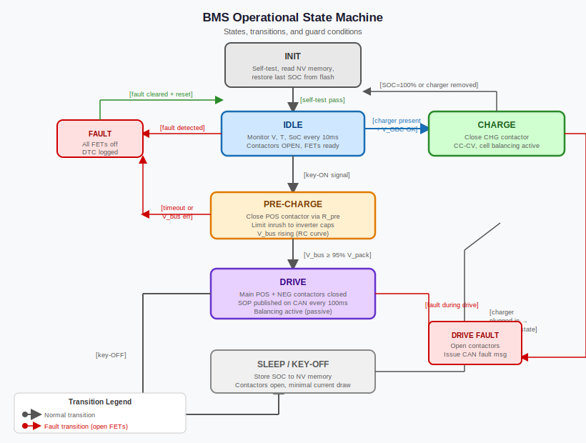

# Ignition Handling — What Happens in Those Two Seconds Before Your EV Moves

*Prerequisites: [Battery Pack & Module Architecture →](../battery/battery.md)*
*Next: [HV Safety Architecture →](./hv-safety-architecture.md)*

---

## It Is Not Like Turning on a Lightbulb

Turn the key in a petrol car: the starter motor cranks, the engine fires, done. The entire ignition event is mechanical and takes under a second. You are not thinking about capacitors.

Turn the key in an EV: nothing mechanical happens. Instead, a microcontroller wakes from sleep, runs a self-test sequence, checks every cell voltage, verifies the high-voltage interlock loop, and then closes three separate contactors in a precise order over a period of 1–3 seconds. Only then does the inverter receive the signal that it may draw current.

That delay is not a firmware bug or a slow processor. It is an intentional, safety-critical sequence. Skip a step — or do them in the wrong order — and you weld your contactors shut, blow your inverter capacitors, or leave a live HV bus accessible to anyone who opens the wrong panel.

This post walks through every stage of that sequence: what triggers the BMS to wake, what it checks before connecting HV, how the pre-charge circuit protects the hardware, and what the exact contactor order must be and why.

---

## What "Ignition" Means Without a Spark Plug

The word *ignition* arrived in EV terminology directly from ICE vocabulary — and immediately became a misnomer. There is no combustion to ignite. What the term means in an EV context is: the driver has signalled intent to operate the vehicle, and the powertrain should transition to a ready state.

In most production EVs the **ignition signal** is a 12V discrete line from the key switch or the **Body Control Module (BCM)** to the BMS. Some architectures replace or supplement this with a **CAN wake frame** — a short CAN message sent on a low-power bus segment that wakes the BMS microcontroller from its sleep state. The two mechanisms can coexist: the 12V line wakes the BMS, and the BMS then waits for a specific CAN "ready" message before beginning the HV connection sequence.

The practical consequence is that the BMS is always passively listening for one of these triggers, even when the vehicle appears completely off. That listening task must run at near-zero power — which shapes the entire sleep architecture described below.

---

## BMS Power States

The BMS does not have two states (on and off). It has a state machine with at least six distinguishable operating modes. Understanding each one explains both the ignition sequence and the shutdown sequence.



| State | HV Bus | Description |
|---|---|---|
| Sleep | Open | Only wake interrupt active. MCU halted. |
| Standby / Wake | Open | BMS MCU running, self-checks, no HV yet. |
| Pre-charge | Partial | Main negative closed; pre-charge resistor energised. |
| Active / Run | Live | All contactors closed, normal operation. |
| Charge | Live (charge path) | Plugged in; charger handshake active. |
| Fault | Open | Contactors open, fault logged, BMS awake. |

**Sleep** is the default state whenever the vehicle is parked. The BMS microcontroller is halted or in a power-down mode. A dedicated low-power comparator — consuming microamps, not milliamps — monitors the ignition pin, the CAN bus for wake frames, and, in some designs, a low-power ADC that periodically scans cell voltages to catch a low-cell condition that would risk deep discharge before the driver returns.

**Standby / Wake** begins the moment the wake trigger fires. The main MCU boots, the AFE chip initialises, and the BMS reads all cell voltages, temperatures, and the High Voltage Interlock Loop (HVIL) continuity status. It will not proceed to pre-charge if any of these checks fail.

**Pre-charge** solves a critical hardware protection problem: motor inverters contain large DC link capacitors that are fully discharged while parked. Closing the main positive contactor directly onto an uncharged capacitor would cause a current spike of hundreds to thousands of amperes — enough to weld contactor contacts shut. The pre-charge circuit routes current through a series resistor first, charging the capacitor slowly until its voltage matches the pack voltage, at which point the main positive contactor closes with negligible inrush. The physics are covered in detail in the next section.

**Active / Run** is the steady operating state. All HV contactors are closed, the bus is live, and the BMS runs its normal 10–100 Hz monitoring loop: cell voltages, pack current, temperatures, SOC estimation, and SOP limits sent to the motor controller via CAN.

**Charge** is triggered by a pilot signal from the charging connector (J1772 pilot signal or CAN message from the EVSE). The contactor configuration may differ from Run — some vehicles have dedicated charge contactors; others reuse the main contactors with the motor controller's gate drivers disabled. Charge-mode voltage and temperature limits are tighter than run-mode limits.

**Fault** is an immediate transition from any state. Any critical fault — cell overvoltage, undervoltage, overtemperature, HVIL break, isolation fault — causes the BMS to open all contactors regardless of what current is flowing at the time. Opening under load damages contactor contacts, but that is an accepted trade-off against the safety risk of leaving HV connected through a fault condition.

---

## Why Pre-charge — The Capacitor Problem

Motor inverters contain large **DC link capacitors** on their HV input terminals. These capacitors stabilise the bus voltage during fast switching transients and act as a local energy reservoir for the switching bridge. In a 400V system a typical inverter might have 500–2000 µF of DC link capacitance. In a modern 800V system, somewhat less — but at twice the voltage, the stored energy (½CV²) is similar.

When the vehicle has been parked and the BMS is in Sleep state, these capacitors have discharged through their own internal bleed resistors to near zero volts. Now consider closing the main positive contactor directly onto this uncharged capacitor bank. From the battery's perspective, at the instant of contact closure, the capacitor looks like a short circuit. The initial current surge is limited only by the cable resistance and contact resistance — often a few milliohms — and the result is a current spike of hundreds to thousands of amperes lasting microseconds.

The consequences are not theoretical. Welded contactor contacts. Blown fuses. Damaged capacitor dielectric from the voltage overshoot during the inrush event. In a conversion EV built without a pre-charge circuit, you may get away with it for weeks before a contactor welds shut — and then you have a permanently live HV bus with no disconnect.

The **pre-charge circuit** solves this with elegant simplicity: rather than connecting the battery directly through the main positive contactor, a second path is used — a smaller **pre-charge contactor** in series with a **pre-charge resistor** (typically 10–100 Ω, sometimes a few hundred watts power rating). The capacitor charges exponentially through this resistor before the main contactor closes.

The voltage across the capacitor as a function of time:

```
V(t) = V_battery × (1 − e^(−t / RC))
```

For a 50 Ω resistor and 1000 µF capacitor, the time constant τ = RC = 50 × 0.001 = 50 ms. The capacitor reaches 63% of battery voltage in one τ, 95% in 3τ (150 ms), and 99% in 5τ (250 ms). In practice the BMS declares pre-charge complete when the **inverter-side voltage** — measured by the BMS at the load terminal of the main positive contactor — reaches within 5–10 V of the pack voltage. This threshold, not a fixed timer, is the correct way to implement pre-charge completion detection, because resistor heating and capacitor value tolerances both affect the actual time required.

<iframe src="../../assets/bms-concepts/precharge-rc-curve.html" width="100%" height="380" frameborder="0"></iframe>

Once the inverter-side voltage matches pack voltage, the inrush current through the main positive contactor at closure is:

```
I_inrush ≈ (V_battery − V_cap) / R_bus ≈ (5V) / (5 mΩ) = 1000 A → reduced to: (5V) / (5 mΩ) = 1 kA without pre-charge
                                                                       (5V) / (5 mΩ) ≈ 1 kA → with pre-charge: ~(5V)/(5mΩ) but ΔV is only ~5V
```

More precisely: without pre-charge, ΔV = 400V, inrush ~ 80,000 A. With pre-charge, ΔV < 5V, inrush < 1000 A — well within the contactor's continuous and peak rating.

---

## Contactor Sequencing — The Exact Order Matters

The sequence of opening and closing contactors is not arbitrary. Getting it wrong either damages hardware or leaves a safety gap. Here is the nominal turn-on sequence step by step.

### Turn-On Sequence

**Step 1 — Close main negative contactor.**
The negative side of the battery is connected to the negative terminal of the inverter. No current flows because the main positive and pre-charge paths are both open. This step is safe under any circumstances.

**Step 2 — Close pre-charge contactor.**
Current now flows from the battery positive terminal, through the pre-charge resistor, through the pre-charge contactor, to the inverter capacitor. The resistor limits inrush to a safe level. The capacitor begins charging exponentially.

**Step 3 — Monitor inverter-side voltage.**
The BMS reads the voltage at the load terminal of the main positive contactor. It waits until this voltage is within the pre-charge threshold (typically 5 V or < 2% of pack voltage) of the measured pack voltage. If the voltage fails to reach threshold within a configurable timeout (typically 1–3 seconds), the BMS aborts: opens the pre-charge contactor, logs a pre-charge timeout fault, and remains in Fault state. A failed pre-charge almost always indicates either a shorted inverter or an open circuit in the HV cabling.

**Step 4 — Close main positive contactor.**
Now that the inverter capacitors are at near-battery voltage, the main positive contactor closes with minimal inrush current. The pre-charge resistor is now effectively bypassed — current flows through the main positive contactor path rather than through the resistor.

**Step 5 — Open pre-charge contactor.**
The pre-charge path is opened. The full HV bus is now routed through the main contactors only.

**Step 6 — Signal inverter ready.**
The BMS sends a CAN message (or asserts a discrete "HV ready" signal) to the inverter, which enables its gate drivers. The motor controller is now permitted to draw current. The vehicle is ready to drive.

### Turn-Off Sequence

The shutdown sequence is equally deliberate. The goal is to avoid opening contactors while high current is flowing — DC contactors can interrupt their rated current, but repeated hot-switching dramatically shortens their service life.

**Step 1 — Ramp inverter demand to zero.**
The BMS commands the motor controller (via CAN torque limit message or direct signal) to ramp its current draw to zero. Some implementations simply wait for the driver to release the accelerator; others actively send a zero-torque command.

**Step 2 — Open main positive contactor.**
With current near zero, the main positive opens cleanly, without significant arc energy.

**Step 3 — Open main negative contactor.**
The negative side disconnects. The HV bus is now fully isolated from the battery.

**Step 4 — Passive capacitor bleed.**
Inverter DC link capacitors are left to discharge through their internal bleed resistors. This typically takes 1–5 minutes depending on capacitor size and bleed resistor value. Until this discharge completes, the inverter terminals remain hazardous to touch — which is why there is always a "WAIT 5 MINUTES" warning in EV service procedures before touching HV components. See the [HV Safety Architecture post](./hv-safety-architecture.md) for the full safe-service procedure.

---

## HVIL — The Hardware Interlock

The **High Voltage Interlock Loop (HVIL)** is a 12V continuity loop threaded in series through every HV connector in the vehicle: the battery pack connectors, the inverter connector, the DCDC converter connector, any service covers that expose HV busbars, and the Manual Service Disconnect (MSD).

When every HV connector is properly mated, the HVIL loop is closed and carries a small continuous current. The BMS monitors this current with a hardware comparator — not a software loop. Response time is under 1 ms.

If any HV connector is disconnected — whether by a crash, a service technician, a failed latching mechanism, or a wiring harness fault — the HVIL loop breaks. The hardware comparator immediately fires and opens the main contactors. At hardware-comparator speed, this happens before any BMS software loop gets a chance to execute.

The HVIL protects against the scenario where someone physically separates an HV connector while the bus is live. Without HVIL, that would expose live HV pins. With HVIL, opening the connector first breaks the interlock, which opens the contactors, before the pins can separate far enough to touch.

One subtle point: HVIL integration into the MSD means that removing the service plug to de-energise the HV bus for maintenance causes the contactors to open before the MSD physically interrupts the HV circuit. This is intentional — the contactors, which are rated for switching, handle the current interruption, and the MSD then provides the physical air gap for safe working.

HVIL design, IMD, and the full six-layer HV safety architecture are covered in detail in the [next post](./hv-safety-architecture.md).

---

## BMS Sleep and Wake — The 12V Battery Problem

An EV parked for three months in an airport carpark must not return to a dead 12V aux battery. This constrains the BMS sleep current to something that a typical 40–60 Ah aux battery can sustain over weeks to months with acceptable self-discharge.

A BMS drawing 50 mA in sleep would drain a 50 Ah aux battery in 1000 hours — about 42 days. That is marginal. Real BMS designs target sleep current under 1 mA, giving over four years before 5% state-of-charge loss on the aux battery.

Achieving sub-1 mA sleep current means almost everything must be off:

- Main MCU: halted or in deepest power-down mode
- AFE chip: off or in ultra-low-power standby
- CAN transceiver: in wake-on-CAN standby (a separate low-power receive-only mode)
- 12V ignition comparator: a discrete hardware comparator that triggers an interrupt when the ignition line goes high

Wake latency from a cold sleep to HV ready is typically 500 ms to 2 seconds. This includes MCU boot time, AFE initialisation, self-checks, and the pre-charge sequence. The 2-second delay you observe when entering the car before it signals ready is not one delay — it is the sum of all these stages.

**Wake sources:**

| Source | Mechanism | Typical Use |
|---|---|---|
| Ignition line | Hardware comparator interrupt | Normal drive ignition |
| CAN wake frame | CAN transceiver low-power listen | Remote functions, OTA update |
| Cell undervoltage | Low-power ADC periodic scan | Prevent deep discharge while parked |
| Charge connector | Pilot signal or CAN | Charge mode wake |

The cell undervoltage wake is a subtle but important feature. If the pack slowly self-discharges while parked — or if a fault creates a small continuous drain — the BMS needs to detect when cells approach the minimum voltage threshold and wake itself to log a fault or apply a protective cutoff, even without driver input.

---

## Charge Mode

Plugging in triggers a separate wake path via the J1772 pilot signal (or CAN message on DC fast chargers). The BMS wakes, identifies the wake source as a charge event rather than a drive event, and executes a charge-specific contactor sequence.

In some architectures, charge uses dedicated contactors — separate from the drive contactors — to allow the pack to be charged while the drive path remains open (for added isolation). In simpler designs the main contactors serve both roles, with the motor controller disabled during charge.

The EVSE and BMS handshake before any HV is applied. The J1772 pilot signal encodes the available current capacity of the EVSE, and the BMS must acknowledge with a pilot signal response before the EVSE closes its internal contactor and applies AC to the on-board charger. This handshake is a safety interlock at the charge inlet — the EVSE will not power up without it.

Charge mode imposes tighter operational limits: upper voltage cutoff is managed more precisely (because overcharge risk is highest at the top of the charge curve), temperature limits are enforced even at lower severity than in drive mode, and the cell balancing algorithm runs actively during charge. Full details in the [Charging Algorithm post](./charging-algorithm.md).

---

## Fault Shutdown

From any state, a critical fault causes an immediate transition to Fault state. The trigger can be any of:

- Cell overvoltage or undervoltage
- Pack or cell overtemperature
- Overcurrent
- HVIL break (hardware comparator path)
- Isolation fault from IMD
- Contactor weld detection
- Communication timeout from a safety-critical node

In Fault state the BMS opens all HV contactors and keeps them open. It stays powered (BMS remains in an awake, monitoring state), logs the fault with a timestamp and all relevant measurement values, and illuminates the dashboard fault indicator. The vehicle is immobile and the HV bus is isolated.

Clearing a fault depends on fault severity. Some faults (transient overcurrent, temporary overtemperature) clear automatically after the condition resolves and the driver cycles ignition. Safety-critical faults — contact weld, HVIL fault, isolation fault — require a service technician to clear. The BMS is designed so that it cannot be talked out of a safety-critical Fault state by a CAN command alone; physical access and a diagnostic tool are required.

The interaction between fault detection, fault classification, and fault escalation is covered fully in the [Error Handling & Fault Reporting post](./error-handling-fault-reporting.md).

---

## Experiments

### Experiment 1: Pre-Charge RC Curve

**Materials**: Arduino Uno or Nano, 9V or 12V power supply, 470 µF to 2200 µF electrolytic capacitor, 47 Ω or 100 Ω resistor (1 W rating), two small relays or MOSFETs, INA219 or voltage divider + Arduino ADC pin

**Procedure**:

1. Build the circuit: power supply → main relay (bypasses resistor, initially open) → capacitor. Add a second relay in series with the resistor across the main relay — this is the pre-charge relay.
2. Start with both relays open, capacitor discharged (short it briefly through a 1 kΩ resistor to confirm zero volts).
3. Close the pre-charge relay. Arduino samples voltage across the capacitor every 10 ms via the voltage divider and logs to serial.
4. When voltage reaches 90% of supply (8.1V for 9V supply), close the main relay. Record the current spike (use INA219 in the main relay path).
5. Rerun with the pre-charge relay skipped — close only the main relay directly. Observe the larger inrush spike.

**What to observe**: The exponential V(t) curve. Calculate τ = RC from your component values and compare to the measured time to reach 63% voltage. With the pre-charge path, inrush at main relay closure is small (< 2V headroom at closure). Without pre-charge, inrush spike is up to the full supply voltage divided by circuit resistance — potentially destructive at full EV voltages.

---

### Experiment 2: Contactor Sequencing State Machine

**Materials**: Arduino, 3 relay modules (simulating main negative, pre-charge, main positive), 3 LEDs (one per relay for state visualisation), one pushbutton (ignition), one pushbutton (fault injection / HVIL break), logic analyser or oscilloscope

**Procedure**:

1. Wire each relay module to an Arduino output pin and a corresponding LED.
2. Program the Arduino with the ignition turn-on state machine: sleep → wake → close main negative → close pre-charge → wait 500 ms (simulating pre-charge) → close main positive → open pre-charge → signal ready (LED).
3. On HVIL button press, immediately open all three relays regardless of current state machine step. Time the response from button press to all-relays-open using the logic analyser.
4. Add a fault injection mode: mid-sequence, trigger the HVIL break. Confirm the state machine aborts and does not continue.

**What to observe**: The exact timing between state machine steps. Confirm HVIL response opens all contactors within milliseconds. Compare hardware interrupt response time (µs) vs software poll response time (add an artificial 10 ms poll delay to demonstrate why hardware comparator speed matters).

---

### Experiment 3: Arduino Sleep and Wake Latency

**Materials**: Arduino Uno or Nano (ATmega328P), AVR sleep library (`avr/sleep.h`), one LED, one pushbutton (ignition signal), oscilloscope or second Arduino measuring wake latency, multimeter for sleep current measurement

**Procedure**:

1. Program the Arduino to enter SLEEP_MODE_PWR_DOWN using the AVR sleep library. Disable all peripherals before sleep. Measure current draw with a multimeter in series with the power supply — target < 5 mA (the Arduino's on-board regulator and USB chip will dominate; a bare ATmega328P with no peripherals draws under 100 µA in power-down mode).
2. Configure the ignition pushbutton as an external interrupt (INT0 on pin 2).
3. On wake interrupt, set an output pin high immediately (before any other work), then run a brief self-check sequence and print "BMS ready" to serial. Measure the time from button press to output-pin-high on the oscilloscope.
4. Add a 500 ms simulated AFE initialisation delay after wake. Re-measure the total time to "BMS ready."

**What to observe**: Wake latency from interrupt to first GPIO response is under 1 ms. Total latency to "BMS ready" is dominated by the simulated AFE init and pre-charge wait. This demonstrates that the 2-second ignition delay in a production EV is a sequence of deliberate steps, not slow hardware.

---

## Further Reading

- **Andrea, D.** — *Battery Management Systems for Large Lithium-Ion Battery Packs* (Artech House, 2010) — Ch. 4–5 cover contactor control architecture and power state management with real circuit topologies.
- **SAE J1772** — EV charging connector standard — defines the pilot signal protocol and handshake sequence between EVSE and vehicle, including the wake and current-offer signalling.
- **IEC 62196-1** — EV connector standard (Type 2, common in Europe) — proximity and pilot signal logic that triggers charge-mode wake.
- **ISO 6469-3:2021** — Electrical safety for EVs: protection of persons against electric hazards — mandates HVIL and defines response time requirements.
- **Orion BMS Wiring Manual** — freely available from Ewert Energy; contains detailed wiring schematics for pre-charge circuits, HVIL loops, and contactor sequencing in a real production BMS.
- **TE Connectivity EV Contactor Application Note** — pre-charge resistor sizing, contact rating, and arc interruption specifications for HV contactors.
- **EVTV Motor Werks (Jack Rickard)** — YouTube archive of practical EV conversion builds including contactor wiring, pre-charge design, and real-world sequencing failures and their consequences.
- **Battery University BU-802** — "Lithium-Ion Safety Concerns" — accessible overview of why HV isolation and disconnect speed matter.
