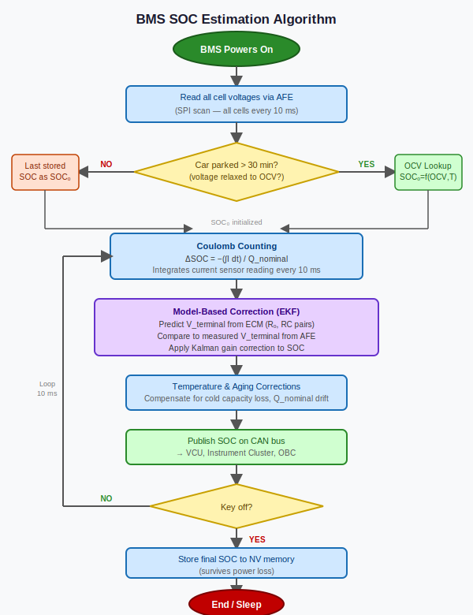

# State of Charge (SOC) — The Estimate Inside Every EV Battery Percentage

*Prerequisites: [OCV vs Terminal Voltage →](./ocv-vs-terminal-voltage.md), [Equivalent Circuit Model Primer →](../intro/equivalent-circuit-model.md)*
*Next: [State of Health (SOH) →](./state-of-health-soh.md)*

---

## The Fuel Gauge That Has No Sensor

Your phone's battery percentage is, technically, a lie. Not a malicious one — there simply is no sensor inside a lithium-ion cell that directly measures "how full" it is. No float, no dipstick, no pressure gauge. The number on screen is the output of an estimation algorithm working from indirect measurements. The same is true for the range indicator in every EV on the road.

**State of Charge (SOC)** is an internal electrochemical state: the fraction of available intercalation sites in the electrodes that are currently occupied by lithium. You cannot probe it directly from the cell terminals. Everything the BMS knows about SOC is inferred from what it *can* measure — voltage, current, and temperature — combined with a model of how the cell works.

This is what makes SOC estimation an engineering problem, not a measurement problem.

---

## The Formal Definition

SOC is defined as the ratio of remaining capacity to total available capacity:

```
SOC = (Q_remaining / Q_max) × 100%
```

A few clarifications that are easy to get wrong:

**SOC is not voltage.** A cell at 3.7 V could be at 40%, 50%, or 60% SOC depending on whether it is under load, just came off a fast charge, or is cold. Terminal voltage and SOC are related through the OCV-SOC curve — but only at rest, and only after sufficient relaxation.

**Q_max is not fixed.** It decreases with age and varies with temperature. A cell that holds 3.0 Ah new may hold 2.5 Ah after 500 cycles, and only 2.2 Ah at −10°C. The denominator in the SOC equation is a moving target. This is the [SOH](./state-of-health-soh.md) problem, and it directly limits SOC accuracy.

**Pack SOC ≠ cell SOC.** In a series string, discharge must stop when the *weakest* cell reaches its minimum voltage — even if all other cells still have charge. Pack-level SOC is usually reported as the minimum cell SOC, which is why a single degraded cell can reduce the apparent capacity of a 200-cell pack.

**The usable window is narrowed deliberately.** Most production EVs operate cells between approximately 10–15% (bottom) and 90–95% (top) electrochemically, but report this as 0–100% to the driver. The BMS applies an offset. This protects long-term cell health without the driver needing to know.

---

## The OCV–SOC Curve — The Most Accurate Method

At rest, after the cell has fully relaxed, terminal voltage converges to OCV. OCV is a stable, repeatable function of SOC and temperature — characterised in the lab and embedded in BMS firmware as a lookup table.

This makes OCV lookup the most accurate SOC estimation method: rest the cell, measure OCV, look up SOC. For NMC chemistry, the curve has enough slope across most of its range that a 1–2 mV accurate voltage reading gives a useful SOC estimate throughout. The accuracy degrades near the top and bottom where the curve flattens.

For LFP, the situation is harder. The OCV-SOC plateau from roughly 20–80% SOC spans only ~50 mV. In this region, 1 mV of measurement noise translates to roughly 1–5% SOC uncertainty (typical LFP plateau slope is 0.2–1 mV/%SOC; actual value is cell- and SOC-dependent — see Safari & Delacourt 2011 cited in the [OCV post](./ocv-vs-terminal-voltage.md)). Voltage-based SOC lookup in LFP is essentially useless across most of the operating range — the curve is too flat to carry useful information.

The critical limitation: **OCV lookup only works when the car is at rest**. The moment current flows, terminal voltage departs from OCV due to the IR drop of the Thevenin model. For a vehicle driven 10% of the time and parked 90%, the startup OCV initialisation is the single most important SOC measurement. But during the drive itself, a different approach is needed.

---

## Coulomb Counting — Simple, Effective, and Drifting

The most intuitive approach: integrate the current.

```
SOC(t) = SOC(t₀) − (1 / Q_max) × ∫ I dt
```

Or in discrete form at each timestep Δt:

```
SOC_next = SOC_current − (I × Δt) / (3600 × Q_max)
```

**Coulomb counting** is the backbone of every production BMS. It is computationally trivial, runs at the sample rate of the current sensor (typically 10–100 Hz), and provides continuous SOC updates regardless of load profile. Its appeal is that it works regardless of the OCV curve shape — flat LFP plateau included.

The problem is drift. Integration of a biased signal produces unbounded error over time.

**Current sensor offset**: a 50 mA systematic offset on a 100 Ah pack accumulates 50 mAh per hour — about 0.05% SOC per hour, or roughly 0.5% over a 10-hour trip. Over thousands of trips without recalibration, this adds up. A 200 mA offset (not unusual in a poorly calibrated Hall-effect sensor) is ten times worse.

**Q_max uncertainty**: as the cell ages, Q_max decreases — the denominator in the SOC equation grows too large relative to the actual capacity. A BMS using the factory Q_max on a 30%-degraded pack will systematically overstate SOC. This is why SOH estimation feeds directly into SOC accuracy — they cannot be solved independently.

**Coulombic efficiency**: charging loses a small fraction of input charge to side reactions (≈0.2–1.0%). Pure Coulomb counting without efficiency correction slowly over-counts charge on the charge side, biasing SOC estimates high over many cycles.

**No self-correction**: pure Coulomb counting has no mechanism to reduce accumulated error. An error introduced at initialisation propagates forever unless an external reference resets it. The reset comes from OCV lookup at rest — which is why the BMS re-anchors SOC every time the car sits long enough for a valid OCV reading.

---

## Model-Based Estimation — The Kalman Filter

The solution is to combine Coulomb counting with the voltage measurement in a principled way. The algorithm that does this is the **Extended Kalman Filter (EKF)**.

The GPS analogy is exact: a GPS receiver uses dead reckoning (integrating velocity and heading) between satellite fixes, and corrects its accumulated drift each time a satellite provides an absolute position. The EKF does the same:

- **Dead reckoning**: Coulomb counting predicts SOC between samples
- **Landmark fix**: measured terminal voltage, compared to the ECM's prediction, provides a correction signal
- **Weighting**: Kalman gain determines how much to trust the voltage correction vs the prediction, based on noise estimates



The EKF state vector is x = [SOC, V_C₁, V_C₂] — the SOC and the two capacitor voltages from the 2RC Thevenin model. At each timestep:

**Predict step** (Coulomb counting + ECM dynamics):
```
SOC_pred  = SOC_est − (I × Δt) / (3600 × Q_max)
V_C₁_pred = V_C₁ × exp(−Δt/τ₁) + R₁(1 − exp(−Δt/τ₁)) × I
V_T_pred  = OCV(SOC_pred, T) − I × R₀ − V_C₁_pred − V_C₂_pred
```

**Update step** (voltage correction):
```
innovation = V_T_measured − V_T_pred
SOC_est    = SOC_pred + K_soc × innovation
```

The Kalman gain K is larger when the OCV curve slope is steep (each mV of voltage innovation corresponds to a larger SOC correction) and smaller when the curve is flat. This is the formal reason LFP SOC estimation is harder: in the flat plateau, the OCV slope ≈ 0, K_soc ≈ 0, and the filter barely corrects its Coulomb-counting drift from voltage measurements. The BMS is essentially flying on Coulomb counting alone across most of the LFP operating range.

For engineers who want to implement this: Plett's *BMS Vol. 2* is the definitive reference, including discrete-time state transition matrices, Jacobian derivation, and noise covariance tuning.

### Variants Beyond the EKF

The **Sigma-Point Kalman Filter (SPKF)** propagates uncertainty through the nonlinear OCV function more accurately without linearisation, at modest additional cost. The **Particle Filter** can represent non-Gaussian SOC uncertainty, useful for highly aged cells. Both are covered in Plett Vol. 2. Production implementations as of the mid-2020s are predominantly EKF-based; SPKF is appearing in some premium BMS designs.

---

## Data-Driven Approaches

Recurrent neural networks (LSTMs) trained on sequences of [V, I, T] data can estimate SOC without explicit ECM parameterisation. Research benchmarks on the NASA and CALCE battery datasets show accuracy competitive with well-tuned EKF implementations.

The barriers to production adoption remain: explainability (safety engineers need to understand failure modes), robustness to out-of-distribution inputs (a model trained at 25°C may fail at −20°C), and cell-specific training requirements. These are active research problems, not insurmountable ones — expect data-driven SOC to become more prevalent in BMS firmware over the coming years.

---

## Challenges in Practice

**Temperature**: Cold reduces usable capacity — a cell that delivers 3.0 Ah at 25°C may deliver only 2.2 Ah at −10°C. If the BMS does not adjust Q_max dynamically, SOC reads too high when cold, and the car runs out of power "unexpectedly." This is the engineering explanation for why winter range is unpredictable on EVs with simpler BMS implementations.

**Aging**: Q_max decreases continuously. A BMS that never updates its Q_max will systematically overstate SOC in an aged pack. This is why SOH tracking (covered in the [next post](./state-of-health-soh.md)) is not optional — it feeds directly into SOC accuracy.

**Cell-to-cell variation**: Even matched cells diverge with use. The weakest cell limits the pack, and its SOC at any given pack voltage differs from the average. Without [cell balancing](./cell-balancing.md), this divergence grows over time and erodes usable pack capacity.

**High C-rate transients**: Under rapid acceleration or regen braking, terminal voltage departs sharply from what the ECM predicts due to unmodelled diffusion dynamics. The EKF's noise model needs to reflect this — or the update step will incorrectly adjust SOC based on a transient voltage excursion.

---

## How the BMS Uses SOC

SOC is not stored for its own sake. It drives decisions throughout the system:

**Range estimate**: SOC × Q_max × average energy consumption per km. The range estimate the driver sees is SOC accuracy plus a consumption model. Winter pessimism in range estimates reflects Q_max reduction at cold temperatures — the BMS is right to be conservative.

**Charge and discharge current limits**: Current limits taper at low SOC (to protect against deep discharge) and at high SOC (to protect against overcharge and reduce lithium plating risk on charge). These limits feed the motor controller and charger directly. See the [SOP post](./state-of-power-sop.md) for how these limits are calculated.

**Cell balancing trigger**: Balancing is activated when cells diverge in SOC. Without accurate per-cell SOC, the BMS cannot make good balancing decisions. See [cell balancing](./cell-balancing.md).

**Deep discharge protection**: The [undervoltage cutoff](./deep-discharge-protection.md) is the hard floor, but a good BMS begins tapering current when SOC approaches the limit, giving a graceful power reduction rather than a sudden shutoff.

---

## Experiments

### Experiment 1: Build an OCV–SOC Curve

**Materials**: 18650 NMC cell, bench charger, INA219 + Arduino, DMM

**Procedure**:
1. Fully charge cell to 4.2 V (CC-CV). Rest 2 hours. Record OCV.
2. Discharge at C/5 in 10% SOC steps (by Ah). After each step, remove load and rest 30 minutes. Record OCV.
3. Repeat until cell reaches 2.8 V. Plot OCV vs SOC.

**What to observe**: The sloped NMC curve vs the flat LFP plateau (if you have both chemistries). Measure the slope dOCV/dSOC in mV per % at different points. Compute how much SOC uncertainty a 5 mV measurement error creates at each slope — this is the fundamental driver of why AFE accuracy specifications matter.

---

### Experiment 2: Demonstrate Coulomb Counting Drift

**Materials**: Arduino + INA219, 18650 cell, CC load resistor

**Procedure**:
1. Fully charge cell. Set SOC = 100%.
2. Discharge at C/3, logging current and computing Coulomb-counted SOC every 100 ms.
3. After 50% of capacity discharged, rest 30 minutes and record OCV. Look up OCV-derived SOC. Note the discrepancy.
4. Repeat with an intentional 50 mA offset added to the current reading. Observe accelerated drift.

**What to observe**: Even without an introduced offset, small integration errors accumulate. With a +50 mA offset, the drift becomes visible within a single discharge. This exercise makes concrete why the EKF's OCV correction is necessary for long-term accuracy — and why current sensor calibration is worth the effort.

---

### Experiment 3: Temperature Effect on Apparent Capacity

**Materials**: Same setup + temperature chamber or fridge, thermistor

**Procedure**:
1. Discharge cell to 50% SOC at 25°C. Rest 1 hour.
2. Measure OCV. Now cool cell to 5°C. Rest 1 hour. Measure OCV again.
3. Discharge at C/5 at 5°C until voltage cutoff. Measure total Ah discharged.
4. Repeat at 25°C. Compare Ah discharged at each temperature.

**What to observe**: Less capacity is available at cold temperatures — the "50% SOC" you started with delivered fewer Ah. Measure the OCV shift between 25°C and 5°C at the same SOC — this is the temperature correction the BMS applies to its OCV table. Without this correction, the BMS would over-predict remaining range at cold temperatures.

---

## Further Reading

- **Plett, G.L.** — *Battery Management Systems, Vol. 1 & 2* (Artech House, 2015) — the definitive reference; Ch. 3–5 of Vol. 1 cover OCV and Coulomb counting; Vol. 2 covers EKF, SPKF, and particle filter in full detail with MATLAB/Python code.
- **Plett, G.L.** (2004) — "Extended Kalman filtering for battery management systems" — *J. Power Sources* 134(2) — the foundational paper on EKF-based SOC estimation.
- **Hu, X. et al.** (2012) — "A comparative study of equivalent circuit models for Li-ion batteries" — *J. Power Sources* 198 — grounds ECM selection in empirical accuracy data.
- **Severson, K.A. et al.** (2019) — "Data-driven prediction of battery cycle life before capacity degradation" — *Nature Energy* — shows how early-cycle features relate to long-term SOH; directly relevant to Q_max tracking.
- TI Application Notes on the BQ34z100-G1 — practical implementation of Coulomb counting + OCV lookup in a commercial fuel gauge IC.
- Battery University — BU-903: "How to Measure State-of-charge" — accessible overview of methods and tradeoffs.
