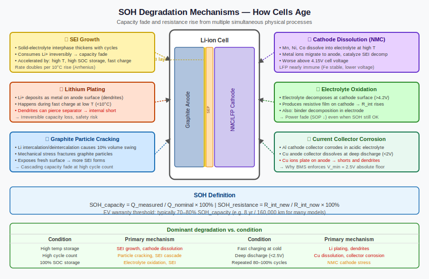

# State of Health (SOH) — Why Batteries Age and What the BMS Tracks

*Prerequisites: [State of Charge (SOC) →](./state-of-charge-soc.md), [The Lithium-Ion Cell →](../battery/cell.md)*
*Next: [State of Power (SOP) →](./state-of-power-sop.md)*

---

## The Invisible Degradation

A brand-new battery and a five-year-old battery of the same model look identical from the outside. Same form factor, same terminal voltage when fully charged, same label. But one of them can deliver 300 km of range, and the other manages 230 km.

**State of Health (SOH)** is the number that quantifies this invisible degradation. It is the battery's answer to the question: compared to when it was new, how capable is this cell now?

Every SOH number below 100% represents energy stored and capacity accessible that can no longer be recovered. The industry convention — 80% SOH as the end-of-life threshold for an EV battery — is not arbitrary. Below 80%, the range loss is significant enough to affect daily usability, and the remaining capacity decline tends to accelerate. Most EV warranties guarantee that the pack will not fall below 80% SOH for a specified period or mileage.

---

## Two Definitions of SOH

SOH has two distinct aspects that degrade independently and matter for different reasons.

**Capacity-based SOH (SOH_C)** measures how much energy the battery can hold relative to its original specification:

```
SOH_C = (Q_measured / Q_nominal) × 100%
```

A cell with SOH_C = 80% can hold 80% of its rated capacity — a direct reduction in driving range. This is the definition most EV owners care about.

**Resistance-based SOH (SOH_R)** measures how much the internal resistance has increased relative to the beginning of life:

```
SOH_R = (R₀_initial / R₀_current) × 100%
```

Resistance growth means **power fade**: the battery has more internal resistance, so it loses more voltage under the same load, and its power output capability is reduced. A cell with doubled internal resistance from new may still hold 90% of its original capacity, but its peak current capability is substantially reduced — noticeable in acceleration and fast-charge acceptance.

End-of-life criteria in practice: typically 80% SOH_C *or* 200% of initial internal resistance, whichever comes first (per USABC guidelines — see Further Reading; OEM warranty thresholds may differ). For high-nickel NMC chemistries under aggressive cycling, resistance growth can trigger end-of-life before capacity does.

---

## What is Happening Inside — Degradation Mechanisms

SOH decline is not a single process. It is the cumulative result of several parallel degradation mechanisms, each triggered by different stresses.



**SEI growth** is the dominant mechanism in most real-world usage. A **Solid Electrolyte Interphase (SEI)** layer forms on the graphite anode surface at first charge and is supposed to be stable thereafter. In reality, it continues to grow slowly throughout the cell's life, consuming lithium from the cathode and depositing it permanently in the SEI. This lithium is no longer available for charge storage — it represents irreversible capacity loss. SEI growth is faster at high temperatures and high SOC, and continues even when the cell is not being cycled (calendar aging).

**Lithium plating** occurs when lithium ions arrive at the anode faster than they can intercalate. Instead of inserting into graphite layers, they deposit as metallic lithium on the surface. This is always bad: it consumes lithium irreversibly (more capacity loss), and the deposited lithium grows into needle-like dendrites that can puncture the separator. Lithium plating is triggered by high charge rates, low temperatures, and charging at high SOC — all situations where the anode's kinetic acceptance rate cannot keep up with the incoming current.

**Particle cracking** results from the mechanical stress of repeated volume cycling. Every time a graphite or NMC particle intercalates and deintercalates lithium, it expands and contracts slightly. Over thousands of cycles, this cyclic stress fractures electrode particles. Fresh fracture surfaces expose active material to electrolyte, generating new SEI growth on the cracks — accelerating capacity loss. Particle cracking is worse with deep discharge (larger volume excursion), high C-rates, and repeated cycling near the ends of the SOC range.

**Electrolyte decomposition** occurs at high voltages and temperatures. The organic electrolyte is thermodynamically unstable against highly oxidised cathode surfaces — it reacts, generating gas and reducing active electrolyte volume. This mechanism is more severe in high-nickel NMC and NCA chemistries.

**Transition metal dissolution** affects NMC cathodes at high voltage. Manganese ions in particular can dissolve from the cathode lattice, diffuse across the electrolyte, and contaminate the anode SEI — accelerating capacity fade through a secondary mechanism separate from the cathode capacity loss itself.

---

## What Accelerates Aging

The stress factors and their effects are well-characterised:

| Stress Factor | Primary Mechanism | Rule of Thumb |
|---|---|---|
| High temperature (>35°C) | SEI growth, electrolyte decomp | 10°C rise ≈ 2× faster calendar aging (Arrhenius approximation — Vetter et al. 2005) |
| High SOC storage (>85%) | SEI growth, cathode stress | Store at 40–60% SOC for long-term (common manufacturer guidance; optimal SOC is cell-specific) |
| Low temperature charging (<10°C) | Lithium plating | Avoid fast-charging at low temperatures; threshold varies by OEM |
| High C-rate charging | Lithium plating, particle cracking | Daily DC fast charging measurably reduces SOH — see Attia et al. 2020 |
| Deep discharge (0–100% daily) | Particle cracking, mechanical stress | 20–80% cycling can significantly reduce degradation rate vs 0–100%; benefit is cell-specific |

These are not independent — combined stresses interact. Charging at 3C in a cold garage is more damaging than either stress alone, because reduced anode kinetics at low temperature combine with the high arrival rate of lithium ions to create severe plating conditions.

The practical upshot for EV owners: charging to 80% daily rather than 100%, avoiding frequent DC fast charging, and not leaving the car at 100% for extended periods are the three highest-impact habits. They directly target SEI growth rate and lithium plating risk.

---

## How SOH is Estimated

Estimating SOH is harder than estimating SOC. SOC changes continuously during use; SOH changes slowly over months. There is no equivalent to the OCV lookup that gives a clean SOH reading — you have to infer it from observable changes in cell behaviour.

**Full capacity test** is the most accurate method: charge fully, discharge at a known rate to cutoff, measure total Ah delivered, compare to rated capacity. SOH_C = Q_measured / Q_nominal. This is how SOH is measured in the lab and during periodic vehicle health checks. It is impractical for continuous in-vehicle estimation because it requires a full discharge cycle.

**Incremental Capacity Analysis (ICA)** exploits the shape of the OCV-SOC curve. Differentiating dQ/dV versus voltage reveals peaks that correspond to phase transitions in the electrode materials. As cells age, these peaks shift, broaden, and shrink in characteristic ways. ICA can track SOH without requiring a full discharge — a slow C/10 discharge is sufficient to reveal the peaks. The technique works in-vehicle during occasional long drives if the BMS logs voltage at high resolution.

**Electrochemical Impedance Spectroscopy (EIS)** injects small AC signals at multiple frequencies and measures the complex impedance response. The resulting Nyquist plot separates ohmic resistance, SEI resistance, and charge transfer resistance — providing a direct window into the physical degradation state. Lab instruments for EIS are expensive and slow; embedded EIS capability is an active area of development and beginning to appear in high-end BMS hardware.

**Model-based tracking** extends the EKF to treat Q_max (or equivalently, SOH) as a slowly varying state. A dual EKF or joint EKF estimates SOC and SOH simultaneously — SOC varies with each second of operation, while SOH drifts over hundreds of cycles. This is the approach most consistent with the online BMS architecture.

**Data-driven prediction** is represented by the landmark Severson et al. 2019 *Nature Energy* paper: features extracted from early-cycle voltage curves (discharge curve shape, variance of dQ/dV) predict remaining cycle life with high accuracy, well before conventional capacity fade becomes measurable. This approach is more relevant to fleet management and second-life decisions than to continuous in-vehicle estimation.

<iframe src="../../assets/bms-concepts/capacity-fade-chart.html" width="100%" height="380" frameborder="0"></iframe>

---

## SOH in the BMS

An in-vehicle BMS uses SOH estimates for several practical purposes:

**SOC accuracy**: The Q_max denominator in the SOC equation must be updated as the cell ages. A BMS running on the factory Q_max for a five-year-old cell will progressively overstate SOC — the driver thinks they have more range than they do. Periodic Q_max recalibration (during full charge cycles or using model-based tracking) keeps SOC accurate over the vehicle's life.

**Current limit adjustment**: An aged cell with higher internal resistance cannot safely accept or deliver the same peak current as a new cell. The BMS reduces current limits in proportion to measured resistance growth, protecting the cell from voltage excursions it can no longer absorb cleanly.

**Warranty and diagnostics**: SOH history is logged in non-volatile memory. Service technicians use it to assess warranty claims. Some manufacturers provide consumer-visible SOH readings; others reserve it for service diagnostics.

**Fleet management**: Operators of EV fleets use aggregated SOH data to predict replacement scheduling, optimise charging practice, and identify packs degrading faster than expected.

---

## Second Life

At 80% SOH, a traction battery is "end of life" for an EV in the sense that range loss becomes significant. But 80% SOH still represents substantial energy storage capability — the cell is not useless.

**Second-life applications** include stationary energy storage (residential or grid), lower-power electric vehicles (e-rickshaws, forklifts), and industrial backup systems where energy density requirements are lower and discharge rates are gentler. A second-life pack can deliver additional years of useful service at a fraction of the cost of new cells.

The challenge: repurposing requires knowing the SOH of each individual cell — to match cells into new packs and predict remaining service life. This is why accurate in-vehicle SOH logging is not just a nice-to-have for the first owner. It directly determines the residual value and second-life potential of the battery.

---

## Experiments

### Experiment 1: Capacity Fade Over Aggressive Cycling

**Materials**: Two identical 18650 NMC cells, bench charger/discharger, Arduino + INA219

**Procedure**:

1. Baseline capacity test for both cells: full CC-CV charge (1C/4.2 V), 1C discharge to 2.8 V. Record Ah.
2. Stress cell A: cycle at 1C between 20–80% SOC. Stress cell B: cycle at 1C between 0–100% SOC.
3. Re-test capacity every 50 cycles using the baseline protocol.

**What to observe**: Cell B (deep DoD) degrades faster than cell A. Plot SOH_C vs cycle number for both. The differential illustrates the particle cracking and SEI growth mechanisms accelerated by large SOC excursions — the physical basis for the "charge to 80%" recommendation.

---

### Experiment 2: ICA — See Aging in the Voltage Curve

**Materials**: Same cells from Experiment 1, high-resolution voltage logging (1 mV resolution or better)

**Procedure**:

1. After baseline and after 100 cycles, discharge each cell at C/10 with 100 ms voltage logging.
2. Numerically differentiate: compute dQ/dV (or dAh/dV) as a function of voltage.
3. Plot dQ/dV vs V for new vs cycled cells on the same axes.

**What to observe**: Characteristic peaks shift and broaden with aging. Even modest capacity fade produces visible changes in the ICA profile. This exercise makes ICA's diagnostic power concrete — SOH changes that are subtle in the raw voltage curve become clear in the derivative plot.

---

### Experiment 3: Calendar Aging vs Temperature

**Materials**: Three identical fully-charged cells, three different storage temperatures (5°C, 25°C, 40°C — use fridge, room temperature, and a warm enclosed space)

**Procedure**:

1. Charge all three cells to 3.7 V (approximately 50% SOC for minimum storage stress).
2. Store at their respective temperatures for 4 weeks.
3. Measure capacity with the baseline discharge protocol (1C from full charge to cutoff).
4. Compare to pre-storage capacity.

**What to observe**: The 40°C cell loses more capacity in four weeks than the 5°C cell. At 25°C, the loss is intermediate. This is SEI growth rate vs temperature — the Arrhenius relationship in practice. Even without a single charge cycle, the battery aged. The 40°C degradation in four weeks illustrates why leaving an EV in a hot car park for weeks is genuinely damaging.

---

## Further Reading

- **Plett, G.L.** — *Battery Management Systems, Vol. 1* (Artech House, 2015) — Ch. 6–7: degradation models, aging-aware ECM parameterisation.
- **Vetter, J. et al.** (2005) — "Ageing mechanisms in lithium-ion batteries" — *J. Power Sources* 147 — the canonical degradation mechanism review; covers SEI, plating, particle cracking, and electrolyte degradation systematically.
- **Severson, K.A. et al.** (2019) — "Data-driven prediction of battery cycle life before capacity degradation" — *Nature Energy* — landmark paper on early-cycle features predicting SOH trajectory.
- **Attia, P.M. et al.** (2020) — "Closed-loop optimization of fast-charging protocols for batteries with machine learning" — *Nature* — demonstrates that charging protocol choice significantly affects SOH trajectory.
- **Birkl, C.R. et al.** (2017) — "Degradation diagnostics for lithium-ion cells" — *J. Power Sources* — systematic taxonomy of degradation modes and ICA/EIS diagnostic signatures.
- USABC Electric Vehicle Battery Test Procedures Manual — defines the 80% SOH end-of-life criterion and standard capacity test protocols.
