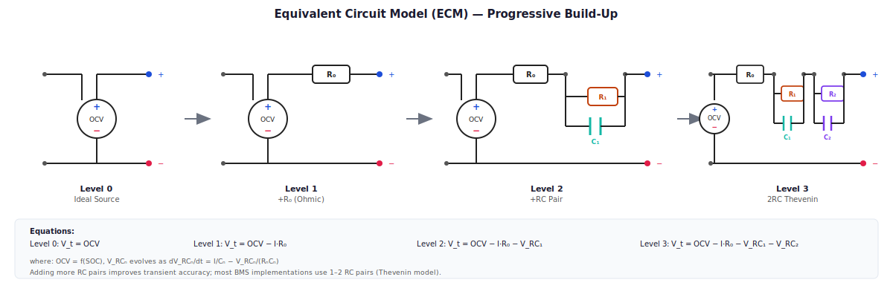
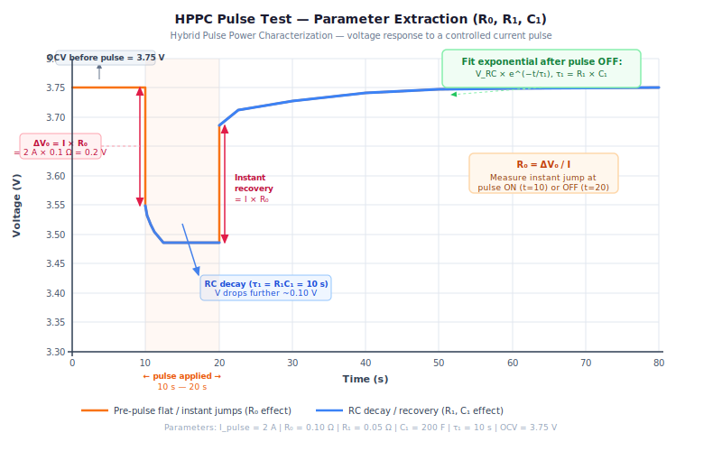

# Equivalent Circuit Model Primer — The Model Inside Every BMS

*Prerequisites: None. This post is self-contained.*
*Next: [OCV vs Terminal Voltage →](../bms-concepts/ocv-vs-terminal-voltage.md)*

---

## Three Mysteries, One Model

You are driving an EV and you floor the accelerator. The battery voltage on the dashboard instantly dips. A second later, it has partially recovered — even though you are still accelerating hard. Where did that recovery come from?

You park the car after a long drive. You check the battery app an hour later and the pack voltage has climbed by a few millivolts — without charging, without any current flowing. Why is the battery seemingly generating voltage out of nothing?

The BMS can estimate your state of charge from voltage — but only if you have been parked for a while. Why does it need the car to sit idle before it trusts the voltage reading?

One model explains all three: the **Equivalent Circuit Model (ECM)**. It is the model that runs inside your BMS every 10–100 milliseconds (implementation-dependent), estimating what is happening inside the cells based on what can be measured at the terminals. This post builds it piece by piece, starting from the simplest possible circuit and adding one component at a time until each mystery is explained.

---

## Why Model a Battery as a Circuit?

A real lithium-ion cell is an electrochemical system. Lithium ions are intercalating into graphite lattices, diffusing through a liquid electrolyte, crossing an SEI (solid electrolyte interphase) layer, reacting at both electrode surfaces — a coupled system of partial differential equations spanning multiple length scales and timescales.

No BMS microcontroller running at 1 kHz can simulate that directly.

The ECM is an engineering compromise: replace the full electrochemistry with a small set of electrical components (resistors, capacitors, voltage sources) that **behave the same way at the terminals**. Not physically accurate at the atomic level — accurate enough at the terminal level for estimation, control, and protection.

This is the standard model in production BMS software worldwide. When a Tesla, a Chevy Bolt, or an Indian EV's BMS estimates your state of charge or limits your power output, it is running some version of this model.

> **For enthusiasts:** Think of it like weather modelling. A weather simulation does not simulate every air molecule — it uses a model that captures the patterns that matter for the forecast. The ECM captures the voltage patterns that matter for the BMS.

---

## Level 0 — The Ideal Voltage Source

The simplest possible model: a battery is a voltage source whose voltage equals the **Open Circuit Voltage (OCV)**.

```
V_terminal = OCV(SOC, T)
```

OCV is the voltage the battery settles to when no current has flowed for a long time. It is a known function of state of charge (the OCV-SOC curve) and temperature. Measure the SOC, look up the OCV curve, and you have the terminal voltage.

This model is **correct at rest** — if the car has been parked for an hour, the terminal voltage will indeed be very close to OCV. It is the foundation everything else builds on.

But the moment you draw current, this model fails. Apply a 100 A discharge pulse and the voltage should instantly drop. Level 0 predicts no drop at all — it says voltage is always OCV regardless of current. That is wrong under any real load.

This is **Mystery 3 in reverse:** the BMS can only trust OCV-based SOC estimation when the car is at rest and has been for long enough that the terminal voltage has settled back to OCV. Under load, the terminal voltage is pulled away from OCV by the dynamics we are about to add.

---

## Level 1 — Add R₀ (Ohmic Resistance)

Place a resistor R₀ in series between the ideal voltage source and the terminal.

```
[OCV source] ---R₀--- [Terminal]

V_terminal = OCV − I × R₀
```

*(Sign convention: positive I = discharge current out of the battery)*

R₀ is the **DC Internal Resistance (DCIR)**. It captures everything that produces an instantaneous voltage drop when current flows: electrolyte resistance, SEI layer resistance, current collector resistance, tab and contact resistance. All of these are ohmic — their voltage drop is instantaneous and proportional to current.

**Mystery 1 solved:** Press the accelerator → inverter draws current → voltage instantly drops by I × R₀. Let off → current drops → voltage instantly recovers by I × R₀. This is the snap you see in the voltage reading under hard acceleration.

### Measuring R₀

Apply a current step and measure the voltage:

```
R₀ = ΔV_instant / ΔI
```

The "instant" is key — measure the voltage at t = 0⁺, right at the moment the current changes, before any slower dynamics have time to evolve. In practice, this means measuring within 10–50 ms of the current step.

### Temperature Dependence

R₀ is strongly temperature-dependent. In cold weather (−10°C), R₀ is typically 2–3× higher than at 25°C for NMC cells — an illustrative range; actual factor depends on chemistry and cell design (Plett 2015). This is why cold EVs have reduced power limits — not reduced capacity necessarily, but reduced *power*, because the instantaneous voltage drop under high current would pull the terminal voltage below the minimum safe level.

### What Level 1 Still Cannot Explain

Apply a 100 A pulse and watch the voltage carefully. The instant drop (R₀) explains the first jump. But the voltage continues to droop **slowly** over the next few seconds, even though the current is perfectly constant. After the current stops, there is an instant partial recovery (the I × R₀ drop disappears), then the voltage continues to slowly climb back toward OCV for tens of seconds.

R₀ alone cannot explain this. We need to add dynamics.

---

## Level 2 — Add an RC Pair (R₁ ‖ C₁)

Place one RC parallel combination in series after R₀.

```
[OCV] ---R₀---+---R₁---+--- [Terminal]
               |        |
              [C₁]      |
               |        |
              GND-------+
```

- **R₁** represents the **charge transfer resistance** — the resistance at the electrode/electrolyte interface, where the electrochemical reaction actually occurs
- **C₁** represents the **electrochemical double-layer capacitance** — the ability of the electrode surface to store charge without a faradaic reaction

The voltage across C₁ evolves according to:

```
dV_C₁/dt = −V_C₁ / (R₁ × C₁) + I / C₁
```

And the terminal voltage becomes:

```
V_terminal = OCV − I × R₀ − V_C₁(t)
```

The time constant of the RC pair is **τ₁ = R₁ × C₁**, typically 10–100 seconds for a lithium-ion cell (illustrative range from published cell characterisation — Plett 2015; actual value is cell and temperature dependent).

### What This Explains

When a constant current I flows, V_C₁ does not jump instantly — it charges up exponentially with time constant τ₁. While it is charging, the terminal voltage continues to droop even under constant current. That is the slow sag you see after the initial R₀ drop.

When current stops:
- The I × R₀ term instantly disappears (instant partial recovery)
- V_C₁ then decays exponentially back toward zero with the same time constant τ₁

**Mystery 2 solved:** Park the car after a drive. V_C₁ is non-zero because current was flowing. With no current, it slowly decays toward zero — and the terminal voltage slowly climbs toward OCV as it does. The battery is not generating voltage. It is releasing stored electrochemical energy from the double-layer capacitance back into the terminal measurement. The "climbing" voltage you see in the app is this decay.

### The Complete Voltage Waveform

The interactive chart below lets you adjust R₀, R₁, C₁, and the current step magnitude, and see the resulting terminal voltage in real time. Use it to build intuition for how each parameter affects the waveform shape before reading the Level 3 section.

> **Interactive:** [ECM voltage response — adjust parameters live](../assets/intro/ecm-voltage-waveform.html)

With the 1RC model, a discharge pulse followed by a rest looks like this:

```
Voltage
   │
OCV┤─────────────────────────────────────────┐ (final rest)
   │                                         ╱
   │                          (slow RC       │
   │                           recovery)     │
   │         ┌────────────────┐ (I×R₀ snap) │
   │         │ (slow RC drop) │              │
   │         │ under constant │              │
   │         │    current     │              │
   ─┼─────────┘               └──────────────┘─────► Time
             ↑                ↑
         Current on       Current off
         (instant R₀ drop first,
          then slow RC droop)
```

---

## Level 3 — Two RC Pairs (The Standard Production Model)

The diagram below shows all four levels of the ECM side by side — from the bare OCV source to the full 2RC Thevenin model. Use it as a reference while reading the sections above.



In reality, the voltage recovery after removing load is not a single exponential — if you plot it carefully, you can see two distinct timescales:

- **Fast dynamics (τ₁ ≈ 10–100 s, typical — cell-specific):** charge transfer at the electrode surface
- **Slow dynamics (τ₂ ≈ 100–1000 s, typical — cell-specific):** diffusion of lithium ions through the electrolyte, a much slower process

Add a second RC pair in series:

```
[OCV] ---R₀---+---R₁---+---R₂---+--- [Terminal]
               |        |        |
              [C₁]     [C₂]      |
               |        |        |
              GND      GND-------+
```

The terminal voltage equation becomes:

```
V_terminal = OCV − I × R₀ − V_C₁(t) − V_C₂(t)
```

With two state variables evolving independently:
```
dV_C₁/dt = −V_C₁ / τ₁ + I / C₁      (τ₁ = R₁C₁, fast)
dV_C₂/dt = −V_C₂ / τ₂ + I / C₂      (τ₂ = R₂C₂, slow)
```

This **2RC Thevenin model** is the standard in production BMS implementations (Hu et al. 2012; Plett 2015 — both in Literature Review). It balances accuracy against computational cost — adding a third RC pair gives diminishing returns in voltage prediction accuracy while tripling the number of parameters to characterise and store.

### As a State-Space System

Express the model in state-space form — this is how it runs in the BMS:

```
State vector:  x = [SOC, V_C₁, V_C₂]

State update:
  SOC_next   = SOC   − (I × Δt) / (3600 × Q_nom)     [Coulomb counting]
  V_C₁_next  = V_C₁ × exp(−Δt/τ₁) + R₁ × (1−exp(−Δt/τ₁)) × I
  V_C₂_next  = V_C₂ × exp(−Δt/τ₂) + R₂ × (1−exp(−Δt/τ₂)) × I

Output (predicted terminal voltage):
  V_pred = OCV(SOC) − I × R₀ − V_C₁ − V_C₂
```

The BMS runs this update every Δt (typically 100 ms), taking the measured current I as input and producing a predicted voltage V_pred. The difference between V_pred and the measured V_terminal is the innovation — the correction signal fed back into the state estimates by the Kalman filter.

> **For engineers:** This is a standard discrete-time LTI system, with the OCV-SOC nonlinearity making it extended (EKF) rather than standard (KF). The exact discretisation shown (zero-order hold) is the numerically stable form used in embedded code.

---

## How ECM Parameters Are Extracted

The model is only useful if its five parameters (R₀, R₁, C₁, R₂, C₂) are known for your specific cell — at multiple temperatures and SOC points.

### The Pulse Test (HPPC-style)

HPPC stands for Hybrid Pulse Power Characterisation, the standard test protocol from the US Advanced Battery Consortium.



1. Rest the cell at a known SOC for at least 2 hours (V_C₁ and V_C₂ decay to zero; per USCAR HPPC procedures)
2. Apply a current step (typically 1C or 2C discharge) for 10–30 seconds
3. Rest again for 30–60 seconds
4. Optionally apply a charge pulse
5. Rest again

From the discharge voltage waveform, extract parameters:

- **R₀:** The instantaneous voltage drop at t = 0⁺ divided by the current step: R₀ = ΔV_instant / ΔI
- **R₁, τ₁:** The fast exponential component of the voltage recovery after the pulse ends
- **R₂, τ₂:** The slow exponential component of the voltage recovery

In practice: fit a two-exponential function to the recovery curve:

```
V_recovery(t) = A₁ × (1 − e^(−t/τ₁)) + A₂ × (1 − e^(−t/τ₂))

where:  R₁ = A₁/I,  C₁ = τ₁/R₁
        R₂ = A₂/I,  C₂ = τ₂/R₂
```

### Lookup Tables Over SOC and Temperature

Parameters are not constant — they change with SOC and temperature. The characterisation is run at 5–10 SOC points (typically 10%, 20%, ..., 90%) and 3–5 temperatures (−10°C, 0°C, 25°C, 40°C, 55°C) — example grid; actual test design follows USCAR HPPC procedures (see Literature Review). The results populate a lookup table embedded in BMS firmware.

During operation, the BMS interpolates from this table based on estimated SOC and measured temperature, updating the model parameters in real time.

This characterisation is done once per cell type in the lab, then shipped in firmware for the life of the pack.

---

## What the ECM Does NOT Capture

Knowing the model's limitations is as important as knowing its strengths.

**Long-term ageing:** R₀ grows and C₁ / C₂ change as the cell ages. The ECM parameters embedded in firmware at manufacturing are increasingly wrong as the battery ages. This is the SOH tracking problem — the BMS must re-estimate parameters over the vehicle's lifetime. The SOH post covers this.

**Lithium plating:** Fast charging at cold temperatures can cause metallic lithium to deposit on the anode instead of intercalating. This is an electrochemical side reaction that the ECM has no way to represent. The BMS guards against it with temperature-dependent charge current limits, not model-based detection.

**LFP hysteresis:** Lithium iron phosphate cells have an OCV-SOC curve that looks slightly different depending on whether the cell is charging or discharging. The OCV after a discharge and the OCV after a charge at the same SOC are not identical — typically offset by 20–30 mV. A standard ECM assumes OCV is a unique function of SOC. For LFP, you need an additional hysteresis state variable in the model. This is covered in the SOC post.

**Very slow diffusion:** The slowest time constant (τ₂) in most 2RC models is tuned to fit dynamics up to 10–15 minutes. For cells with very slow solid-state diffusion (some LFP chemistries), the voltage may continue to drift for 30+ minutes after a load change. A 3RC model or a Warburg impedance element is needed for full accuracy at these timescales — overkill for most production BMS implementations.

---

## Experiment Ideas

### Experiment 1 — See the RC Voltage Response (No Battery Needed)

**Materials:** 10 kΩ resistor, 1000 µF capacitor, 9 V battery, switch, Arduino with ADC or oscilloscope

**Setup:** Wire up: `9V battery → switch → 10kΩ resistor → 1000µF cap → GND`. Log voltage across the capacitor at 1-second intervals.

**Procedure:**
1. Close the switch. Log V_cap vs time for 60 seconds.
2. Open the switch. Log V_cap vs time for another 60 seconds.
3. Calculate τ = R × C = 10 kΩ × 1000 µF = 10 s.
4. Verify: V_cap should reach 63% of its final value in approximately 10 seconds.

**What to observe:** The exponential charging and discharging curves. This is exactly the shape of V_C₁(t) in the ECM — the same RC dynamics, just scaled to much longer time constants in a real battery cell (seconds to minutes rather than 10 ms). Changing R or C proportionally changes τ and shifts the curve left or right.

### Experiment 2 — Extract R₀ from a Real 18650 Cell

**Materials:** 18650 cell at ~50% SOC (rested overnight), INA219 current/voltage sensor, Arduino, 4Ω load resistor, N-channel MOSFET (e.g., IRLZ44N) for switching, USB serial logging

**Setup:** Wire the MOSFET in series with the load resistor across the cell. Use the Arduino to toggle the MOSFET gate and log INA219 readings every 10 ms.

**Procedure:**
1. Rest the cell for at least 1 hour. Record OCV.
2. Start logging. Close the MOSFET (apply load). Log for 30 seconds.
3. Open the MOSFET (remove load). Log for 5 minutes.
4. Export the data.

**Extract R₀:**
```
R₀ = (OCV − V_at_t=0.01s) / I_measured
```
Use the earliest voltage reading after switching on, before the RC dynamics have time to develop.

**What to observe:** The two-phase voltage response is usually clearly visible even at 10 ms sampling:
- Instant drop at load application (R₀)
- Continued slow droop under constant load (RC dynamics)
- Instant partial recovery at load removal (R₀)
- Slow exponential recovery toward OCV (RC dynamics decaying)

A typical 18650 NMC cell has R₀ ≈ 60–150 mΩ at room temperature. At −10°C, repeat the experiment and observe R₀ roughly doubling.

### Experiment 3 — Simulate the 2RC ECM in Python

**Materials:** Python (NumPy, Matplotlib), the R₀ value from Experiment 2 (use typical values if skipping Experiment 2: R₀ = 0.08 Ω, R₁ = 0.03 Ω, τ₁ = 30 s, R₂ = 0.01 Ω, τ₂ = 300 s)

**Code skeleton:**
```python
import numpy as np
import matplotlib.pyplot as plt

# ECM parameters (typical NMC 18650 at 25°C, 50% SOC)
R0, R1, C1, R2, C2 = 0.08, 0.03, 1000, 0.01, 30000
tau1, tau2 = R1 * C1, R2 * C2

OCV = 3.75  # V at ~50% SOC
dt  = 0.1   # seconds

# Current profile: 2A discharge for 30s, then rest
t_total = 120  # seconds
I_profile = np.where(np.arange(0, t_total, dt) < 30, 2.0, 0.0)

Vc1, Vc2, V_out = 0.0, 0.0, []
for I in I_profile:
    Vc1 = Vc1 * np.exp(-dt / tau1) + R1 * (1 - np.exp(-dt / tau1)) * I
    Vc2 = Vc2 * np.exp(-dt / tau2) + R2 * (1 - np.exp(-dt / tau2)) * I
    V_out.append(OCV - I * R0 - Vc1 - Vc2)

t = np.arange(0, t_total, dt)
plt.plot(t, V_out)
plt.axvline(30, color='r', linestyle='--', label='Load off')
plt.xlabel('Time (s)'); plt.ylabel('Terminal voltage (V)')
plt.title('2RC ECM — simulated voltage response'); plt.legend(); plt.show()
```

**What to observe:** The characteristic two-phase drop and two-phase recovery. Experiment with doubling τ₁ or τ₂ and watch how the timescales shift. Increase R₀ and see how the instant drop magnifies. This gives intuition for why cold batteries (high R₀) lose voltage headroom so quickly under peak power demands.

---

## Takeaways

- A real battery cell is too complex to simulate directly in a BMS. The ECM replaces the electrochemistry with a small circuit that behaves the same way at the terminals.

- **R₀** (ohmic resistance) explains the instantaneous voltage drop when current flows. It rises sharply in cold temperatures and is the primary reason cold EVs have reduced power limits.

- **RC pairs** explain why voltage continues to change even under constant current, and why it recovers slowly after current stops. The time constants are tens to hundreds of seconds — much slower than anything you would intuitively associate with "electrical" behaviour.

- The **2RC Thevenin model** is the standard in production BMS firmware. It has five parameters (R₀, R₁, C₁, R₂, C₂) that vary with SOC and temperature and are stored in a lookup table.

- Expressed as a state-space system with states [SOC, V_C₁, V_C₂], the ECM is the model that the Kalman filter in the BMS uses to estimate SOC. Without the model, there is nothing to correct against.

- The ECM does not capture ageing, lithium plating, or LFP hysteresis. These are handled separately in SOH tracking and charge algorithm posts.

---

## Literature Review

### Core Textbooks

- **Plett, G.L.** — *Battery Management Systems, Vol. 1: Battery Modeling* (Artech House, 2015) — Ch. 3 and 4 are the definitive treatment of ECM derivation, parameter extraction, and state-space form. The notation used in this post follows Plett's conventions.

- **Linden & Reddy** — *Handbook of Batteries, 4th ed.* — electrochemical background for understanding what each ECM component physically represents at the electrode level

### Key Papers

- **Hu, X. et al.** (2012) — "A comparative study of equivalent circuit models for Li-ion batteries" — *Journal of Power Sources* 198, pp. 359–367 — Systematic accuracy-vs-complexity comparison: 0RC, 1RC, 2RC, Thevenin variants. Shows 2RC is the practical sweet spot.

- **Chen, M. & Rincon-Mora, G.A.** (2006) — "Accurate electrical battery model capable of predicting runtime and I-V performance" — *IEEE Transactions on Energy Conversion* 21(2) — Accessible derivation with experimental validation on commercial cells.

- **Plett, G.L.** (2004) — "Extended Kalman filtering for battery management systems of LiPB hybrid electric vehicle batteries" — *Journal of Power Sources* 134(2), pp. 262–276 — The paper showing how the ECM state-space form feeds directly into the EKF estimator used in production BMS software.

### Online Resources

- **Gregory Plett's BMS course** (University of Colorado Colorado Springs) — freely available lecture slides and MATLAB/Python code covering ECM derivation, HPPC parameter extraction, and Kalman filtering

- **MATLAB Battery Equivalent Circuit Model example** (MathWorks documentation) — runnable Simulink model of a 2RC ECM with parameter lookup tables and a drive cycle validation

- **Battery University** — "BU-902: How to Measure Internal Resistance" — practical guidance on DCIR measurement, including errors to avoid

### Standards and Test Procedures

- **USCAR Electric Vehicle Battery Test Procedures Manual** (US Advanced Battery Consortium) — defines HPPC procedures, rest time requirements, and SOC/temperature grid design for ECM parameter extraction. Available at uscar.org.

- **DOE/INL Battery Test Manual for Plug-In Hybrid Electric Vehicles** (INL/EXT-07-12536) — companion HPPC reference covering PHEV battery characterisation; rest period and pulse protocol specifications used throughout this post. Available at osti.gov.

### Application Notes

- **TI Application Report SLUA902** — "Battery State of Charge Estimation Using the Thevenin Equivalent Circuit" — implementation guidance for TI's BMS ICs

- **Analog Devices** — "Modeling and Simulation of Lithium-Ion Batteries from a Systems Engineering Perspective" (available on the ADI website) — practical parameter extraction guide with worked examples
