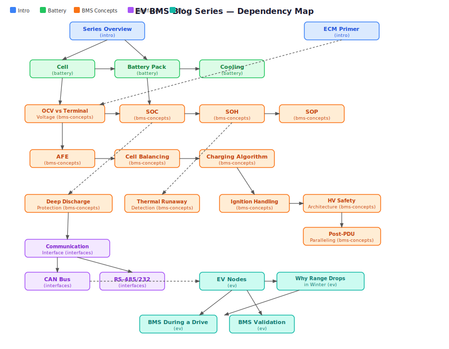
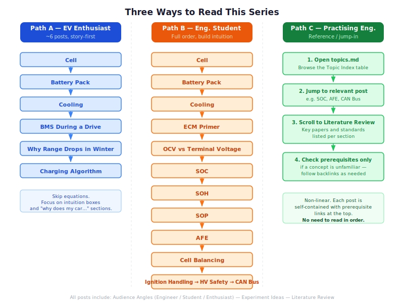

# How to Read This Blog — A Map of the EV BMS Series

This is a technical blog about EV battery management systems — how they work, how they think, and why they do the things they do. Before diving in, here's everything you need to know to find the right starting point and get the most out of it.

---

## What This Blog Is (and Isn't)

This is not a buying guide. It is not a range comparison or a spec sheet review. It does not tell you which EV to buy or which battery chemistry "wins."

What it is: a ground-up technical explanation of how EV batteries work — from the cell level up through the algorithms, safety systems, and communication protocols that make a modern EV battery management system function. By the end of the series, you should be able to open a BMS datasheet or a live CAN bus log and understand what you are looking at.

Every post is written to serve **three readers at once**:

- **Engineering students (2nd–4th year EE / ME / ECE):** You have circuit theory and maybe some coding. You want to understand what BMS engineers actually do — not the textbook abstraction, but the real implementation. This series builds from cell physics through algorithm design to embedded communication.

- **EV enthusiasts:** You own or want an EV. You've read specs but want to understand the engineering behind range, charging, degradation, and dashboard warnings. You do not need any prior technical knowledge. Every post starts with an intuition-first hook and ends with plain-English takeaways.

- **Practicing engineers:** You work in automotive, power electronics, or a related field and want a reference on topics adjacent to your specialty. Use the index below to jump directly to what's relevant. Each post has a Literature Review pointing to the key papers and standards.

Depth is always flagged. When a section goes technical, it says so. When it's accessible to everyone, it says that too.

---

## What You Need to Know Before Starting

**For engineering students:** Ohm's law, basic RC circuits, and how a voltage divider works. If you know these, every post is accessible. Calculus appears in the SOC and SOP posts but is explained in context — you will not need to differentiate anything from scratch.

**For enthusiasts:** Nothing required. Every post opens with a real-world hook you've probably experienced — a voltage drop under hard acceleration, a range estimate that collapses in January, a charger that mysteriously slows down at 80%. The physics follows the experience.

**For engineers:** The Equivalent Circuit Model (ECM) primer is worth reading even if you know the basics. It establishes the notation and model structure used throughout the series.

---

## The Series Map

The diagram below shows the full dependency graph — arrows indicate "should be read before". Dashed arrows are soft dependencies (helpful but not required). Use it to plan your reading order or to understand why a post references another.

### Introduction (Start Here)

| Post | What It Covers |
|------|----------------|
| **Series Overview** *(this post)* | Reading guide and map |
| **Equivalent Circuit Model Primer** | The Thevenin model that underpins SOC, SOP, and OCV posts. Read this before anything in BMS Concepts. |

### Battery — The Hardware Foundation

| Post | What It Covers |
|------|----------------|
| **Cell** | Chemistry, formats (18650 / prismatic / pouch), datasheets, NMC vs LFP. The vocabulary of everything else. |
| **Battery Pack & Module** | How cells become a pack. Series/parallel configuration, xSyP notation, module vs pack hierarchy. |
| **Cooling** | Why temperature is the master variable. Passive, forced-air, and liquid cooling architectures. |

### BMS Concepts — The Intelligence Layer

These posts build on each other. Reading order matters.

| # | Post | What It Covers |
|---|------|----------------|
| 1 | **OCV vs Terminal Voltage** | The voltage gap that every other post references. Why the number on the dashboard is not the "true" battery voltage. |
| 2 | **State of Charge (SOC)** | The fuel-gauge problem. Coulomb counting, OCV lookup, and why you need a Kalman filter. |
| 3 | **State of Health (SOH)** | How batteries age. Capacity fade, internal resistance rise, and how the BMS tracks both. |
| 4 | **State of Power (SOP)** | Why you can't always floor it. How the BMS computes real-time power limits from voltage, temperature, and SOH. |
| 5 | **Cell Balancing** | Why packs go out of balance. Passive (burn it off) vs active (move the charge) balancing. |
| 6 | **Analog Front End (AFE)** | The hardware that measures every cell voltage and temperature. The bridge between electrochemistry and software. |
| 7 | **Deep Discharge Protection** | What happens below the minimum voltage. Copper dissolution, irreversible damage, and the recovery protocol. |
| 8 | **Thermal Runaway Detection & Handling** | The last line of safety. Five stages of runaway, how the BMS detects each, and what AIS-156 requires. |
| 9 | **Charging Algorithm** | CC-CV charging, fast charging, cold-temperature derating, and why the charger slows at 80%. |
| 10 | **Error Handling & Fault Reporting** | DTC codes, severity levels, CAN fault messages, and how the BMS tells the driver (and the cloud) something is wrong. |
| 11 | **Ignition Handling** | How the BMS wakes up, runs pre-charge, arms the contactors, and shuts down safely. |
| 12 | **HV Safety Architecture** | The complete safety circuit: HVIL loop, contactors, pyro-fuse, and six-layer defence-in-depth. |
| 13 | **Post-PDU Paralleling** | Connecting multiple battery packs. The inrush current problem and why pre-charge matters here too. |
| 14 | **BMS During a Drive** | A narrative that ties the whole series together — what the BMS is doing every 100ms during a real drive. |

### Interfaces — How Everything Communicates

| Post | What It Covers |
|------|----------------|
| **Communication Interface Overview** | All protocols used in a BMS system: CAN, SPI, I²C, RS-485, UART, LIN. |
| **CAN Bus** | Deep dive. Frame structure, bit stuffing, arbitration, error frames, J1939. |
| **RS-485 / RS-232** | Deep dive. Multi-drop wiring, termination, Modbus RTU, industrial BMS context. |

### EV — The Vehicle Context

| Post | What It Covers |
|------|----------------|
| **EV Nodes** | Every ECU in a BEV and how they connect. VCU, BMS, inverter, OBC, DC-DC, HVAC, and the CAN backbone. |
| **Why Range Drops in Winter** | Combines SOP, SOC, and thermal physics into one direct answer. |

### Standards

| Post | What It Covers |
|------|----------------|
| **AIS-156** | Indian standard for EV battery safety. Thermal propagation test, IP requirements. |
| **AIS-004** | Indian type approval standard for EVs. |
| **ISO 26262** | Functional safety for automotive systems. ASIL levels and how they apply to BMS software. |
| **ISO 13849** | Safety of machinery — relevant for EV charger and service equipment. |

---

## Three Suggested Reading Paths

### Path A — "I want to understand my EV" (enthusiast, ~6 posts)

Start here if you own or follow EVs and want the engineering intuition without needing the full technical depth.

1. **Cell** — understand what is physically inside your battery
2. **Battery Pack** — understand how cells become the pack under your floor
3. **Cooling** — understand why winter and fast charging stress the battery
4. **BMS During a Drive** — see all of it working together in a single drive
5. **Why Range Drops in Winter** — the direct technical answer to a question every EV owner has
6. **Charging Algorithm** — understand why fast charging slows at 80%

### Path B — "I'm a student building EV knowledge" (read in order)

This is the full technical path. Reading in order ensures every post's prerequisites are already covered.

1. **Cell → Battery Pack → Cooling** — hardware foundation
2. **ECM Primer** — essential model before touching BMS Concepts
3. **OCV vs Terminal Voltage → SOC → SOH → SOP** — the estimation stack
4. **AFE → Cell Balancing** — measurement hardware and charge management
5. **Deep Discharge → Thermal Runaway → Charging Algorithm** — protection and charging
6. **Ignition Handling → HV Safety** — system safety architecture
7. **Error Handling → CAN Bus → EV Nodes** — communication and vehicle integration

### Path C — "I need a reference on a specific topic" (engineer)

Use the table above to jump directly. Every post's Literature Review section points to the key papers, datasheets, and standards relevant to that topic. No need to read sequentially.

---

## How Each Post is Structured

Every post follows the same format:

**Hook** — A real-world observation or experience that motivates the topic. Not a definition, not a formula — something that makes you want to know the answer.

**Intuition First** — The physical picture. What is actually happening? Why? This section is always accessible regardless of technical background.

**Technical Depth** — The equations, circuit diagrams, algorithm implementations, and edge cases. This section has the detail engineers and students are looking for.

**Takeaways** — Plain-English summary of the key points. If a section was too technical, the takeaways give you the essentials.

**Experiments** — 2–3 hands-on experiments with a consistent low-cost hardware kit used throughout the series:
- Arduino Uno/Nano + INA219 (current and voltage logging)
- 18650 Li-ion cells (NMC and LFP where chemistry comparison matters)
- NTC thermistors
- MCP2515 CAN shield (CAN and communication posts)
- MAX485 module (RS-485 post)
- TI BQ76940EVM or BQ76920 breakout (AFE post)

*Part choices above are examples used in this blog's experiments; equivalents with similar specifications will work.*

**Literature Review** — The key textbooks, papers, online resources, and standards that go deeper on that topic.

---

## A Note on Depth

Some posts go deep. The SOC post covers the Extended Kalman Filter. The CAN post covers bit stuffing and error confinement. These are intentional — the goal is *intermediate* depth, not a beginner-only survey.

If a section loses you, the Takeaways at the end always give you the plain-English version. You can return to the technical depth when you're ready, and the cross-links between posts will tell you which prerequisites to read first.

The series is designed to be reread. A post that seems abstract now will make more sense after you've read its prerequisites.

---

## Where to Start

If you are not sure, start here: **[Equivalent Circuit Model Primer →](./equivalent-circuit-model.md)**

It is the shortest post that gives you the most leverage. It explains the model that the BMS runs in real time, and understanding it makes every subsequent post click into place. After that, follow whichever path above fits your goal.

---

## Further Reading

For going beyond this blog:

- **Plett, G.L.** — *Battery Management Systems, Vol. 1 & 2* (Artech House, 2015) — the definitive technical reference for BMS estimation and control
- **Warner, J.T.** — *The Handbook of Lithium-Ion Battery Pack Design* — for hardware and pack engineering depth
- **Battery University** (batteryuniversity.com) — free, well-organized, excellent for building intuition before tackling the technical posts
- **Gregory Plett's BMS course** (University of Colorado) — free lecture slides and MATLAB code, pairs well with this blog's estimation posts
- **TI University Program** — free courses on battery management ICs
