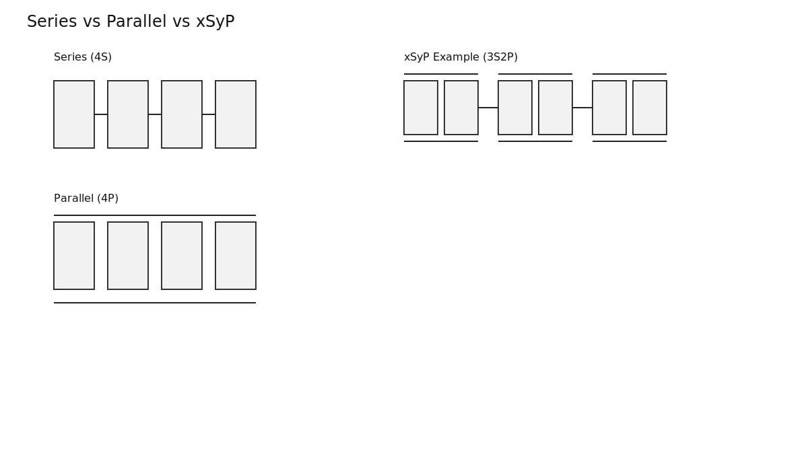
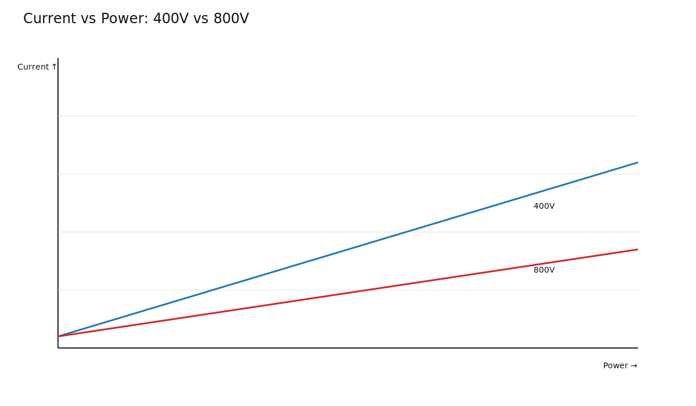
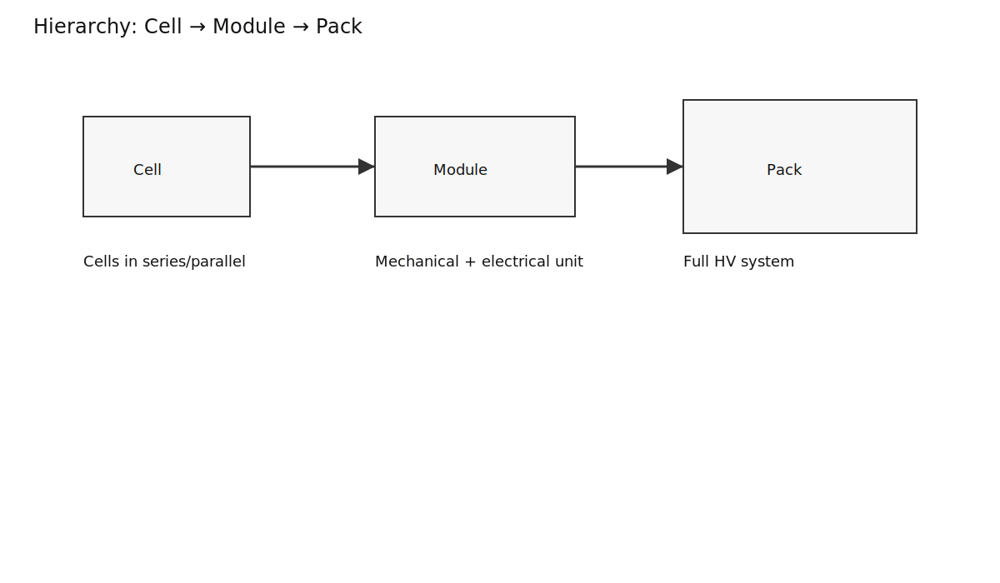
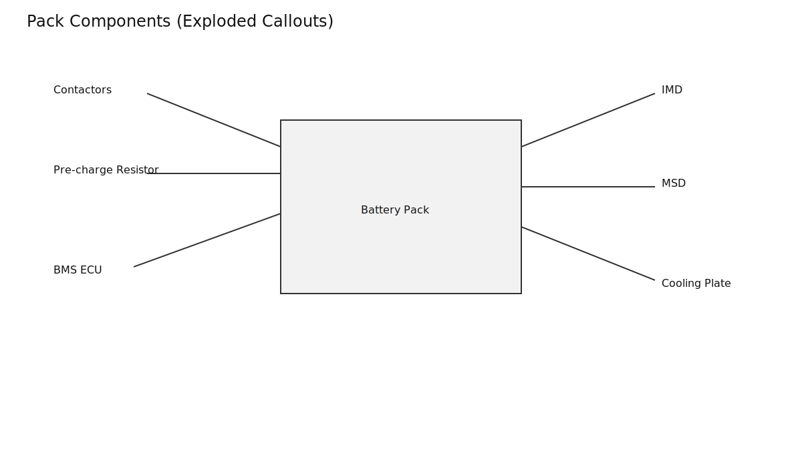
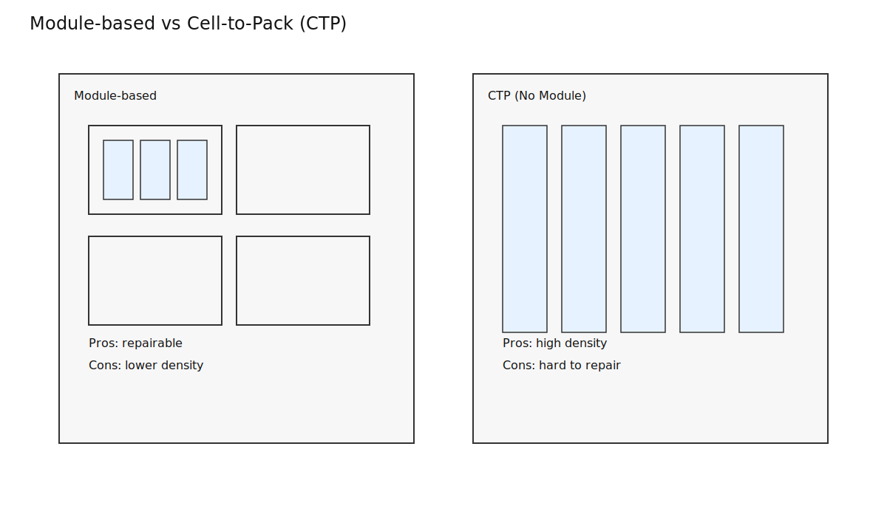
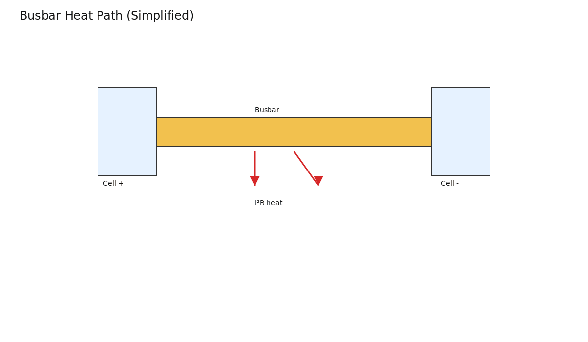
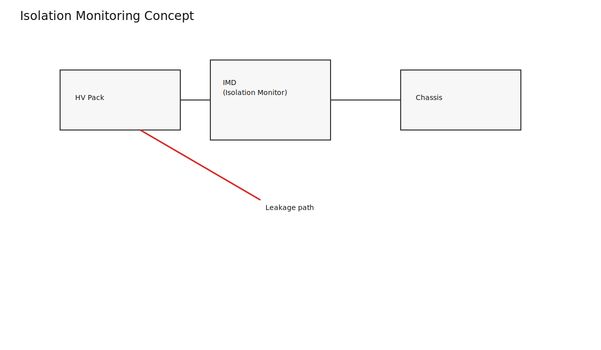
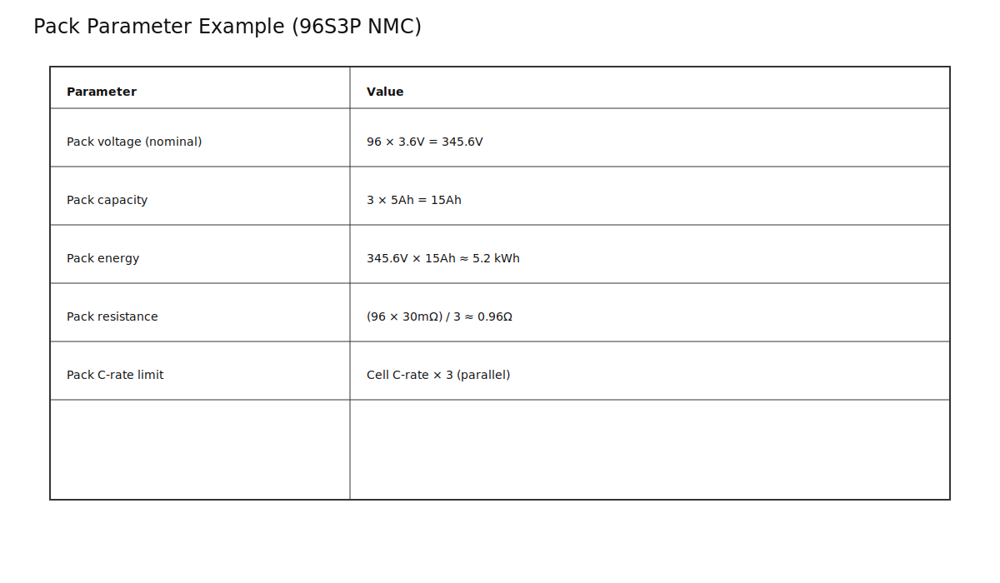

# Battery Pack & Module Architecture — From Cells to 400 V / 800 V Systems

*Prerequisites: [Cell Fundamentals →](./cell.md)*  
*Next: [Cooling / Thermal Management →](./cooling.md)*

---

## From a 3.6 V Cell to a 400 V Pack

A single Li-ion cell is ~3.6 V and a few amp-hours. An EV pack needs hundreds of volts and hundreds of amp-hours. You cannot just build one giant cell; safety, thermal management, and manufacturing variability make that impossible. So we build **packs** out of many smaller cells. The way those cells are connected determines voltage, capacity, power, impedance, and safety.

---

## The Two Levers: Series and Parallel

### Series — Add Voltage
Connect cells end-to-end.

```
[Cell] -- [Cell] -- [Cell]   => voltages add
```

- Voltage adds: 10 x 3.6 V = 36 V
- Capacity stays the same
- Resistance adds: R_pack = N x R_cell
- Every cell carries the same current
- The weakest cell limits the entire string

### Parallel — Add Capacity
Connect cells side-by-side.

```
[Cell]
[Cell]  => capacity adds, voltage stays the same
[Cell]
```

- Voltage stays the same
- Capacity adds: 3 x 5 Ah = 15 Ah
- Resistance divides: R_pack = R_cell / N
- Cells self-balance; failure in one cell can drive current into it

### Series + Parallel (xSyP)
Real packs combine both. For **96S3P** with 5 Ah cells:

- V_pack = 96 x 3.6 V = 345.6 V
- C_pack = 3 x 5 Ah = 15 Ah
- E_pack = 345.6 V x 15 Ah = 5.18 kWh (per module)



---

## Why 400 V? (And Why 800 V?)

Power is P = V x I. For the same power, higher voltage means lower current. Lower current means smaller cables, less I^2R loss, and easier thermal management.

- **400 V**: mature ecosystem, lower insulation cost
- **800 V**: lower current for the same power, faster charging with less cable heating



Most EVs today are 400 V; premium platforms and fast-charge leaders are moving to 800 V.

---

## Pack Hierarchy — Cell → Module → Pack



### Cell
The fundamental electrochemical unit (covered in the Cell post).

### Module
A mechanical and electrical sub-assembly of cells, typically 6–24 cells. It contains:

- Busbars and interconnects
- Sense wires for each cell
- Thermistors
- Structural compression hardware

Modules are easier to repair and replace, but add weight and volume.

### Pack
The full HV assembly. It includes:

- Main contactors + pre-charge circuit
- Current sensor (shunt or Hall)
- Manual Service Disconnect (MSD)
- BMS electronics and AFE chains
- Cooling system and enclosure



### Cell-to-Pack (CTP)
CTP eliminates the module layer. Cells mount directly into the pack structure, increasing volumetric efficiency but reducing repairability.



---

## Cell-to-Module Engineering Details

### Busbars and Interconnects
Busbars carry full pack current. Their resistance and thermal path influence power capability. Flexible busbar systems (CCS) absorb manufacturing tolerances and thermal expansion.



### Mechanical Compression
Prismatic and pouch cells swell with cycling. Controlled compression maintains electrode contact and reduces delamination. Cylindrical cells are rigid and typically do not need external compression.

### Cell Holders and Bonding
Cylindrical cells often use plastic holders for spacing and vibration isolation. Some packs bond cells to cooling plates with thermally conductive structural adhesive.

---

## HV Isolation and Safety

High-voltage packs are isolated from chassis ground. Isolation monitoring detects leakage paths and faults.



Key safety elements:

- Main contactors and pre-charge path
- HVIL loop (interlock)
- Pyro-fuse or crash-activated fuse
- Manual Service Disconnect (MSD)

Standards that drive these requirements include ECE R100, FMVSS 305, and ISO 6469-1.

---

## Pack-Level Electrical Parameters — Worked Example

For a 96S3P pack using Samsung 50E cells (5 Ah, 3.6 V, 30 mOhm DCIR):

| Parameter | Calculation | Result |
|---|---|---|
| V_pack nominal | 96 x 3.6 V | 345.6 V |
| V_pack max | 96 x 4.2 V | 403.2 V |
| Capacity | 3 x 5 Ah | 15 Ah |
| Energy | 345.6 V x 15 Ah | 5.18 kWh |
| DCIR | (30 mOhm / 3) x 96 | 0.96 Ohm |

The weakest cell still governs. Under load, the pack voltage collapses first where the most resistive or lowest-capacity cell sits.



---

## Pack-Level vs Cell-Level Limits

The BMS sets pack limits based on the most constrained cell, not the average. One hotter or weaker cell can reduce available power for the whole pack. This is why matching, balancing, and thermal uniformity matter.

---

## Repairability and Second Life

- **Module-based** packs: replace a bad module; easier diagnostics and second-life assessment.
- **CTP packs**: high efficiency and low cost, but usually replace-the-pack repair strategy.

Second-life reuse depends on knowing SOH at module or cell granularity; CTP makes that harder.

---

## Takeaways

- Series/parallel topology determines voltage, capacity, impedance, and fault behavior.
- 400 V vs 800 V is a system-level trade-off, not just a marketing number.
- Module vs CTP is the current design pendulum: efficiency vs repairability.

---

## Experiments

### Experiment 1: Build a 4S Pack and Measure Parameters
**Materials**: 4 matched 18650 cells, holder, DMM, INA219.

**Procedure**:
1. Measure each cell OCV and DCIR.
2. Assemble 4S string.
3. Verify pack OCV = sum of cell OCV.
4. Measure pack DCIR and compare to sum of cell DCIR.

**What to observe**: One weak cell constrains the pack earlier under load.

### Experiment 2: Series vs Parallel Capacity Test
**Materials**: 4 cells, switchable 2S2P vs 4S1P vs 1S4P setup.

**Procedure**:
1. Discharge each configuration at equal per-cell C-rate.
2. Measure total delivered mAh and Wh.

**What to observe**: Voltage and capacity scale predictably; total energy is similar.

### Experiment 3: Isolation Resistance Demo (Safe Scale)
**Materials**: 9 V battery, 10 MOhm resistor, DMM.

**Procedure**:
1. Measure isolation to chassis with no fault.
2. Add a 1 MOhm fault path and re-measure.
3. Scale the leakage current to 400 V.

**What to observe**: How isolation monitoring detects small leakage paths.

---

## Literature Review

### Core Textbooks
- Andrea, D. — *Battery Management Systems for Large Lithium-Ion Battery Packs*
- Warner, J.T. — *The Handbook of Lithium-Ion Battery Pack Design*
- Ehsani, M. — *Modern Electric, Hybrid Electric, and Fuel Cell Vehicles*

### Key Papers
- Saw, L.H. et al. (2016) — J. Cleaner Production
- Zubi, G. et al. (2018) — Renew. Sustainable Energy Reviews
- Ciez, R.E. & Whitacre, J.F. (2017) — J. Power Sources

### Standards / App Notes
- ECE R100, FMVSS 305, ISO 6469-1, IEC 62660-2, SAE J2929
