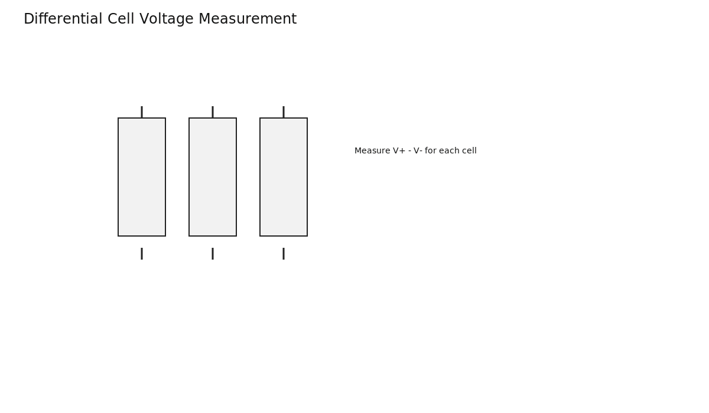
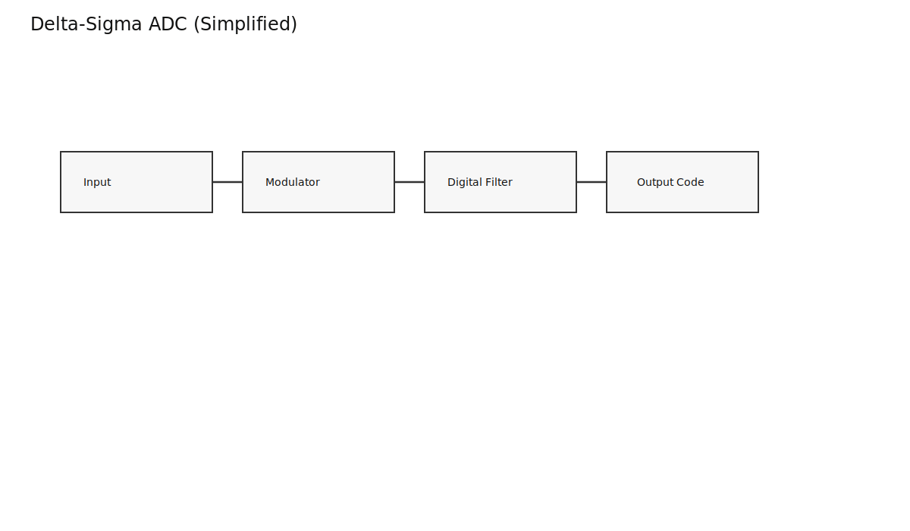
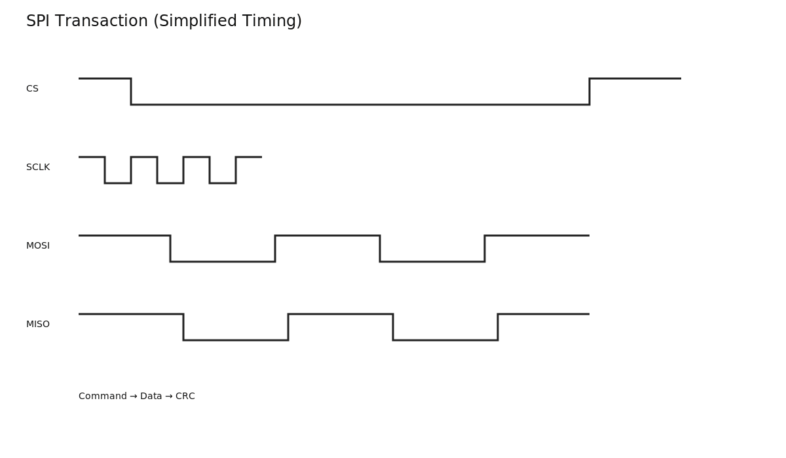
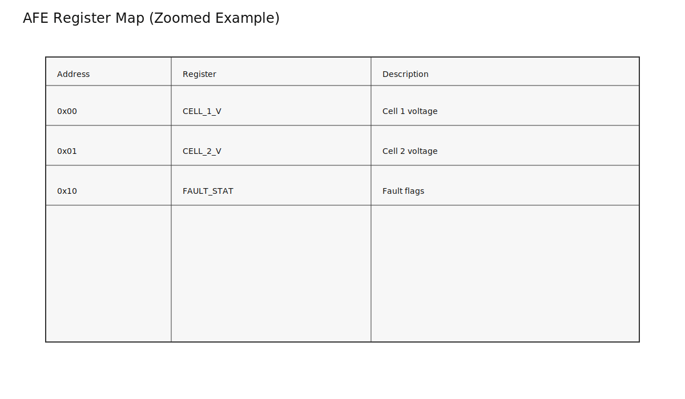
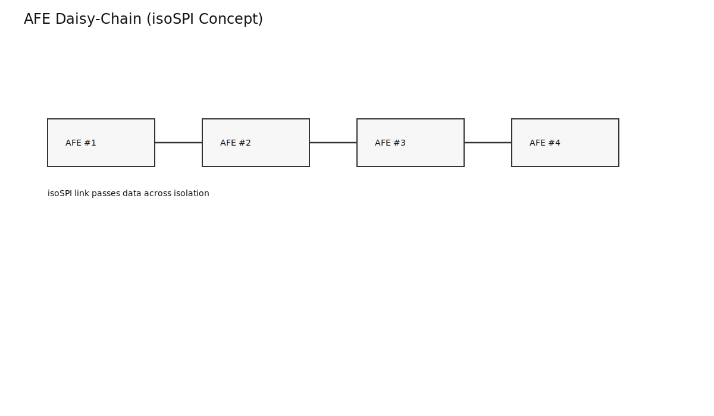

# Analog Front End (AFE) — The Eyes and Ears of the BMS

*Prerequisites: [Battery Pack & Module Architecture →](../battery/battery.md)*  
*Next: [Cell Balancing →](./cell-balancing.md)*

---

## Flying Blind Without It

A BMS must protect a system that may span 0 to 800 V, hundreds of amps, and harsh temperature swings. The MCU at the heart of the BMS is a small 3.3 V digital chip that cannot touch those signals directly. The **Analog Front End (AFE)** is the hardware that makes it possible to measure cell voltages, temperatures, and current *safely* and *accurately*, then hand those values to the MCU as clean digital data.

Accuracy is not a small detail. A 10 mV error in cell voltage can translate into a 2–3% SOC error, which becomes premature power cutoffs or undetected overcharge risk. The AFE is where hardware quality shows up as software performance.

---

## What an AFE Actually Is

An AFE is a purpose-built IC for battery monitoring. It is not just an ADC with a few resistors. It typically includes:

- Differential cell voltage measurement with multiplexing
- A precision reference and a delta-sigma ADC
- CRC/PEC-protected digital output
- Balancing FET drivers (often on-chip)
- Protection comparators for OV/UV

Common AFEs and their cell counts:

| Manufacturer | Part | Cells per chip | Notes |
|---|---|---|---|
| Texas Instruments | BQ76920 / BQ76930 / BQ76940 | 5 / 10 / 15 | Widely used, MCU + SPI/I2C interface |
| Analog Devices | LTC6804 / LTC6811 / LTC6812 | 12 / 18 / 15 | isoSPI daisy-chain, automotive staple |
| Maxim | MAX17843 | 14 | Automotive-grade daisy-chain |
| NXP | MC33771 | 14 | Automotive-grade |
| Renesas | RAA489100 | 14 | High-voltage stack monitor |

The value is not just raw resolution. It is *safe measurement at high common-mode voltage* plus the digital reliability required for safety systems.

---

## Cell Voltage Measurement

The problem: in a 15S pack, cell 10 sits at about 36 V above ground. A standard ground-referenced ADC cannot measure it without being destroyed.

The solution is **differential measurement**: the AFE measures the voltage difference between each cell's V+ and V- directly, so the absolute voltage relative to ground is irrelevant.



Most AFEs use a **delta-sigma ADC** because battery voltages change slowly but need high precision. Delta-sigma trades speed for noise rejection and resolution, which is perfect for cell measurement.

Typical numbers:

| Parameter | Typical value |
|---|---|
| Resolution | 16-bit |
| Accuracy | ±1–5 mV per cell |
| Full scan (15 cells) | 1–10 ms |
| Reference drift | tens of ppm/degC |



Why the mV matter: at mid-SOC, NMC OCV slope is roughly 15–25 mV per 1% SOC. A 5 mV error is ~0.2–0.3% SOC per cell. That error compounds across a pack and across time.

---

## Current Measurement

Pack current is usually measured with a shunt resistor in the main current path. The AFE (or a dedicated current-sense IC) measures the tiny differential voltage across that shunt.

- Typical shunt: 0.5–2 mOhm
- 100 A through 1 mOhm = 100 mV (measurable)
- 10 A through 1 mOhm = 10 mV (noise becomes significant)

A Hall-effect sensor is the alternative: galvanically isolated and safe, but typically lower accuracy. This matters because **current error integrates into SOC drift** over time. A 1% current error produces roughly a 1% SOC error over a full cycle.

Some AFEs include a current sense amplifier input; others rely on an external current sense IC (for example INA219-class) that reports current to the MCU over I2C or SPI.

---

## Temperature Measurement

AFEs measure temperatures using NTC thermistors. The AFE provides a known excitation voltage, measures the divider output, and the MCU converts it using a lookup table or Steinhart-Hart equation.

```
1/T = A + B*ln(R) + C*(ln(R))^3
```

Placement is critical. One thermistor per module can miss a hotspot; production packs use multiple sensors per module, often near cell tabs where heat concentrates.

---

## Balancing Control

Most AFEs include passive balancing control. Each cell channel has a balancing control bit in a register. The MCU decides which cells to bleed; the AFE turns on the corresponding MOSFET gate driver.

Balancing current depends on the external bleed resistor (often 50–200 mA). The AFE executes the decision; the balancing strategy lives in firmware.

---

## MCU Interface and Register Map

AFEs are configured and read over SPI (sometimes I2C). The MCU reads voltage/temperature registers and writes configuration registers (OV/UV thresholds, balancing enables, protection settings).




A typical SPI read looks like:

```
1. CS low
2. Send command byte (e.g., read cell voltages)
3. Receive data bytes
4. Receive CRC/PEC
5. CS high
6. Verify CRC, retry if needed
```

The CRC is not optional in a real vehicle. Inverter switching noise, long cables, and EMI are constant threats. Bad reads propagate into bad SOC and bad protection decisions.

---

## Daisy-Chain Topology for Large Packs

One chip handles ~5–18 cells. A 96S pack needs multiple AFEs chained together. The challenge is isolation: each chip floats at a different high-voltage potential.

Analog Devices solves this with **isoSPI**, a transformer-coupled communication scheme. The MCU sends a broadcast command, and each AFE appends its data as the frame propagates through the chain.



TI-based designs often use external digital isolators per chip instead of isoSPI, which increases wiring complexity but can be simpler to reason about in software.

---

## Hardware-Speed Protection

Most AFEs include OV/UV comparators that can trigger protection faster than the MCU loop. If a cell crosses the threshold, the AFE asserts an ALERT pin or directly drives a protection FET path. This is the final safety layer if the MCU hangs or is too slow.

Protection thresholds are programmed during initialization; if those values are wrong, the hardware layer is wrong. This is why production BMS firmware verifies register writes on every boot.

---

## Takeaways

- The AFE is the BMS measurement backbone: it makes safe, accurate sensing possible.
- Measurement accuracy directly limits SOC accuracy and protection confidence.
- Understanding the AFE register map is the first real step toward production-grade BMS firmware.

---

## Experiments

### Experiment 1: Interface with a BQ76940 Eval Board
**Materials**: BQ76940EVM or BQ76920 breakout, Arduino, 5–15 Li-ion cells, SPI wires, DMM.

**Procedure**:
1. Wire SPI and ALERT lines per the TI reference schematic.
2. Write a basic SPI driver to read cell voltages.
3. Compare AFE readings against a DMM for each cell.

**What to observe**: Register map access, CRC behavior, and typical measurement error in mV.

### Experiment 2: Measurement Error to SOC Error
**Materials**: AFE setup + precision voltage reference.

**Procedure**:
1. Feed known voltages to AFE inputs.
2. Measure error in mV.
3. Use an OCV-SOC slope to compute SOC error.

**What to observe**: LFP's flat OCV curve makes the same mV error far more damaging than in NMC.

### Experiment 3: Two-Chip Daisy-Chain Demo
**Materials**: 2x AFE boards, 10 cells, Arduino.

**Procedure**:
1. Wire two AFEs with separate CS lines.
2. Poll both sequentially and combine into a 10-cell report.

**What to observe**: Multi-chip coordination and the extra software complexity of scaling.

---

## Literature Review

### Core Textbooks
- Andrea, D. — *Battery Management Systems for Large Lithium-Ion Battery Packs*
- Razavi, B. — *Design of Analog CMOS Integrated Circuits* (delta-sigma basics)

### Key References
- TI BQ76940 Datasheet and TRM
- Analog Devices LTC6804 / LTC6811 Datasheets
- Maxim MAX17843 Datasheet

### Application Notes
- TI SLUAA14 — BQ76940 Firmware Development Guide
- Analog Devices AN-2394 — LTC6804 demo system
- TI SLVA729 — Li-Ion Battery Pack Protection Fundamentals
