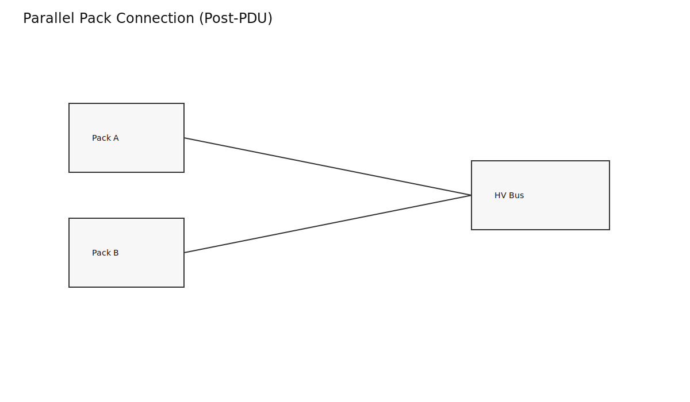
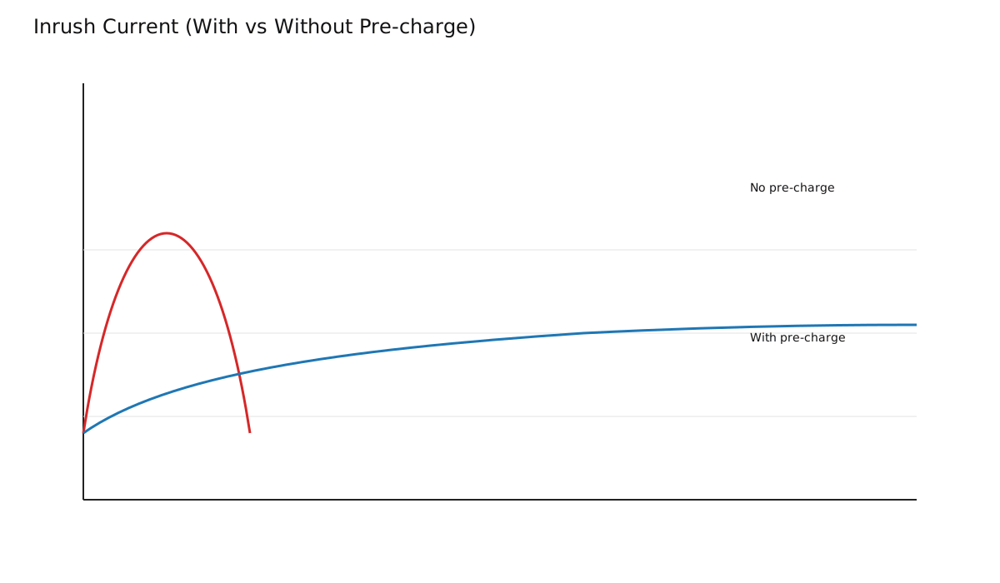
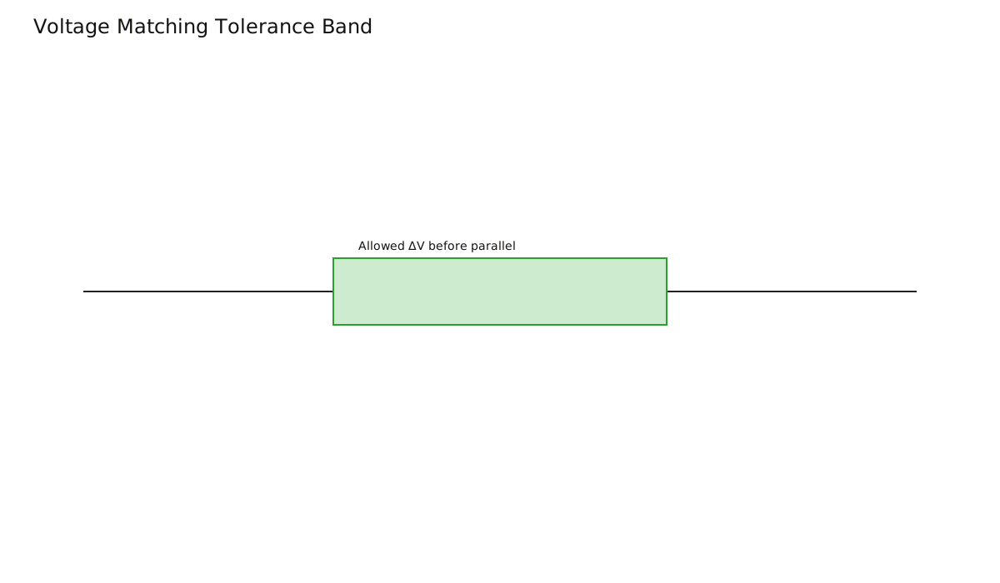
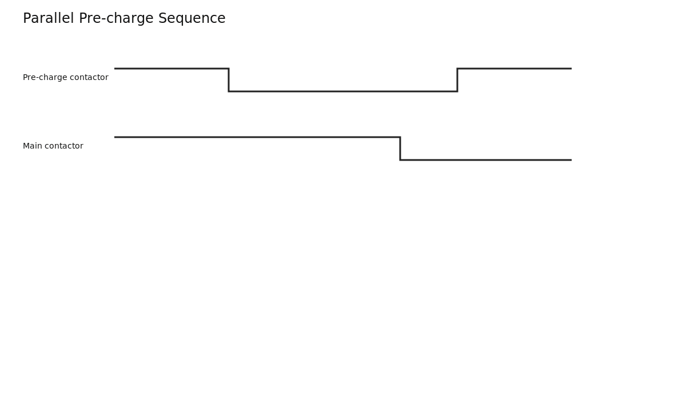
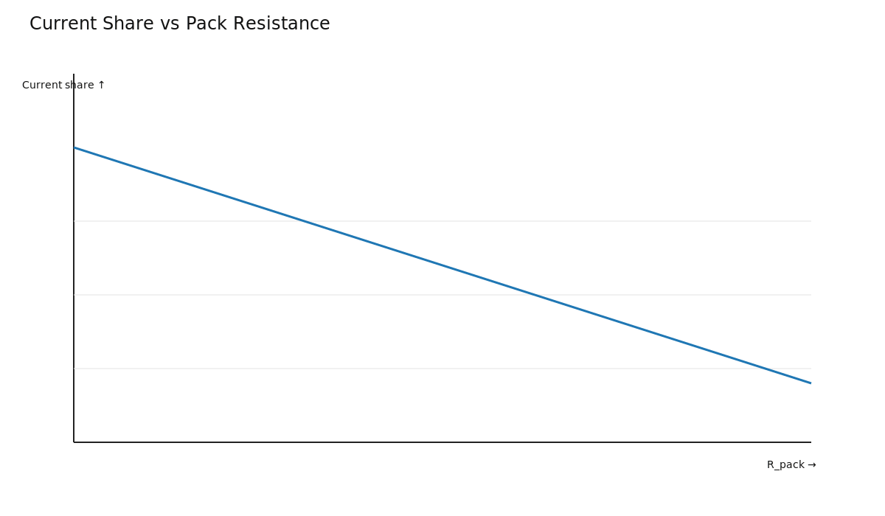

# Battery Paralleling: Safely Connecting Battery Packs in Parallel

Paralleling packs post-distribution can increase capacity/current capability, but unmanaged connection can create severe inrush and imbalance currents.

## Main Risk: Inrush and Voltage Mismatch

When bus voltages differ, high transient current can flow immediately at connection.

## Controlled Connection Strategy

Use pre-charge and sequence control before closing main parallel contact paths.

## Current Sharing Reality

Parallel sharing depends on branch resistance and dynamic impedance.

## Takeaways

- Voltage matching and pre-charge are non-negotiable.
- Equal nominal ratings do not guarantee equal current sharing.
- Control logic must assume asymmetric real-world behavior.
