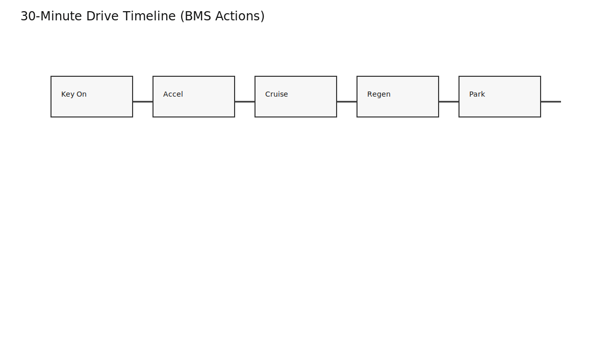
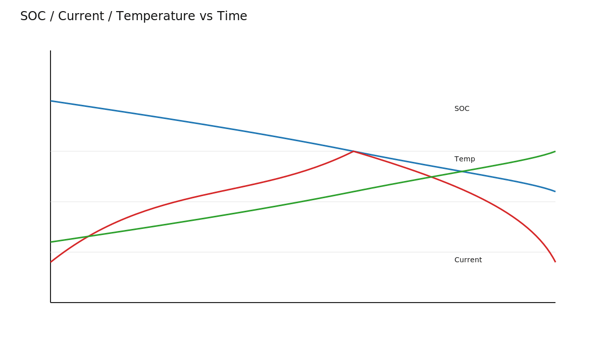
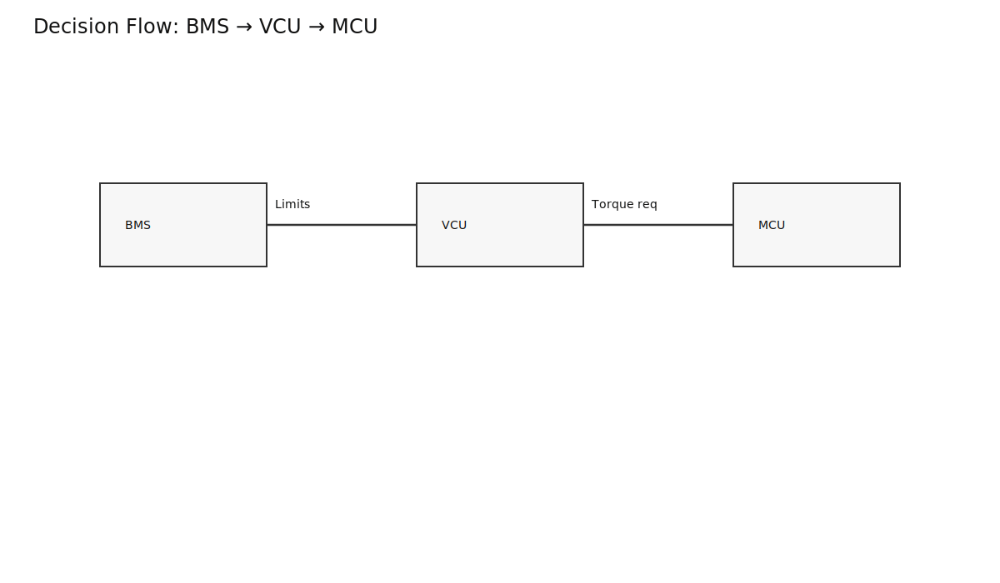
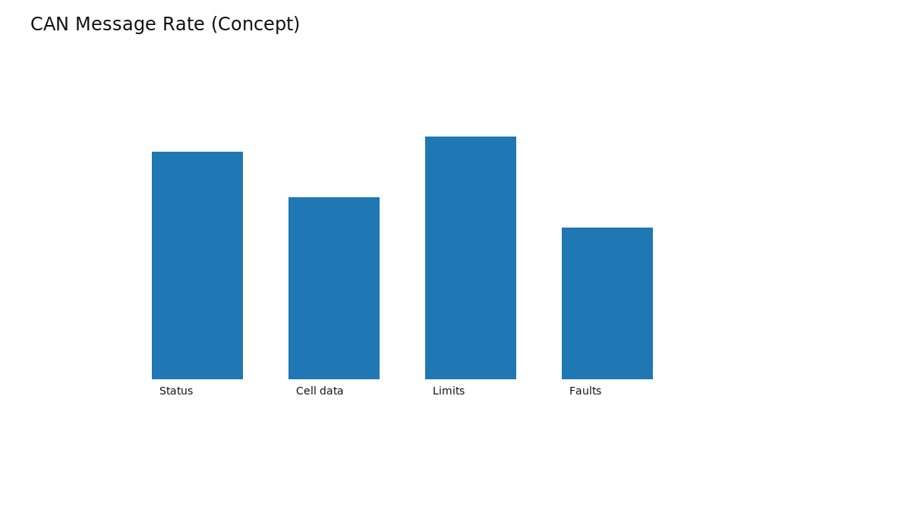

# BMS During a Drive: What Happens Every Second

A drive looks smooth to the driver, but the BMS is continuously estimating, limiting, and reporting.

## Startup

At key-on, BMS validates pack status, initializes estimates, runs contactor/pre-charge logic, and publishes readiness.

## Acceleration and Cruise

During acceleration, current rises and voltage drops. BMS recalculates limits from SOC, temperature, and cell margins.

During cruise, it tracks SOC drift, thermal behavior, isolation state, and anomaly trends.

## Regen and Charge Acceptance

Regen is charge current. BMS checks headroom before allowing requested regen torque.

## Decision and Communication Loop

- Sense pack state
- Evaluate limits/fault logic
- Publish limits and diagnostics to vehicle ECUs

## Takeaways

- BMS is an active real-time controller, not just a monitor.
- Most “car feels different today” moments are BMS limit decisions.
- Thermal state and weakest-cell state dominate performance limits.
