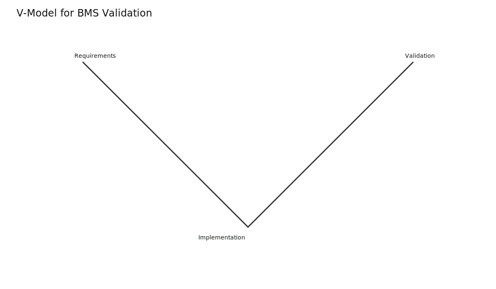
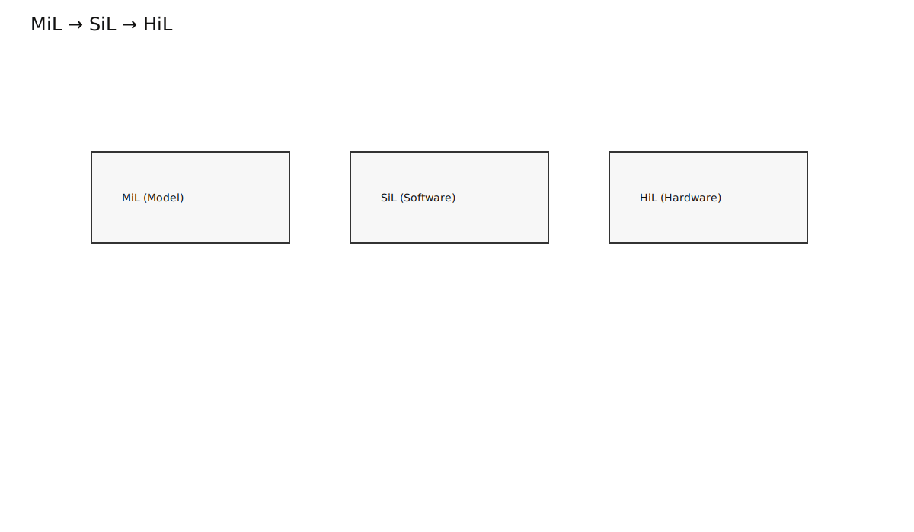
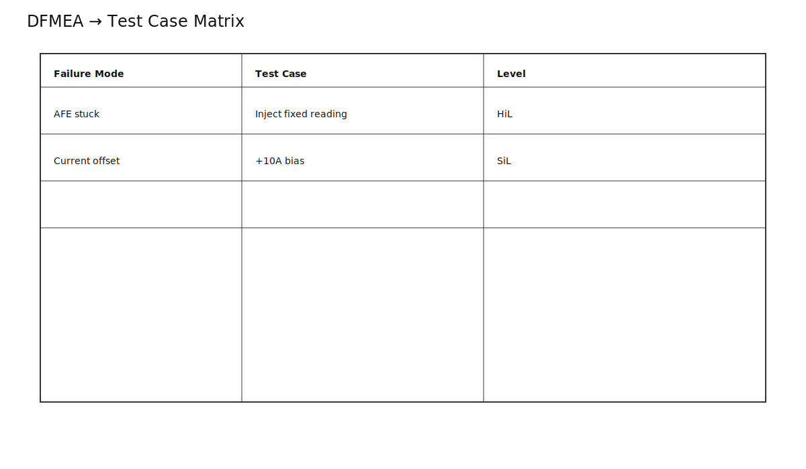
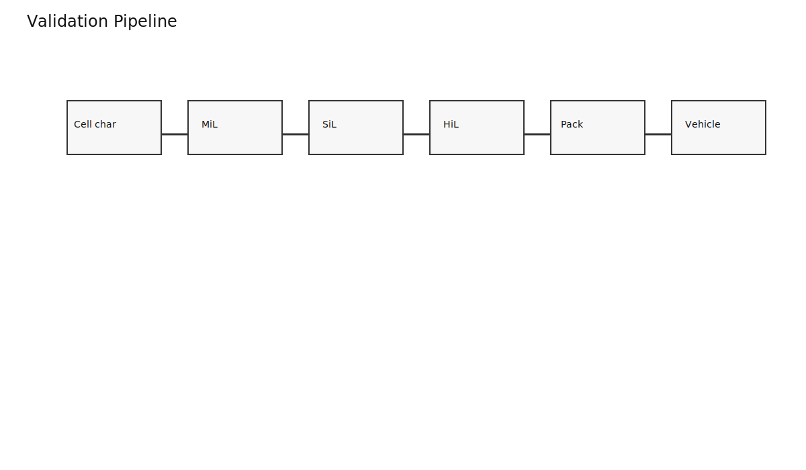
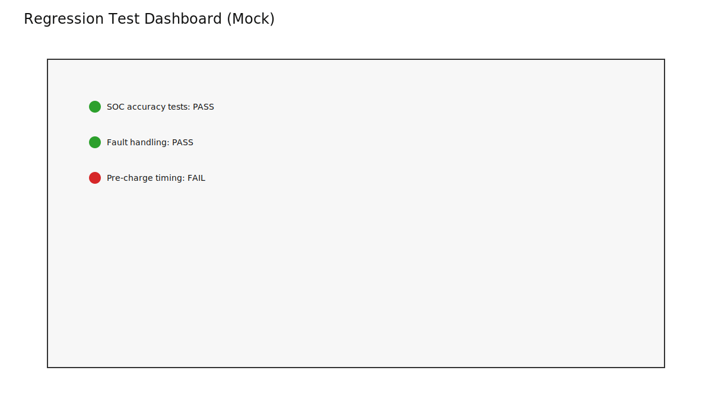

# BMS Validation: From Model to Real Vehicle

BMS validation proves software behavior across normal, edge, and fault conditions before production release.

## Validation Stack

- MiL: algorithm checks against models
- SiL: compiled software behavior checks
- HiL: real ECU against plant simulation and fault injection
- Vehicle testing: integration with real hardware and environment

## Requirement Traceability

DFMEA risk items should map to explicit test cases and pass criteria.

## Release Pipeline

Validation is staged, gated, and continuously repeated via regression after each relevant change.

## Takeaways

- Validation quality is a safety feature.
- Coverage, repeatability, and traceability matter as much as pass/fail counts.
- Late-stage bugs are expensive; shift-left validation reduces risk dramatically.
