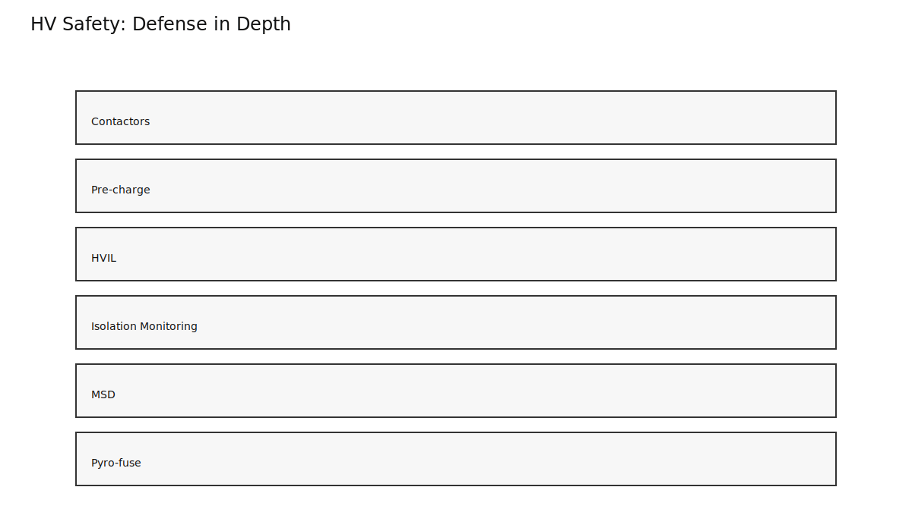
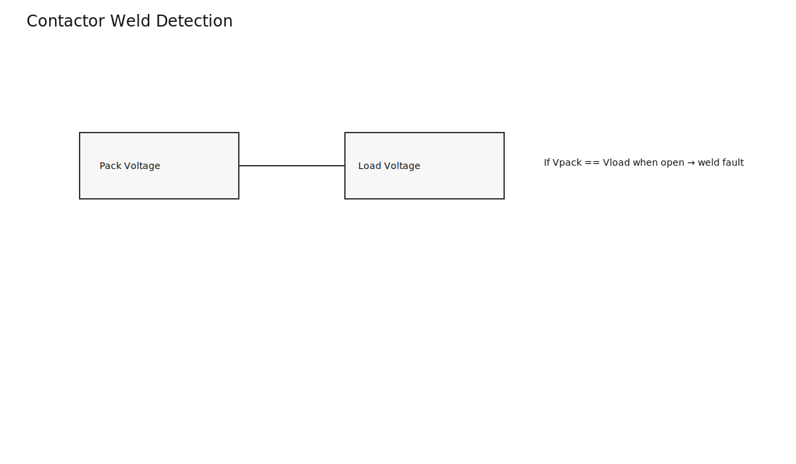
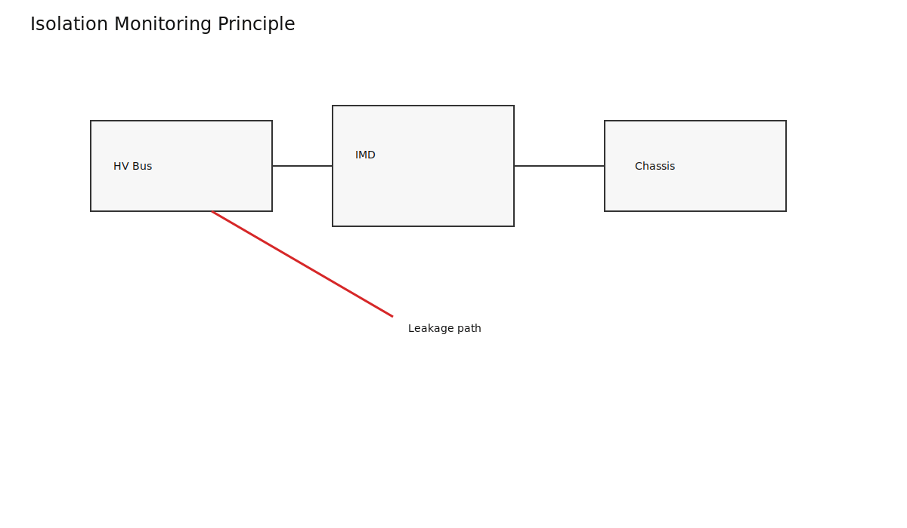
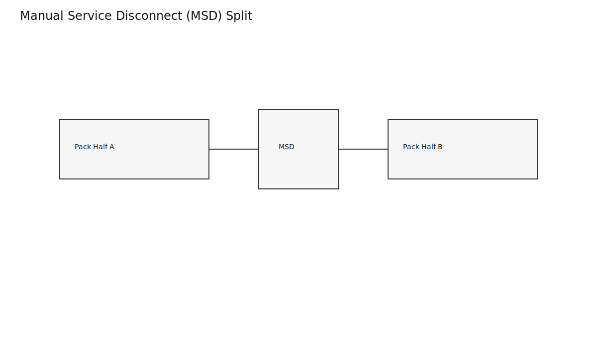
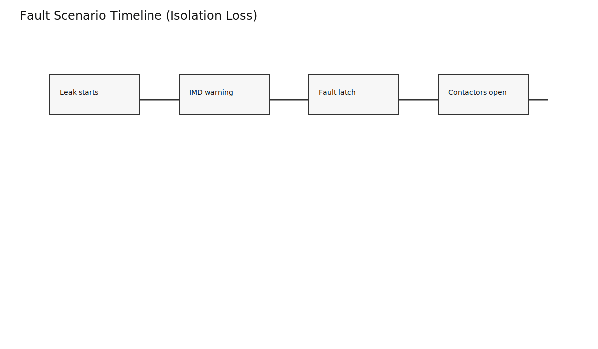

# HV Safety Architecture in EV Battery Packs

HV safety is implemented as layered defense, not a single device.

## Core Safety Building Blocks

- Contactors and pre-charge path
- Isolation monitoring
- Manual service disconnect (MSD)
- Fuse and pyro-fuse strategy
- HV interlock and diagnostics

## Fault Response Timing

Fault handling must be deterministic and staged from warning to hard isolation.

## Takeaways

- Safety architecture is a coordinated system.
- Detection, actuation, and fail-safe defaults must align.
- Compliance requires both design evidence and validation evidence.
