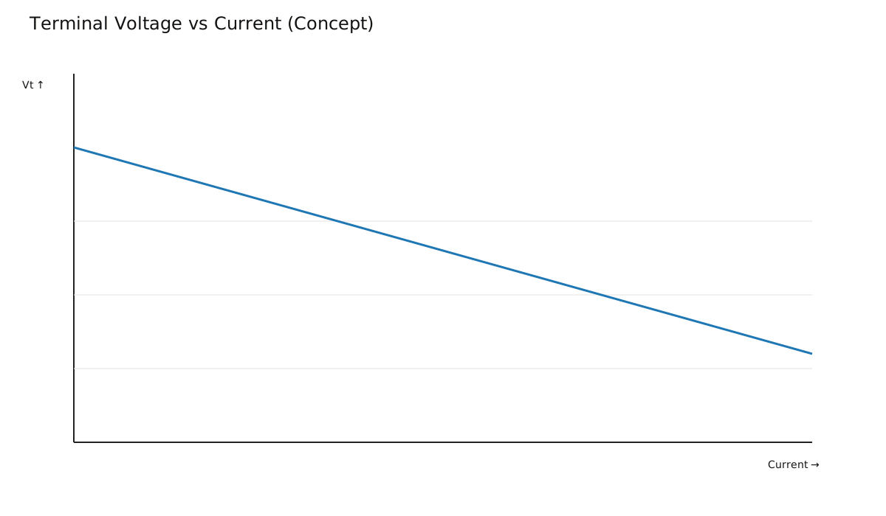
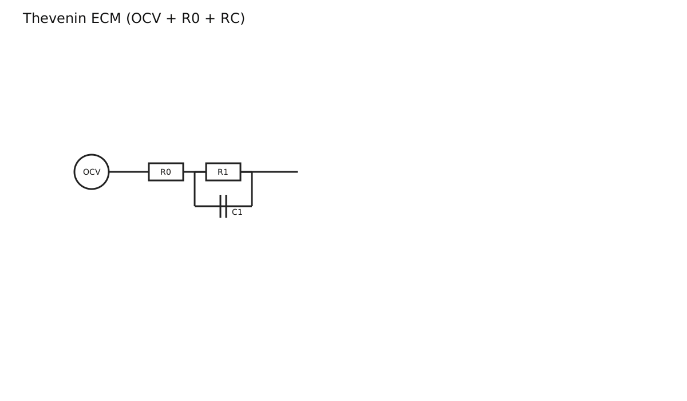
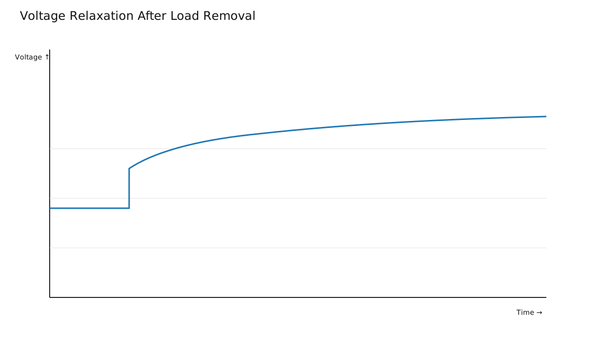
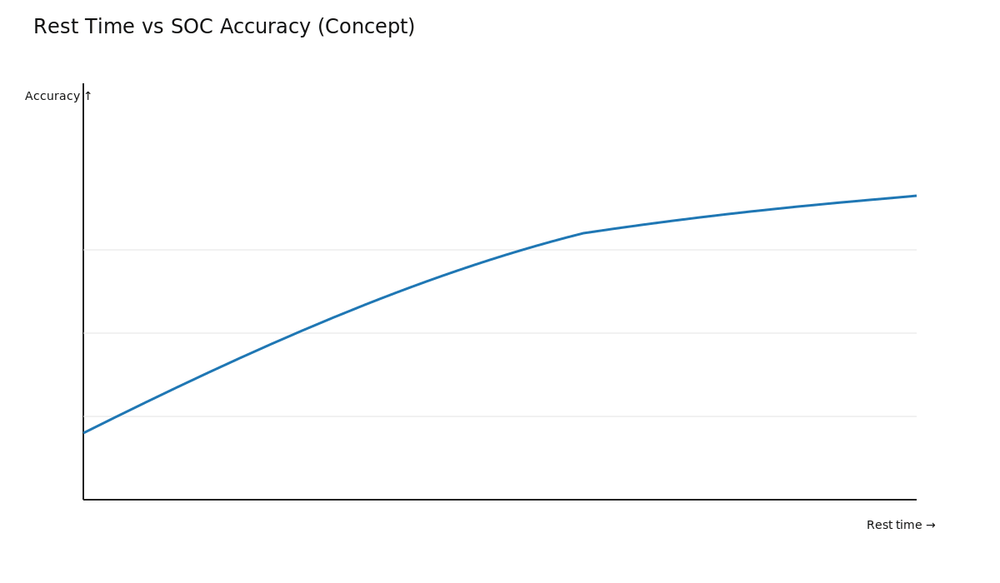
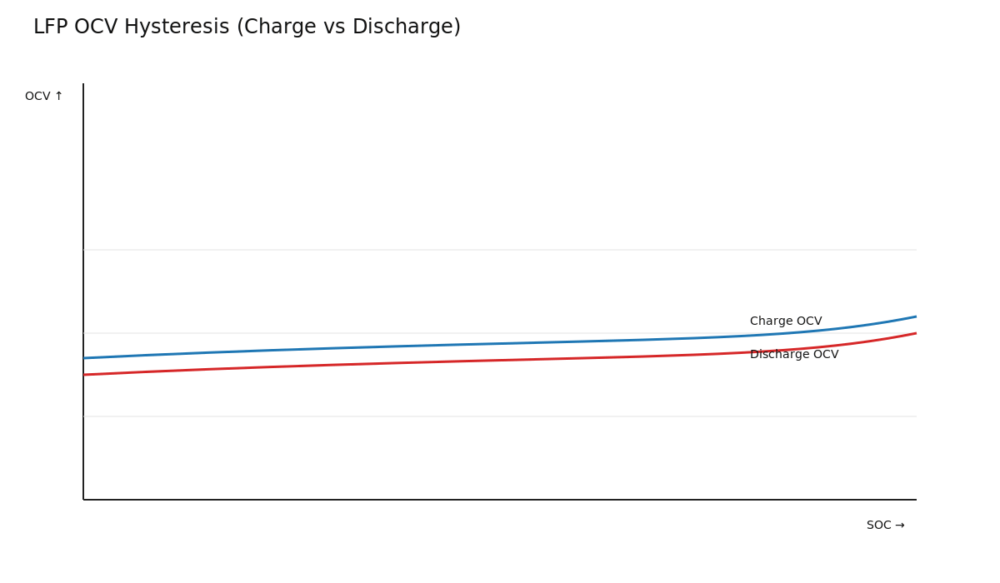

# OCV vs Terminal Voltage: Why Voltage Alone Misleads Under Load

Open-circuit voltage (OCV) and terminal voltage are not the same during dynamic operation.

## OCV vs Measured Terminal Voltage

- OCV represents equilibrium after rest
- Terminal voltage includes load-induced drops/rises and transient polarization

## Relaxation and Rest Time

After load removal, voltage relaxes toward OCV over time. Short rest gives biased SOC inference.

## Chemistry Nuance: LFP Hysteresis

For LFP, charge/discharge path history affects OCV relationship.

## Takeaways

- Terminal voltage is context-dependent.
- Reliable SOC uses model + current integration + temperature compensation.
- Rest-based OCV correction is useful, but only with proper settling context.
