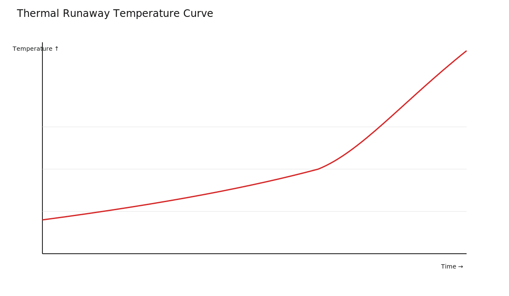
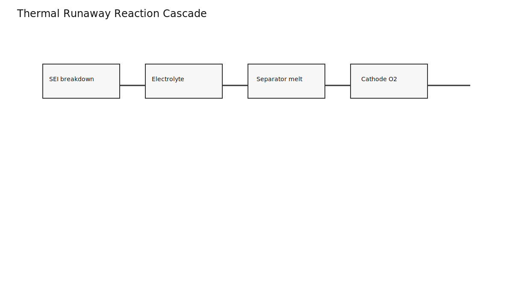
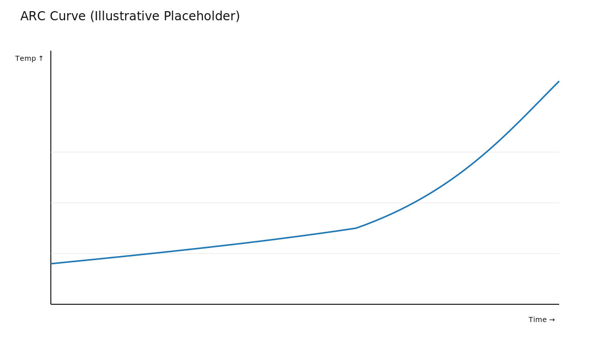
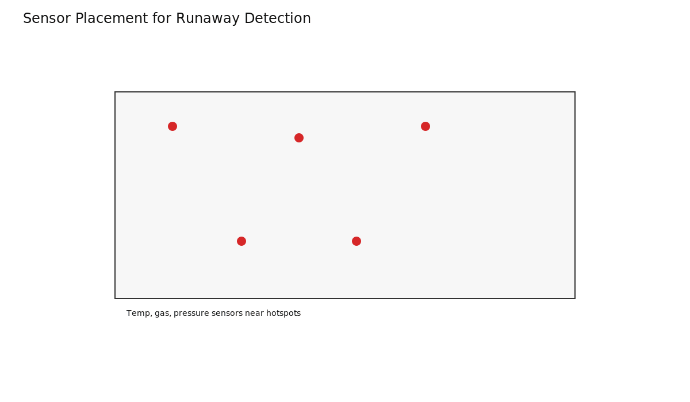
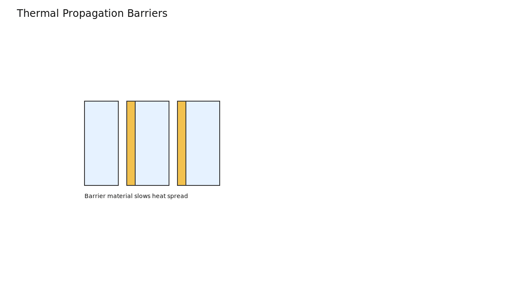

# Thermal Runaway Detection and Handling in EV Packs

Thermal runaway is a self-accelerating exothermic failure mode. Prevention and early detection are critical.

## Reaction Cascade

Runaway develops through escalating chemical and thermal stages.

ARC-style characterization is used to understand onset behavior and severity trends.

## Detection Architecture

Early warning uses layered sensing:
- Distributed temperature sensing
- Voltage anomaly detection
- Gas/pressure indications where available

## Response and Containment

BMS actions escalate with severity: derate, isolate, latch faults, and coordinate vehicle safety states. Physical pack design must limit propagation.

## Takeaways

- Runaway mitigation is system-level: cell chemistry, pack design, sensing, and firmware.
- Detection latency strongly affects containment outcomes.
- Prevention logic upstream is the highest-value safety layer.
